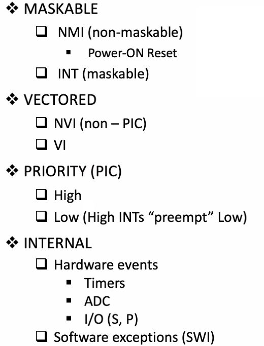

# Interrupts
October 12, 2021

## Quiz 5 review
- Multi-level memory hierarchy from fastest to slowest: Registers, L1, L2
- L1 cache is refilled directly from L2 cache
- RISC CPU's L1 cache architecture is separate I- and D-caches (Harvard style)
- L2 is unified cache (von Neumann style)
- L3 cache is shared unified cache
- Each level of cache memory is approx. 10 times larger/smaller and faster/slower
- Cache memory is made from SRAM
- Cache memory in most RISC CPUs use direct mapping
- Cache is refilled in one chunk at a time, known as a block
- D-Cache misses in RISC can only be caused by Load/store instructions
- Direct mapped, write-through D-Cache organization has the simplest hardware imp
- I-Cache misses in RISC are most likely to be caused by jump instructions
- Virtual memory is most likely to be needed by desktops and servers
- Virtual memory uses virtual, logical, and segmented/paged forms of addresses, NOT physical addresses
- Virtual memory uses a page table with an op-chip cache called a TLB

## Interrupts
Interrupts are the method of creating a temp halt during program exec and allows periphs to access the microproc.

There are basically three classes of interrupts: non-maskable, non-vectored, and vectored.
- Maskable indicates the use of an enable bit. NMI doesn't have an enable bit - it's always enabled. Thus, when the machine is powered on, these interrupts are already enabled.
- NVI are used in the BIOS for most important I/O devices
- VI are used for peripherals: keyboard, mouse, display, printers, etc. Typically a vector (device) is identified by an 8-bit byte and placed on the data bus so the processor can read the interrupt with a Load Byte instruction.

### Classes of interrupts
Priority interrupts can be separated into high and low priority, where high pri are taken care of before low pri. Internal interrupts can be characterized by hardware events and software exceptions.

Read chapter 7 for more info on MIPS exceptions.