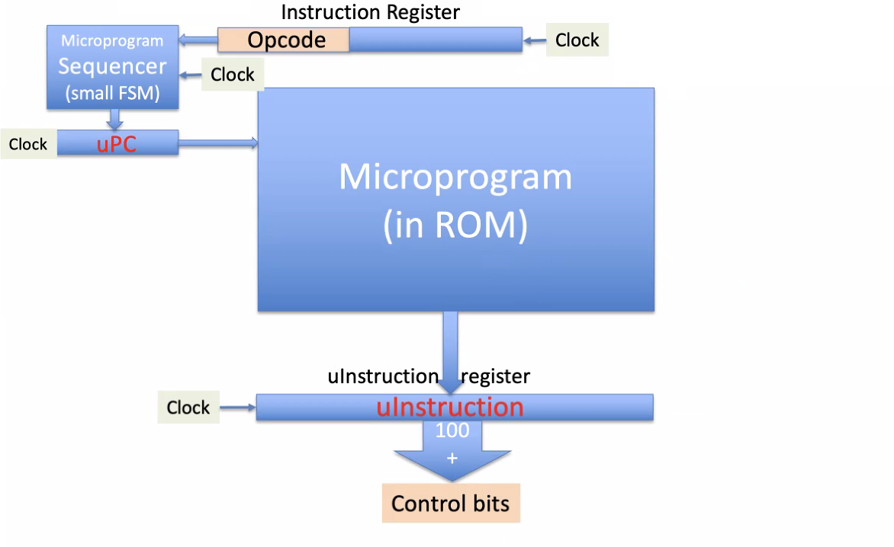

# Instruction Control Unit
October 19, 2021

## News
The Apple M1 Pro and M1 Max were released yesterday. Completely redesigned M1 chips with crazy specifications, specifically in memory interface throughput. The architecture is still 5 nm, so the chips are physically larger while nearly doubly the number of transistors on the Pro versus the original M1.

The Pro features 8 hi-performance cores with "ultra wide" execution architecture, 192KB i-cache, 128KB d-cache, and 24MB L2 cache; and 2 hi-efficiency cores with "wide" execution architecture, 128KB i-cache, 64KB d-cache, and 4MB L2 cache. Notably absent is a shared L3 cache - instead, DRAM memory is used partially as a cache. The Pro GPU has 16-cores with 2048 execution units, up to 49512 concurrent threads with 5.2 teraflops and 164 gigatexels/second and 82 gigapixels/second.

As tradition, DRAM is located on a module very close to the processor, maximizing bandwidth and offering 200GB/second. The Pro offers 32GB of memory with a 256-bit Low Power DDR5 interface.

The Max doubles the number of GPU cores from the Pro, and offers a 32-core GPU with 4096 execution units, up to 98304 concurrent threads, 10.4 teraflops, and 327 gigatexels/second, 164 gigapixels/second. The Max memory modules consist of 64GB of DRAM, a 512-bit interface and up to 400 GB/sec bandwidth.

Security features include hardware-verified secure boot, runtime anti-exploitation, and fast in-line encryption.

## ICUs
Software is executed by a computer according to the rules of its instruction set. The software is implemented by lots of logic in a state machine called the Instruction Control Unit, which produces a set of bits to control the entire computer over each clock cycle. The role of the ICU is to interpret an instruction from an ISA and output control bits (around 100, sometimes more) to accomplish the requested task. ICUs are pipelined, and the hardware implementation can be a finit state machine with or without microprogramming.

The ICU has to decode both the op code and the operand field and provide control bits. The ICU sends out both its own control bits as well as control bits from the op code, sent to the adder to accomplish an arithmetic task. An adder will then calculate an effective address for load/store instructions or branching.

The following is a flow chart for a Mealy-Moore logic-based state machine; this architecture is very fast but requires complex combinational logic:

Microprogramming is different; a ROM-based state machine is more simply organized. An instruction register would provide an ins to a microprogram sequencer (in itself a small finite state machine), which produced the address of the next microinstruction and is then sent to a microprogram counter. The microprogram ROM of standard subroutines will then fetch the uPC and send control bits to the microinstruction register. This is a slow process compared to an implementation of a finite state machine ICU - all early CISC processors used a microprogrammed ICU (ROM) and RISC replaced this idea with a finite state machine ICU.

