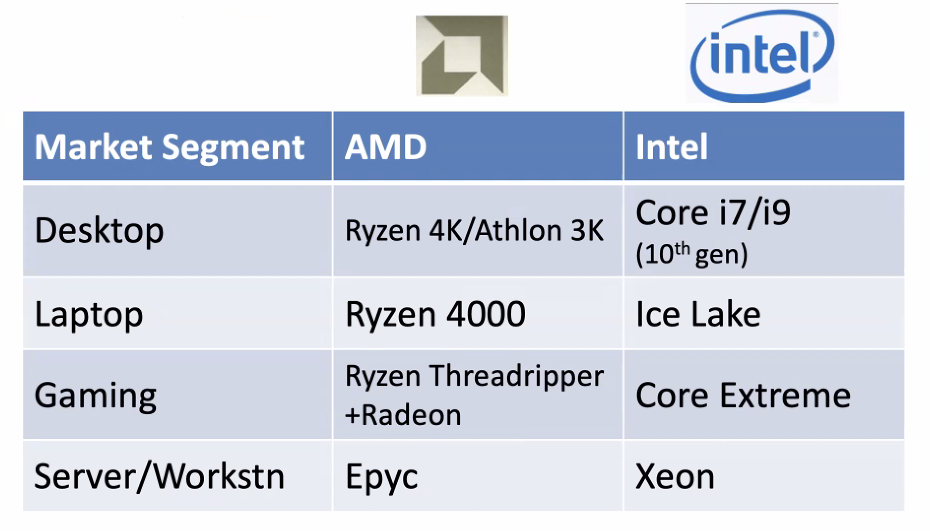

# Multithreading
October 28, 2021

We will be looking at chapter 6 in the ZyBook: parallel processing, hardware multithreading in the CPU, and instruction level parallelism.

## CPU families

The AMD Zen architecture is now known as the Ryzen, which competes with cosumer-level products from Intel.

## ICU
We have previously taken a dive into the ICU, understanding that it parses opcodes and sends control bits to the machine, as well as providing control bits to the ALU. The ICU is just one EU inside the processor.

## Hardware Multithreading
Related to multiple instruction, multiple data (MIMD), hardware multithreading allows multiple overlapping threads to share functional units of a single processor to utilize resources more efficiently. MIMD relies on different processes to keep multiple processors busy. Threads have a program counter, a register state, and a stack. It is a lightweight **process**. A process may have one or more threads.

Section 6.4 details temporal and simultaneous multithreading extensively; as well, there are annotated slides provided by Drobman.

Without multithreading, superscalar processor systems can only run multiple threads independently, one at a time. Thus, with cache misses and other stalls, there is significant processing downtime. With multithreading, a stall or halt triggers a context switch to another thread, reducing downtime significantly. With temporal MT, a single thread will occupy processor resources until a halt triggers a switch; fine-grained, or interleaved MT, can introduce algorithms to evenly distribute processor time and increase fairness resource distribution. Simultaneous multithreading (SMT) with superscalar is the most efficient method of hardware utilization, completely occupying issue slots of a processor at any given time with one or more thread.

