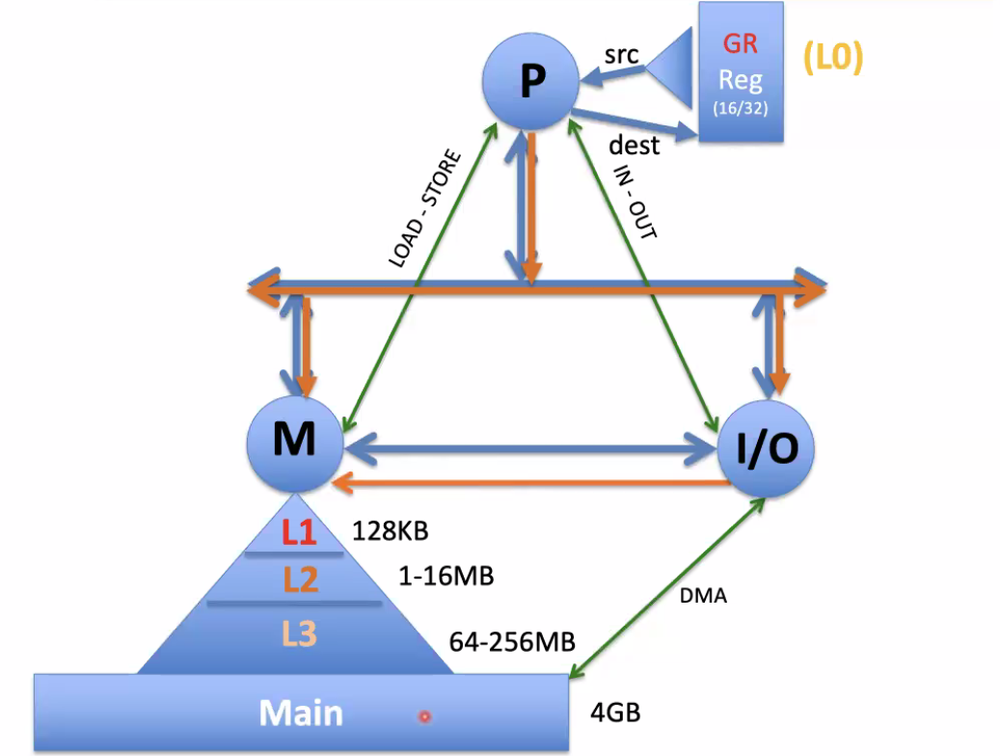
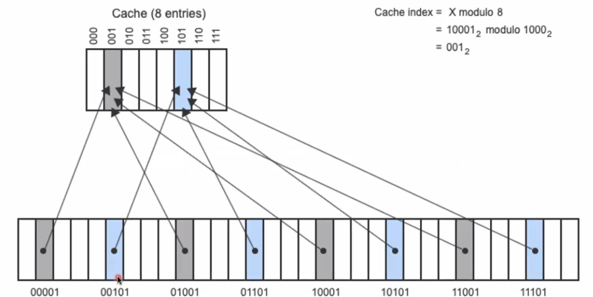

# Cache Memory
October 7, 2021

To review: virtual memory is implemented by the operating system to avoid collisions between programs. Naturally, every programmer is going to want to start accessing memory at the beginning of the segmentation. Virtual memory implementations allow programs to access physical memory without clobbering values used by other programs.

## Multilevel memory
We can construct a hierarchy of memory, with caches lying on the top, with a main memory (RAM) at the base. Secondary storage like hard disk drives and SSDs also form a much slower base below main memory. The fastest local storage is the register set; however, the fastest *memory* is the Level 1 cache.

In the first computers, only registers existed. As semiconductors became smaller and more accessible, RAM cells were eventually developed, and improved according to Moore's Law.

As memory is moved "away" from the processor, the time penalty for accessing that level of memory increases significantly. Reading from a SSD is about 1000 times slower than reading from L1 cache.

In direct-mapped cache, both a data object and a "tag" are stored. The tag refers to an identification method which references the higher-order bits of an address in main memory. Thus, since cache memory is much smaller than the gigabytes of memory available as RAM, mutliple addresses in main memory may share the same space in cache, according to their lower-order bits. 

See also: associative mapping (Chapter 5)