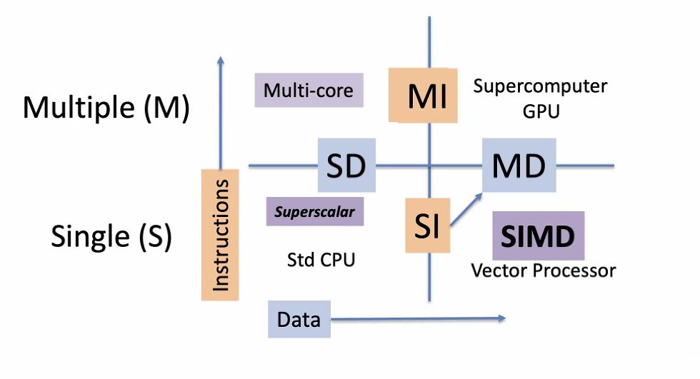

# Parallelism: SIMD (AVX) and ILP
November 16, 2021

We can see parallel processing in the CPU in two different ways: data-level parallelism and instruction (code) level parallelism. 

## Notes

### Project 2
1. Research simulators:
- MIPS/MARS
- ARMsim
- 1 other
2. Perform simulations:
- Cache
- BHT and others
- Virtual memory
3. Research benchmarks:
- Single-core
- Multi-core
- MT
- SIMD
  
### Quiz review - System calls, Intel 12th Gen, JTAG/JEDEC
Only one more quiz left!
- System calls are defined as: a primitive op that calls a system-level routine
- In MIPS, syscall is the system call primitive
- In ARM, SWI/SVC is the system call primitive op
- Intel's latest 12th gen CPUs were introduced (for sampling) in the 4th quarter of 2021
- 12th gen CPUs include the i5/i7/i9 series
- 12th gen Core i7 CPU's have a max base frequency of 3.6 GHz
- There is 25MB of LLC (last-level cache) on the 12th gen i7 CPUs
- 12th gen core varieties include the P and E type cores (performance and efficiency)
- 12th gen CPU architecture includes the Z690 South Bridge chipset
- JTAG is an IEEE (Institute of Electrical and Electronics Engineers) standard for testing chips which has a 4-pin interface (TDI, TDO, TCLK, TMS), using boundary scan
- JTAG inputs commands and test data
- JEDEC is an EIA (Electronic Industry Association) group which sets standards for memory parts

## Parallel Processing
Hardware can be serial or parallel, and software can be sequential or concurrent. Thus, there are (at least) four different environments in which processing may occur.

The Flynn Partition creates a classification system of single vs multiple for processes and data:

With superscalar + SMT, we can process multiple instructions, but we are stuck working with one set of data. In SIMD, we have arrays of data (or matrixes, aka tensors) where we can process multiple sets of data in a single instruction. This capability of processing "vectors" of data was originally called Multi-media extension (MMX) in the x86 but is now fairly common with streaming SIMD extensions (SSE) and now, advanced vector extensions (AVX). Multi-instruction multi-data computers exist in supercomputing and GPU floating point execution.