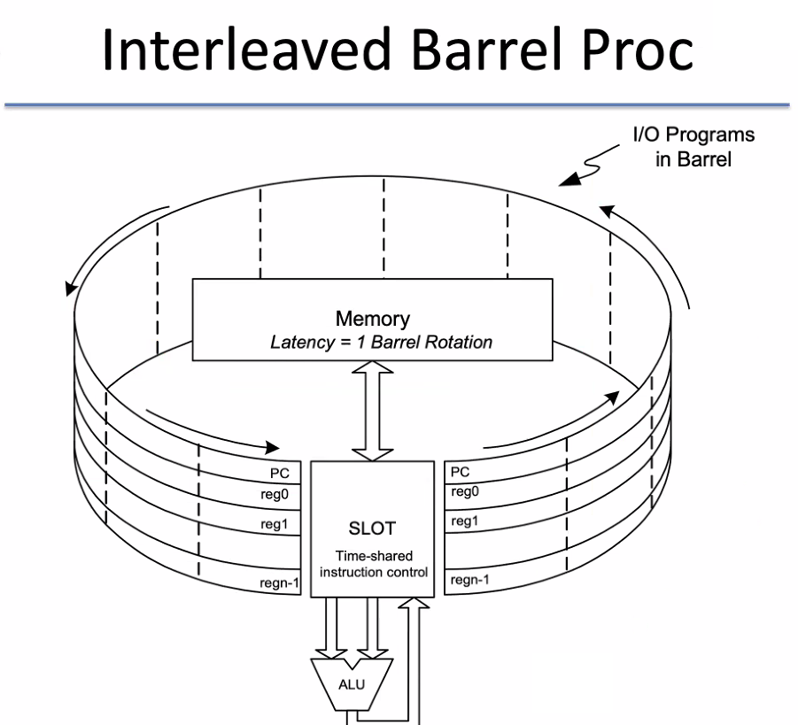

# Multi-core and multi-threading
November 2, 2021

To review: sections of chapter 4 on ILP and pipelining, plus chapter 6 on multi-core and hardware multithreading

## Multithreading
The operating system schedules processes and also divides processes into threads; typically the programmer will assign processes into threads, which are assigned to cores by the OS. This is software MT. There is also implementations of MT in the hardware, splitting and assigning stack and registers to their own process or thread.

Originally, ARM did not implement MT; however, as embedded systems became more sophisticated, ARM did end up implementing MT with more recent Cortex cores.

Interleaved "barrel processor" - courtesy of Mikko Lipasti, University of Wisconsin

Superscalar is another hardware concept which enables simultaneous multithreading. Before we had multi-core systems, superscalar inspired designers to duplicate execution units in a CPU to fetch multiple instructions at once, using shared L1 caches.
