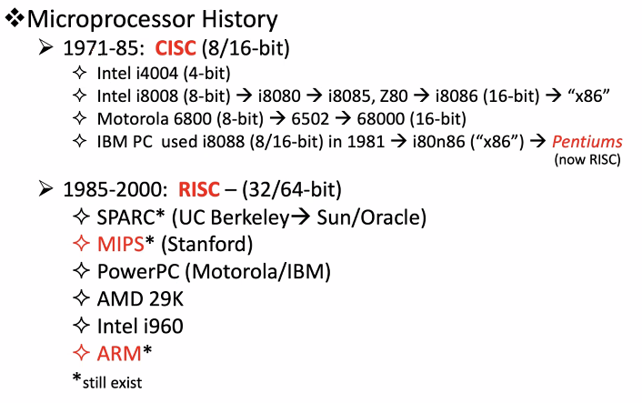

# MIPS / MARS cont.
September 14, 2021

## Things to remember
#### Major characteristic of RISC architecture
RISC has LOAD/STORE instructions and general registers, to make data manipulation fast and executed in a single cycle. CISC, on the other hand, performs memory-to-memory manipulation and takes multiple clock cycles, therefore running much slower.

#### Branching
In all architectures (except ARMv7) we restrict conditionals to branch instructions (in MIPS, BRA, BRCC, AND LOOP). RISC also has JUMP, whereas ARM does not.

#### Caching
L1 cache originally crammed code and data into the same area, whereas "Harvard" style separated data and instructions (L1-i and L1-d). Later, as Moore's Law progressed, L and L3 cache became possible.

## MIPS
Just like with x86, there are 32-bit and 64-bit versions which have evolved separately. MARS used the modern version of 32-bit, called MIPS32.

R2000 (MIPS I) has a CPU, with 32 registers + ALU + multiply/divide, along with a 7-register coprocessor and another FPU co-processor.

## More MARS
In the memory segmentation, the top 1/4 is dedicated mostly to I/O, the next quarter for the kernel, and the last half for data. The stack preferably grows down into the heap. This is just a default organization and can be rearranged if desired (except for the exception handler address, which is "hardwired")

