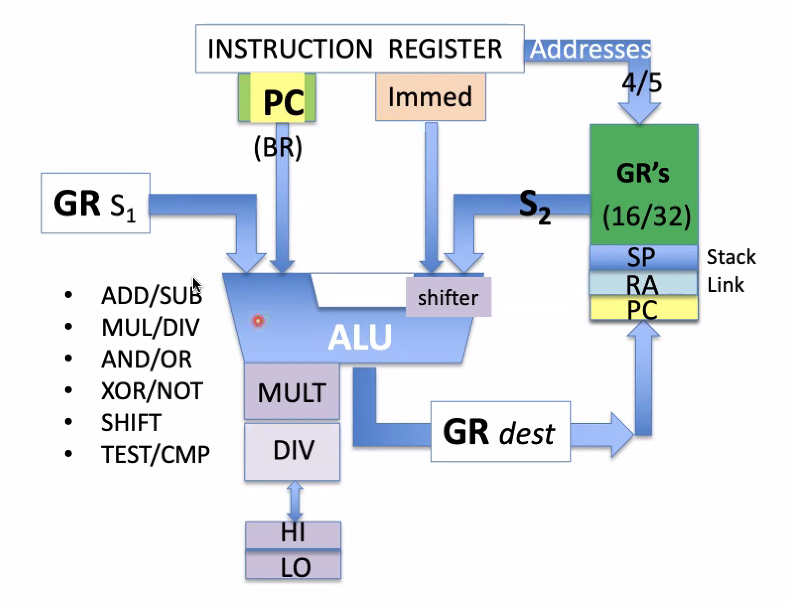
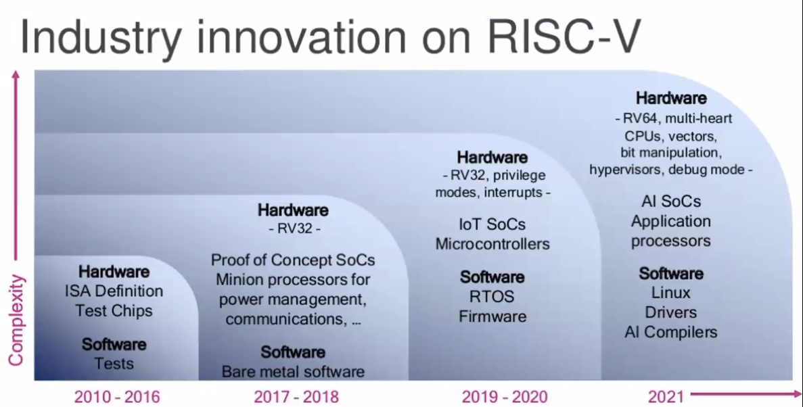

# MIPS/MARS and RISC V
September 16, 2021

Note: Java 8 update 301 may cause a bug in MARS - tread carefully...

To review, the MIPS memory segmentation model is "standardized" but mostly editable. By convention, I/O is handled in the top quarter, kernel data and ops in the 2nd quarter and remaining data & instructions in the last half.

Inside a given CPU core, besides the instructions we see one or more execution units. 2 or more execution units in called "superscalar." 

The baseline MIPS arch has a CPU, FPU, and an exception handler. The following figure is a general description of the CPU:

There are 3 basic instruction formats, separated into fields to sum to 32-bits:
- r-type: opcode (6-bits), 2 source register fields (5-bits each), 1 destination register (5-bits), optional shift amount (5-bits), and function code (6-bits)
- i-type: opcode (6), source register (5), destination register (5), and immediate value (constant or memory address) (16)
- j-type: opcode (6) and address (26)

ARM does not have JUMP instructions, so it doesn't use a j-type instruction at all.

RISC-V is an open-source version of MIPS, governed by the RISC-V International Org. It is extremely similar to MIPS and shares the same design philosophy.

RISC-V allows for variable length instructions, giving the programmer the ability to write instructions beyond 32- and 64-bit lengths. As well, the opcode field is expended to 7-bits, and moved to the lowest order bit fields.
