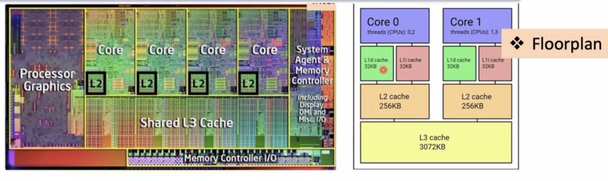

# Computer Architecture Review (COMP 122)
September 2, 2021

## Briefs
Check out PDFs on Hi-performnce Computing and Quantum Computing - will be relevant later on in the course.

Quiz 0 is a diagnostic test - average is currently 50%

## Key slides - overview

### Syllabus review
**MIPS/RISC V** (Open source version of RISC) (*Microprocessor without Interlocked Pipeline Stages/reduced instruction set computer*) is most popular, **ARM** is increasingly popular in mobile devices and SoC's, **x86** is mainly used in desktops and servers and seems to be starting to fade.

**RISC** uses a 32-bit instruction, with a 6-bit op code and the remaining 26 available for data.

Types of instructions:
- r - register
- i - immediate
- j - jump

### Drobman's 4 layers of architecture:
- Macro-arch: System arch (cores)
- ISA: primitives and software interfaces
- Computer Organization: EUs - execution units (ALU, Registers, ICU - instruction com)
- Micro-arch (branch prediction, pipelines/threads, scheduling)
  
### ISA/SoC Landscape
- Mobile (low-power performance)
  - MIPS
  - ARM (Apple, Qualcomm, Samsung, Google)
- Desktop/Server (high-power performance)
  - x86 (Intel, AMD)
  - ARM (Apple, nVidia)
- IoT
  - Amazon
  - Google
- Manufacturing/Foundries
  - Taiwan Semiconductor Manufacturing Company
  - Samsung
  - GlobalFoundries (AMD)

### ISA layer breakdown
- Instruction set (primitives, pseudos)
- Registers (General registers/dedicated)
- Memory (Segmentation, Virtual/Physical)
  - Virtual memory addresses are usually 

### Architecture
Multi-core arrangements:

- Each core contains level 1 d/i (memory for instructions + memory for data) and level 2 caches (both L1 and L2 usually encapsulated in core), plus a shared level 3 cache between all cores.
- Cache is the level of memory that is interfacing between "main" memory: DRAM/SRAM
- Reasoning for caches are generally to speed up fetching of data and instructions (specifically at L1i cache)
  - CPU registers run even faster than caches, using d-flipflops
- The ALU, ICU, and registers are referred to as an EU (execution unit)

### Levels of Instructions
We can consider a number of "building blocks" of Assembly software/programming:
- Primitives: native machine instructions (in the ISA set)
- Pseudo instructions: groups of 1 or more primitives abstracted into a single instruction (extended instructions)
- Macros: blocks of code that will be substituted in place
- Subroutines: blocks of code which are "called"
- Micro instructions are completely different!
  - Complete set of all control bits per clock cycle
  - In general, any functionality can be implemented using hardware, software, or both

### Software layers
We can break software down into different layers:
- User apps
- APIs
- Operating Systems

### Hardware layers
- Monitor - low level shell in operating system or embedded system
- Boot loader & BIOS - low level firmware
- Hardware CPU - **main focus of COMP 122**

### Microprocessor history
1971-85: CISC (8/16 bit)
- Intel i4004 (4-bit)
- i8008 (8-bit) -> i8080 -> 8085, Z80 -> i8086(16b) -> "x86"
- Motorola 6800 (8-bit) -> 6502 -> 68000 (16-bit)
- IBM PC used i8088 (8/16-bits) in 1981 -> i80n86 ("x86") -> Pentiums (now RISC)

1985 - 2000: RISC (32/64-bits)
- SPARC* (UC Berkeley -> Sun/Oracle)
- MIPS* (Stanford)
- PowerPC (Moto/IBM)
- AMD 29k
- Intel i960
- ARM*
 (*) still in use