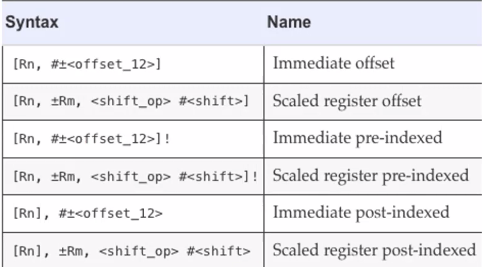

# ARM and Systems on Chips (SoC)
September 21, 2021

## Quiz #2 Review
- CPU Execution Unit contains ALU + ICU + registers

- A CPU core contains EU + L1 caches

- SoC can contain any of these: GPU, CPU, FPU

- MIPS32 ISA contains Integer and FPU primitives + psuedo ops

- A MIPS CPU may contain an Integer unit + up to 4 co procs, CP0 + CP1(FPU)

- MIPS CP0 contains BadVA, Status, Case + EPC registers

- CP1 contains $f0-$f31 registers

- MIPS CP2 is not defined

- MIPS FPU is also called CP1

- MIPS FPU does not have an addi instruction (integer instruction)

- MIPS "load" insstructions can read data from .heap, .data, or .stack (any memory segment)

- MIPS "store" ins first writes data via a "write buffer" directly into L1 d-cache

- MIPS32 "Load immediate" (li) and "load address" (la) ins are pseudo instructions

- MIPS32 lw, lh, lhu, lb, lbu ins are primitive instructions

- In MIPS32, execution of the following results in data being stored into the heap:
```
li $t2, 0x100400a
sb $t1, ($t2)
```

## ARM
Main flavors of ARM:
- v5 ()
- v7
- v8

### ARM v7 ISA
Load store:
- LDR(b, h, w) - load register
- STR (b, h, w) - store register
- LDM{IA} - load multiple
- STM - store multiple
- SWP(b, w) - swap registers
- PUSH/POP - stack ops

Branch/jump:
- BNE - branch not equal
- BEQ - branch equal
- BLNE - 
- BLEQ - branch less than or equal

Returns:
- ERET - exception return

Conditional:
- IT -if/then

Debug:
- BKPT - breakpoint
- DBG - debug
- HLT - halt

Addressing modes:


Imediates in ARM are prefixed with an equals sign (=)

MOV instructions only perform register-to-register. SVC (SuperVisor Call) is eqivalent to syscall in MIPS; SMC (Service monitor call) also exists.

Conditionals can be suffixed to other instructions besides just branching (SUBGT, ADDCS, etc). However, for this functionality to work properly, a CMP (compare) instruction must be given using the desired operands.

ARM has "saturating" instructions which operate depending on the overflow condition.