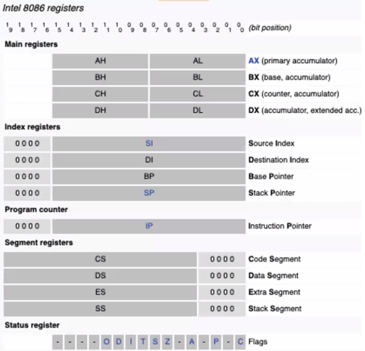

# Systems-on-chips and x86
September 28, 2021

## Quiz 3 review
- MIPS add instructions for unsigned integers are addu, addiu
-  The two's complement of binary integer 2 is 111...10; all 1's is -1, so 111...10 is -2.
- Multiply instructions take more than 1 clock cycle.
- Conditionals can be implemented in assembly via bne, beq, and bgtz
- Looping to a label can be implemmented in Assembly via bgtz Label
- Conditionals for >0 can be implemented in MIPS via bgtz, bgtzal
- Java code ```if (x <= 0) y = 1;``` can be represented in MIPS with (```x, y```) in (```$t1, $t2```) using:
  ``` assembly
  bgtz $t1, next; 
  li $t2, 1; 
  next;
  ```
- RISC V varies from other ISA's by having variable length instructions.
- RISC V differs from other ISA's by using a 7-bit opcode.
- RISC-V places the opcode at the least-significant end of the instruction word.
- RISC-V has 32 general registers.
- RISC- V has R, I, S, and U base instruction formats.
- RISC-V accesses data memory via load and store using different instuction formats; MIPS has a single format for both loading and storing.
- RISC-V conditional branches support comparing 2 registers to each other. ARM only allows setting flags via a compare instruction (such as after a subtract instruction), and MIPS allows comparing registers to 0.

## SoC survey
Qualcomm Snapdragon chips are utilizing ARM (either v6, v7, or v8, depending on model). these chips are often found in mobile phones. Core architetcure may include FPU, SIMD extension, and 16-bit Thumb cores. Typically built using 14nm with up to 8 cores.

MediaTek is a competitor to Qualcomm. Using 12nm fab processes, the architecture uses 4 cores. 

Samsung also has a variety of Exynos chips - ARMv7 architectures are utilizing 28-45nm. This is older technology, but Samsung manufactures these chips themselves. ARMv8 chips use smaller, modern nm fab processes. Interestingly, Samsung also makes automobile SoCs.

Review SoC slides on Drobman's site to see more real-world implementations of ARM technology.

## x86
Refers to the original ISA of the 8086 16-bit microprocessor, released in 1978. Both Intel and AMD have 32 and 64-bit ISAs but they are still held under the x86 banner (though the 64-bit ISA is usually referred to as x64). The original IBM PC used the i8088, which was basically the 8086 with an 8-bit data bus. In the past, many companies were using x86 technology, however today there are 3 main players in the market: Intel, AMD, and VIA.

A timeline of x86 development can be found on Drobman's website.

Intel used to make a number of solderable support chips for x86 architiecture - As Moore's Law dictates, these functions are now found completely encapsulated as logic structures into individual cores.

In 8086, addressing is extended from 16 to 20 bits:
