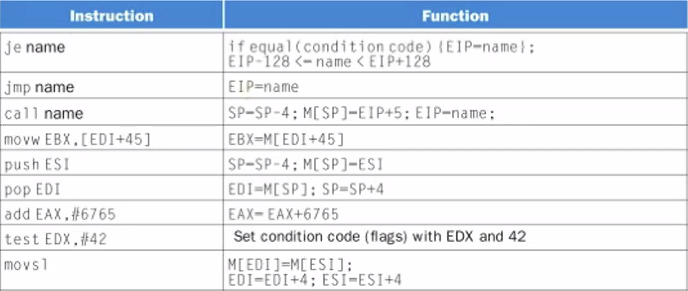

# x86, VAX, and MIX
September 30, 2021

i386 was the first 32-bit model of x86, at the same time as ARM and MIPS came out in 1985. At this time, virtual memory was introduced with 4KB pages (big chunks of individual memory segmentations).

In x86, 20-bit addressing is achieved by an added 4-bit provided by the segment registers. With the introduction of the 80386, the top 8 registers were extended to 32-bits with additional data segment registers.

Just as in MIPS, the FPU has its own separate register set.

## Typical x86 Instructions

Note that there are no branches! We now have conditional jumps. As well, some of these are considered to be "extended" instructions, indicating that some instructions (such as "call") will take multiple clock cycles to execute, since they are assembly aliases for multiple instructions. This differs from pseudo instructions in that they are a primitive part of the architecture, rather than assembler implementations constructed for ease of use.

