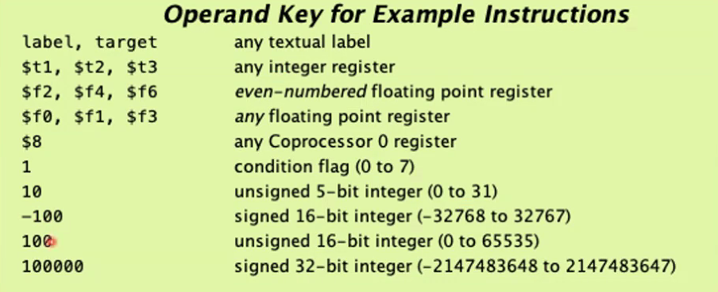

# MIPS/MARS
September 9, 2021

The MIPS assembly runtime simulator (MARS) is a .jar file and will utilize Java to run. 

RISC V is the "final frontier" of MIPS, an open source implementation developed by Patterson and evolved from UC Berkeley architecture.

Instruction sets are based off a standard 5 superclasses: computation, memory operations, program control, system control, and I/O. The instructions contained in these classes vary from set to set (for instance, ARM doesn't use JUMPs).

Static data variables are placed in the "data" segment of memory, whereas "dynamic" data is allocated into the heap.

## MARS
The MIPS architecture contains a main processor and 4 co-processors. The MARS sim uses only 2 co-processors - a "main" integer unit and a floating-point unit.

MARS implements the standard memory segmentation model - text, data, heap, stack, kernel (OS), kernel data, and MMIO

MARS includes SPIM, a library of standard services like printing, reading, etc.