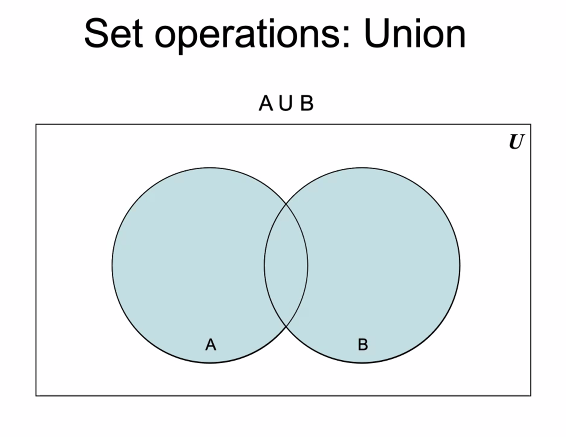
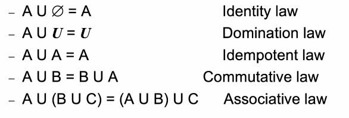
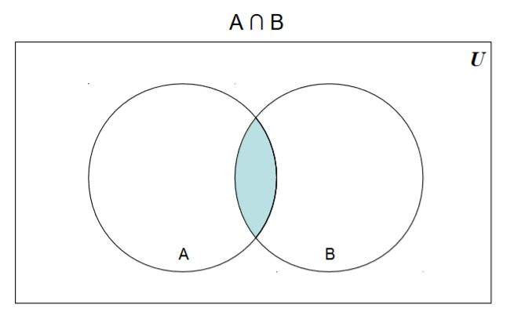
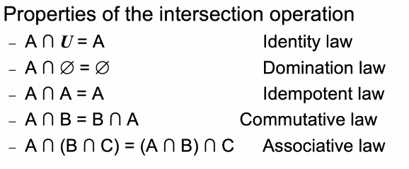
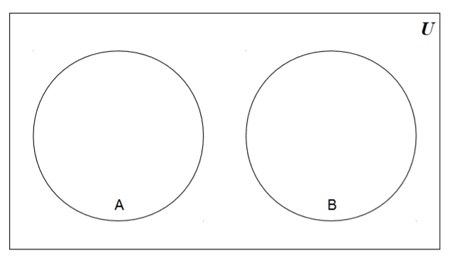
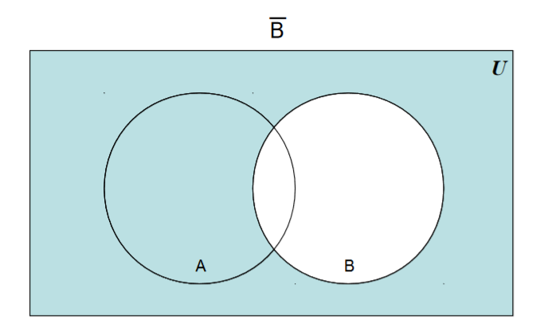
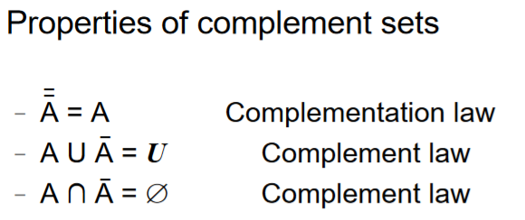

# Sets cont.
January 27, 2022

### To review:
Sets are a collection of objects. Duplicates are ignored and order does not matter. Sets can be explicitly listed or by using set-builder notation. Sets can also be graphically represented using Venn diagrams.

Sets can contain other sets, as well as the empty set. Two sets are equal if and only if they contain exactly the same elements.

## Tuples
A point in space can be denotes by using a set of points (in which case, the order here matters). For a two-dimensional space, the points are listed as $(x, y)$; for 3-d space, $(x, y, z)$. The cartesian product is a set of pairs. Denoted by $A \times B$, it lists all possible ordered pairs (tuples) where each "coordinate" is from a different set.

For example, if $A = \{0, 1, 2\}$ and $B = \{0, 2\}$, then:

$$
B \times A = \{(0,0), (0, 1), (0, 2), (2, 0), (2, 1), (2, 2)\}
$$

Note that $A \times B \not= B \times A$, unless $B = A$, or one or both of the sets are the empty set $\emptyset$. Here, order is very important.

The cardinality of the cartesian product $A \times B$ is equal to the product of the cardinality of $A$ and the cardinality of $B$:

$$
\vert A \times B \vert = \vert A \vert\vert B \vert
$$

This can be proved by listing out each combination in a matrix-like list of $\vert A \vert$ rows and $\vert B \vert$ columns.

## Set Operations
A union of two sets describes all of the elements of both sets. It can be considered analogous to the logical "or:"

Formally, we can define the union using set-builder notation:

$$
A \cup B = \{ x \vert x \in A \text{ or } x \in B \}
$$

The union operation has some defined properties:

Conversely, the intersection operation is only the set of elements which are in both sets. It is analogous to the logical "and:"

This can be defined formally:

$$
A \cap B = \{ x \vert x \in A \text{ and } x \in B \}
$$

Two sets are disjoint if their intersection is the empty set - that is, they have no elements in common. This means that the empty set is disjoint with the empty set, since the intersection is the empty set.

The difference of two sets is the set of elements in one set which are not in the other set. Hence, for two sets $A$ and $B$:

$$
A - B = \{x \vert x \in A \text{ and } x \notin B \}
$$

Complement sets are composed of all elements which are not in a given set, denoted by $\bar{S}$. 

We can thus define a difference by using the complement:

$$
A - B = A \cap \bar{B}
$$

A symmetric difference of sets is the set of elements which are in either set, but NOT in both. It is analagous to the "exclusive-or:"

$$
A \oplus B = \{ x \vert (x \in A \text{ or } x \in B) \text{ and } x \notin A \cap B \} \\
A \oplus B = (A \cup B) - (A \cap B)
$$