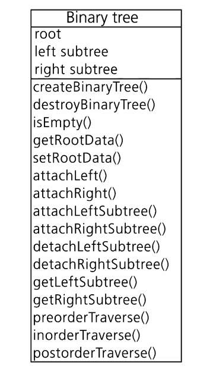
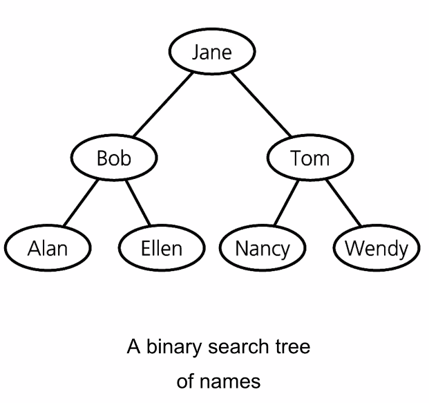

# Trees Part 1
October 6, 2021

We've talked about vectors and arrays, which are designed to grow and shrink, as well as linked lists which are a collection of nodes, linked one by one by pointers. Trees are something of combination of the two.

## Terminology
**Trees** are composed of nodes and edges - a **node** is related to other nodes by **edges**, and these relationships are hierachical. A node can be a **root**, located at the top of the tree. As well, a node can have parents and children, as well as siblings. Parents are closer to the root, children are farther away, and siblings are on the same **level** as the node in consideration. 

Sets of nodes than can be split off from the main tree are called **subtrees**. If a node has no children, it is called a **leaf node**. The **height** of a tree is the number of nodes along the longest path from the root to a leaf.

Trees can be categorized into general trees, which just follow this loose organizational framework described above, and **binary trees**, which contain at most 2 children per node (hence, the binary declaration). Thus, every level from the root grows by a power of 2.

## Binary search trees (BST)
A binary search tree is a binary tree which carries the following properties for each node:
- a node's value is greater than all values in its left subtree
- a node's value is less than all values in its right subtree
- both subtrees of the node are also binary search trees

Hence, all nodes of the subtree on the left side of a given node are smaller than the value of the node, and all nodes in the subtree to the right of the node are greater than the value of the node.

### Insertion 
Insertion into a BST takes three possible cases into consideration: either we have a tree consisting only of a root; we can append a new leaf; or, we can insert into the middle of the tree. Essentially, we iterate through the tree, comparing values and moving to the left subtree or right subtree depending on if the new node is less than or greater than the iterated node.

### Deletion
For a leaf node, deletion is simple: just set the parent node's pointer to the leaf to null. Things get a little tricky when deleting nodes in the middle of a tree, though.

For a node with one child, the parent of the node will "inherit" the children of the node to be deleted. For nodes with two children, we must start substituting nodes. By traversing the left subtree of the node to be deleted, we can find another node which has no right-hand children. We can then copy that node's values over the node to be deleted. The old instance of the copied node can now be deleted.

## Traversals
A binary tree can be travsered, or "explored," in a couple of ways. For instance, if we want to display the data of every node in the tree, we must traverse the entire tree.

- Preorder traversal starts at the root and basically travels "diagonally left" over the tree, visiting the root of a subtree before traversing its edges.
- Inorder travsersal starts at the least-most value (the left-most leaf) and visits the root between moving to another subtree to the right. In a binary search tree, this will display values in ascending order.
- Postorder traversal visits all leaves first before moving up through the tree

## Height
The height of a tree can be calculated by recursive calls of a height() method. If a null pointer is encountered, the method returns 0. Otherwise, it returns 1 plus either height(leftNode) or height(rightNode), whichever is greater.