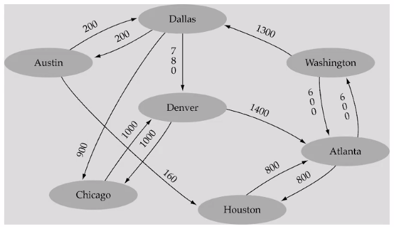
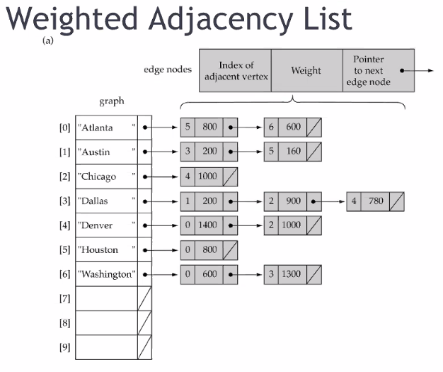
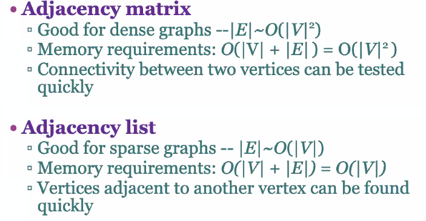

# Introduction to Graphs
November 17, 2021

Graphs are connections of nodes and edges together. In graph terms, we call nodes as "vertices." The edges describe relationships among the vertices. Graph data structures have been used a lot in software engineering, especially in conjunction with hash tables. Examples are social networks - accounts are connected via friend requests or connections.

Formal definition:
G = (V, E)
V(G) is a finite, non-empty set of vertices
E(G) is a set of edges

Vertices i and j are adjacent if (i, j) is an edge in E(G). An edge (i, j) is incident on vertices i and j.

An unidirected edge has no orientation, whereas a directed edge has a pointed direction. An undirected graph consists of all undirected edges, and vice versa. A directed graph is also known as a "digraph."

A complete graph has the maximum number of edges - all vertices are connected to other vertices. The maximum number of edges in an undirected graph is n(n - 1) / 2; for a directed graph, n(n - 1).

Trees (binary trees, BSTs, AVL trees, etc) are just specialized graphs!

A weighted graph has edges which have a value property. This value could be a single dimension (such as the price of a ticket between two destinations) or be more complex (flight time, max capacity of plane, etc. all bundled into a Relation or Edge object).

The degree of a vertex is the number of edges *incident* to that vertex; in-degrees are a quantity of incoming edges (where the vertex is the head), whereas out-degrees are a quantity of outgoing edges (where vertex is the tail). Care must be taken to consider whether an edge is directed or undirected - an undirected edge essentially counts towards both the in-degree and out-degree counts.

A path is a sequence of vertices connected by edges. Formally, a sequence of vertices P = i1, i2, ..., ik is an i1 to ik path in the graph G=(V,E) if and only if the edge (ij, ij+1) exists in the set of edges E(G). A subgraph is any set of vertices in a graph which are connected to each other by edges. A cycle is a path with the same beginning and ending vertex. A path can accumulate weighted edge values (or edge objects).

In graph theory, a connected *undirected* graph that *contains no cycles* is a tree. A **rooted** tree is one where a specific vertex is designated as the "origin." A subgraph of a graph G which contains all the vertices of G and is a tree is called a **spanning tree** of G, with n vertices and n - 1 edges.

## Implementations
Array based implementations involve a simple array to list the vertices, and a two-dimension array (called an adjacency matrix) to represent the edges (see notes for the same concept in MATH262 - Linear Algebra). If there is no connection, a value of zero is usually used.

A linked list implementation can also be used, where an array is still used to maintain individual vertices (by index) and a list is used for each vertex which is adjacent to the individual vertex.

If the graph is dense, where the graph is close to a complete graph, and there are many incident edges, then the adjacency matrix (array implementation) is good to use. However, if there are less than or equal number of edges between vertices, where a graph may be more sparsely distributed, then a adjacency list (linked list implementation) may be more efficient to use. The main consideration here is memory requirements: 

