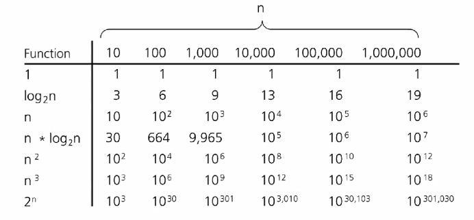

# Introduction to Advanced Data Structures
September 15, 2021

How do we analyze the performance of an algorithm? We can consider time complexity, where the execution time grows as a function of the input (declared as N, the number of elements to be processed). Performance is classified as the number of operations needed - whether it's dependent or independent of input size.

Big O notation gives us an asymptotic limit of the worst case performance for a given N. For instance, finding the maximum element in an array of unsorted elements has a complexity of O(N) - in the worst case, we need to walk through the entire array to find the maximum element. In a sorted array, this can be reduced to O(1) - the maximum element will be at the beginning or the end of the array, depending on the sort method.

Comparison of growth-rate functions:

## Amortized Analysis
Typically, an array is a fixed size. What do we do when we need an array of variable size?

A vector is a dynamically allocated array. The size (number of cells in use) is tracked versus the capacity. If the vector fills up, the capacity of the vector is increased. However, the action of expanding the vector can be expensive - essentially, it's an O(N) time cost every time it needs to grow. Thus, it's preferable to minimize the number of expansions. The amount of growth of the capacity is optimized using **amortized analysis** (for instance, ArrayList doubles the capacity on expansion). In contrast, shrinking an array capacity as the size decreases is not efficient when the size reaches half capacity - what if we shrink to half the previous capacity, then immediately add an element? The cost of expansion and shrinking is O(N) each time. Thus, the "trigger" or event which calls to shrink the array has a different limit than the event which calls to expand the array.

## Linked Lists
Compared to a contiguous allocation of memory like an array, a linked list of a series of nodes can point all over the place in the memory segment. The list always has a head, a pointer which points to the first element of the list. Normally, the end of the list is a null element.

Insertion of an element is inherently faster than an array, which must shift subsequent elements over by one index. Insertion in a linked list simply edits the values of pointer values. Even if we must search the list for a specific spot for insertion, all that is happening is the manipulation of pointer values.

We have different variations of a linked list:
- Singly linked: conventional structure; 'head' pointer is defined, with each subsequent node containing a value and a 'next' pointer.
- Doubly Linked: Similar to singly linked, but each node also has a pointer to the previous node.
- Circular: the 'next' pointer of the end of the list points to the head
- Head & Tail: the end of the list is assigned a pointer