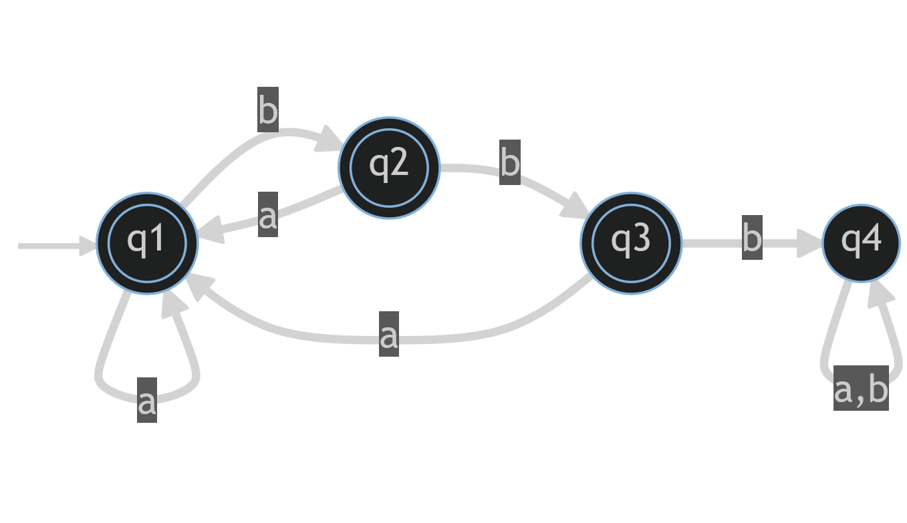
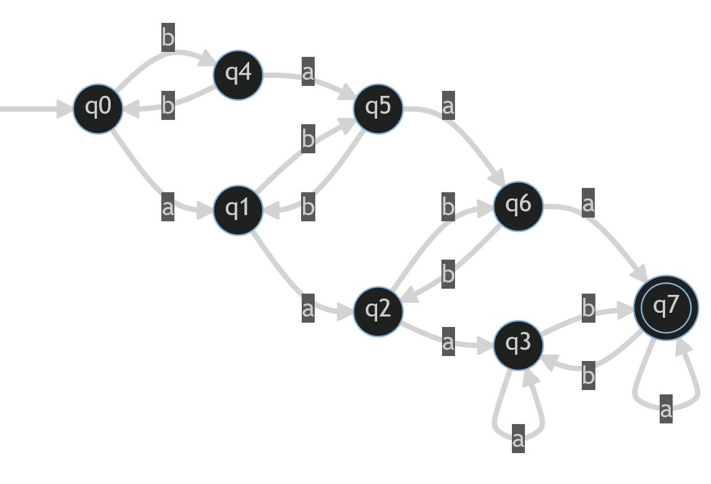

# Homework #1
David McNeary
COMP 310
Section 16578-FA2022
10/20/2022

### Problem 1:
Omitted

### Problem 2:
a.) $\{a^ib^j : i\cdot j \text{ is even}\}$

> $(aa)^*b^* + a^*(bb)^*$

b.) $\{a^ib^j : i\text{ is even or }j\text{ is odd}\}$

> $(aa)^*b^* + a^*b(bb)^*$

c.) $\{a^ib^j : (i\cdot j) \% 2 = 1\}$

> $a(aa)^*b(bb)^*$

d.) $\{w\in \{a, b\}^* : \text{ the first and last letter in } w\text{ are different}\}$

> $(a(a + b)^*b^+) + (b(a + b)^*a^+)$

e.) $\{a^ib^ja^k : i+j \text{ even and }j+k\text{ odd}\}$

> $((aa)^*(bb)^*a(aa)^*) + (a(aa)^*b(bb)^*(aa)^*)$

f.) $\{w\in\{a, b\}^∗ : w \text{ does not contain }3\text{ consecutive }b\text{s}\}$

> 

g.) $\{w\in\{a, b\}^∗ : n_a\% 3=0\}$

> 

h.) $\{w \in \{a, b\}^∗ : w \text{ does not end with }ba\}$

> 

i.) $\{w \in \{a, b\}^∗ : w \text{ contains an odd number of } b \text{s and at least 3 }a\text{s}\}$

> 

j.) $\{w \in \{a, b\}^∗ : \vert w\vert\ge 4\}$

> 

### Problem 3:
#### DFA 1:
Accepted:
- $baaab$
- $abaaaab$
- $abaabbaaaababb$
- $baaaaaaabb$
- $abbaabbaaaabb$

Rejected:
- $aaa$
- $abbaaaba$
- $abab$
- $baab$
- $abba$

This DFA accepts words which end with the substring $baaaa^*b^+$ - that is, words which end with a substring containing 3 or more $a$'s sandwiched between a $b$ on the left and one or more $b$'s on the right.

#### DFA 2:
Accepted: 
- $aba$
- $abb$
- $ba$
- $bb$
- $bba$

Rejected: 
- $aabaa$
- $baabaa$
- $aaa$
- $abbab$
- $abab$

This DFA accepts words which end with either $bb$ or $ba$.

#### DFA 3:
Accepted:
- $\lambda$
- $aabb$
- $abab$
- $aabbaababa$
- $babababa$
- $bbaabababbaa$

Rejected:
- $aba$
- $ba$
- $babab$
- $bbaabbaaa$
- $a$

This DFA accepts words with even numbers of $a$'s and even numbers of $b$'s, consecutive or not.

### Problem 4:
#### NFA 1:
Accepted: 
- $b$
- $bab$
- $babab$
- $baaabaabababbbb$
- $bbbbbbbb$

Rejected:
- $a$
- $baba$
- $bbbbba$
- $babbbbba$
- $baaaaaaaba$

This NFA accepts all words which end in $b$.

### Problem 5:
#### NFA 1:

#### NFA 2:
