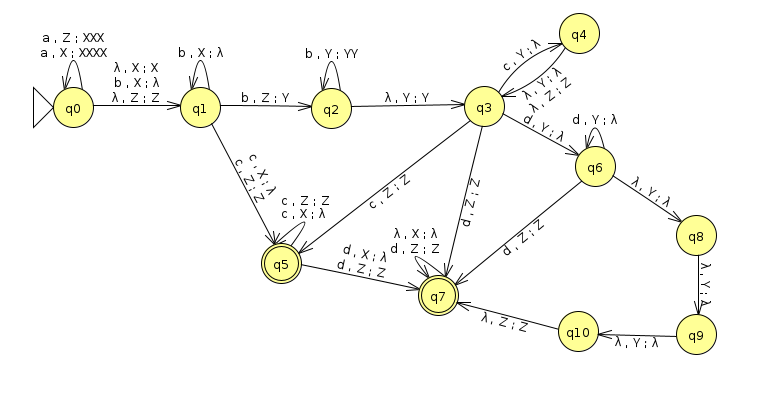

# Homework #2
David McNeary
COMP 310
Section 16578-FA2022
12/12/2022

## CFGs
1. $\{a^ib^jc^k : i+j=2k \}$

$$
\begin{align*}
S &\rightarrow aScc \space\vert\space  A \space\vert\space \lambda \\
A &\rightarrow bAcc \space\vert\space \lambda
\end{align*}
$$

2. $\{w\in \{a,b\}^*: w\text{ contains } abaab\}$ 

$$
\begin{align*}
S &\rightarrow AabaabA \\
A &\rightarrow aA \space\vert\space bA \space\vert\space \lambda
\end{align*}
$$

3. $\{a^ib^j:2i\lt j+2\lt 3i\}$

$$
\begin{align*}
S &\rightarrow aaAbbb \\
A &\rightarrow aAbb \space\vert\space aAbbb \space\vert\space \lambda
\end{align*}
$$
## NPDAs
4. $\{a^ib^jc^kd^l:3i+2k\gt j-l-3\}$
> 

5. $\{w\in \{a,b,c\}^*:2n_a+3n_b=n_c+2\}$

## Reductions
6. Useless (unreachable or non-terminating) productions are crossed out:
$$
\begin{align*}
S &\rightarrow \xcancel{CaBF} \space\vert\space AA \space\vert\space \xcancel{EAB} \\
A &\rightarrow \xcancel{CaE} \space\vert\space \xcancel{CabE} \space\vert\space aB \\
B &\rightarrow DbDb \space\vert\space aA \space\vert\space aS \space\vert\space a \\
C &\rightarrow \xcancel{AaA \space\vert\space BbB \space\vert\space a \space\vert\space b} \\
D &\rightarrow AA \space\vert\space SS \space\vert\space a \\
E &\rightarrow \xcancel{EE \space\vert\space Fa \space\vert\space AaBF} \\
F &\rightarrow \xcancel{Ea \space\vert\space Fa \space\vert\space EF}
\end{align*}
$$
Because productions $E$ and $F$ do not include any terminating variables and mostly recurse either between or upon themselves, any production which uses $E$ and $F$ variables is non-terminating and can be eliminated.

7. 

$$
\begin{align*}
S &\rightarrow Aa \space\vert\space aA \space\vert\space Bb \space\vert\space bB \space\vert\space a \space\vert\space b \\
A &\rightarrow Sa \space\vert\space B \space\vert\space aS \\
B &\rightarrow B \space\vert\space Ba \space\vert\space aB \space\vert\space Ca \space\vert\space a \\
C &\rightarrow A \space\vert\space AA \space\vert\space B \space\vert\space AB \space\vert\space BA \space\vert\space a \\
\end{align*}
$$
8.
$$
\begin{align*}
S &\rightarrow SS \space\vert\space Aa \space\vert\space aAA \space\vert\space Sa \space\vert\space AaS \space\vert\space ab  \\
A &\rightarrow AA \space\vert\space bA \space\vert\space b \\
\end{align*}
$$
## Chomsky Normal Form
9.
$$
\begin{align*}
C &\rightarrow BB | AF | NE \\
S &\rightarrow BB | AF | NE \\
A &\rightarrow BI | AJ | OG \\
B &\rightarrow OO | O | OM \\
D &\rightarrow NO \\
E &\rightarrow SD \\
F &\rightarrow OO \\
G &\rightarrow ND \\
H &\rightarrow BB \\
I &\rightarrow AH \\
J &\rightarrow NA \\
K &\rightarrow BN \\
L &\rightarrow NK \\
M &\rightarrow AL \\
N &\rightarrow a \\
O &\rightarrow b \\
\end{align*}
$$
## CYK Algorithm
10.
$abaaba$:
a | b | a | a | b | a
--- | --- | --- | --- | --- | --- 
S, A | B, C | S, A | S, A | B, C | S, A
null | B, E | S, A, D, E | null | B, E| 
D | S, B, E | null | D| | 
S, A, C, D | A, C | C, D| | | 
S, B, D, E | S, A, B, C, E| | | | 
S, A, B, C, D, E, C| | | | | 

$aaba$:
a | a | b | a 
--- | --- | --- | ---
S, A | S, A | B, C | S, A
S, A, D, E | null | B, E
null | D
C, D |

$baab$:
b | a | a | b
--- | --- | --- | ---
B, C | S, A | S, A | B, C
B, E | S, A, D, E | null
S, B, E | null
A, C |

## Proofs of non-CF
11. $\{w\in\{a^i, b^j, c^k\}^*:i=2j=3k\}$

Let $w = a^p b^{p/2} c^{p/3}$ be a string in the language of length at least $p$. We can write $w = xyz$ where $x = a^p$, $y = b^{p/2}$, and $z = c^{p/3}$.

Now let's consider the string $xy^2z = a^p (b^{p/2})^2 c^{p/3}$. This string is not in the language because it violates the condition $i=2j=3k$. Therefore, the language is not context-free by the pumping lemma.

12. $\{a^{n!}\}$

Let $w = a^{p!}$ be a string in the language of length at least $p$. We can write $w = xyz$ where $x = a^k$, $y = a^l$, and $z = a^{p!-k-l}$ for some $k,l$ such that $0 \le k,l \le p$ and $k+l \le p$.

Now let's consider the string $xy^2z = a^k (a^l)^2 a^{p!-k-l}$. This string is not in the language because it has fewer than $p!$ $a$'s. Therefore, the language is not context-free by the pumping lemma.