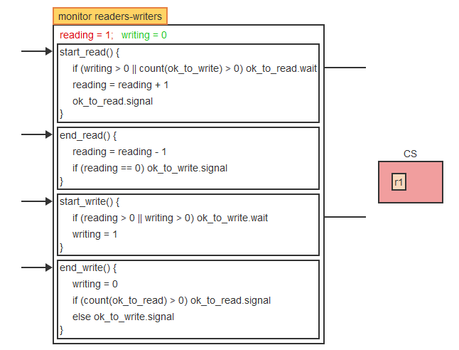
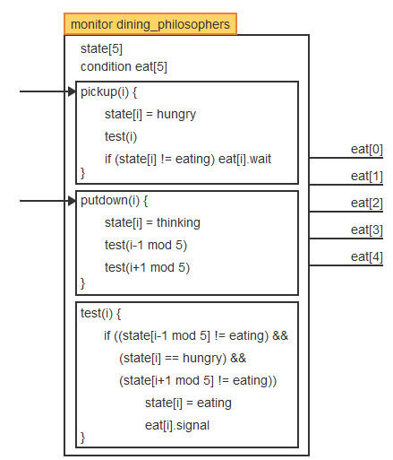
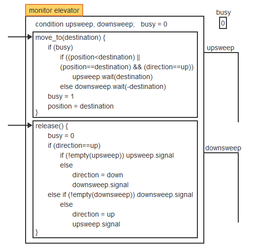

# Semaphores cont.
February 22, 2022

## Implementing Semaphores in Hardware
Most modern architectures offer efficient solutions to implementing the semaphore design. This is performed using specialized instructions.

A **test-and-set instruction (TS)** copies a variable into a register and sets it to zero. This is performed in a single machine cycle. The instruction is usually in the form of TS(R, x) where R is the register and x is the memory address of the variable. TS allows for easy implementation of a **lock,** which is a synchronization "barrier" through which only one process may pass at a time. The key is to remember that TS always copies the value of x into the register R, *then* sets x to 0.

A **binary semaphore** is just a 0 or 1 value, eliminating the need for consideration of possible integers in the TS instruction. <code>Vb(sb)</code> and <code>Pb(sb)</code> are the operations which set the semaphore to its desired value. **Busy-waiting** is the re-occurance of a while loop when a process is waiting for a change in conditions. CPU resources are consumed even when a process is waiting, since it is still executing <code>while</code> instructions, so implementing <code>Pb(sb)</code> using TS can be wasteful.

Consider a single process *p* which normally accomplishes executing a critical section in *q* quantum units. However, with an additional *n* concurrent processes which time-share the CPU, each process will run for one unit of time during busy-waiting, thus the execution of *p* is increased to *nq* total time units.

A general semaphore may be implemented using a a regular integer together with a binary semaphore and increment/decrement operations for both. When the value of the integer is greater than zero, it indicates the value of the semaphore. When it is less than zero, it represents the size of a waiting list of processes which are blocked on the semaphore. To avoid busy-waiting scenarios, processes will block themselves by placing a resource request on the negative integer, calling the increment as they are granted the request; processes are unblocked one at a time as the variable is incrementes back towards zero.

## Monitors
Semaphore operations are often low-level primitives and are therefore hard to debug. Therefore, **monitors** are implemented as high-level primitives to encapsulate access to the semaphore operations and their data. Essentially, processes are stacked into a queue when the semaphore is closed, and popped off the queue when the semaphore is open. The queueing of processes and the control of semaphore variables are controlled completely by the monitor. Monitors may instead use a priority queue, called a **priority wait,** to specify importance rather than using the FIFO behavior of a queue. Additionally, the monitor will have a high-priority queue, called an urgent queue, which grants important processes permission to skip the line in the waiting list.

Monitors are implemented using semaphores and counters. A mutex semaphore is initialized to 1 to enforce mutual exclusion. Two binary semaphores are initialized to 0 and used to allow a process to block on the condition variable and be added to the waiting list, as well as to block a process executing a signal operation in order to facilitate the urgent queue. Counters track the number of processes blocked on each semaphore.

## Classic Synchronization Problems
### Readers and Writers
Two types of processes, readers and writers, are in competition to access a common resource. Readers can enter the CS and access the resource at the same time, but only one writer can access theresource at a time. Thus, this problem must maximize the number of readers who are able to access concurrently while ensuring that blocked processes do not starve. A reader may enter the CS to join other readers only when there is no writer waiting; as well, readers who are waiting for a writer to exit the CS must be allowed to enter the CS before the next writer enters.

A monitor may be used to solve this problem. It is implemented with 4 functions, with reading and writing each having 2 functions to start or end the activity. Two counters keep track of the currrent number of readers and writers in the CS. Two condition variables are used for blocking readers and writers. A counter function is used to compute the length of each condition queue, indicating the number of processes blocked on that condition.

### Dining Philosophers
This scenario represents a situation where multiple processes, all of which rely on more than one resource, compete for shared resources. To avoid deadlock, resources must be managed effectively.

Five "philosophers" are seated around a table, on which five "forks" are arranged. Philosophers go between "thinking" and "eating" states asynchronously - when thinking, the philosopher does not require forks, but before eating the two forks between the philosopher and their adjacent philosophers are acquired. Thus, the solution must guarantee that any non-adjacent philosopher to an eating philosopher may also eat.

A monitor may be implemented to simply the problem, removing forks from consideration by implied availability. Philosophers may be in one of three states: thinking, hungry, or eating. Thinking requires no forks, hungry is the state where a philosopher is blocked on one or both required forks, and eating is when the philosopher is holding both forks.  While attempting to transition from thinking to eating, a function checks to see if philosophers adjacent to the transitioning philosopher are currently eating. Thus, deadlock is avoided because forks are not acquired one at a time; both forks must be available to make the transition.

### Elevator Algorithm
A disk is constructed of concentric tracks, which are accessed by read/write requests in an arbitrary order. The goal is to minimize travel between the tracks, while preventing starvation of reading/writing processes. An "elevator" may represent the read/write head of the disk, which moves between "floors" representing the data tracks. The elevator remains in constant motion, moving in a direction to reach the highest or lowest floor requested before changing direction and servicing all floors currently requested.

