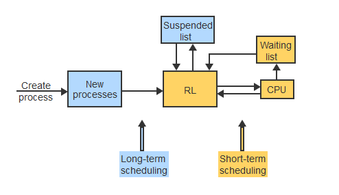

# Scheduling
February 8, 2022

There must be a way for the OS to manage multiple processes requesting access for CPU power. Scheduling is a way to organize this competition.

## Principles of Scheduling
**Long-term scheduling** decides when a process should enter the ready state (or rather, get added to the ready list) and queue up for their turn at the CPU. Processes are subject to long-term scheduling when they are entering the ready list from a new state or a suspended state. **Short-term scheduling** decides which of the ready processes should run on the CPU next. Processes entering the ready list from the running state or the blocked state are therefore handled by short-term scheduling.

A **non-preemptive** scheduling algorithm makes decisions only when a halt occurs, and allows a running process to run until either work is completed, or a block or error is encountered. **Preemptive** scheduling algorithms split time at the CPU more "fairly," and will decide to interrupt execution of one process so that another process with higher priority may have its turn, occuring whenever:
- a new process enters the ready list
- a blocked or suspended process re-enters the ready list
- a process has run out its allowed CPU time before the OS switches to another process

The **priority** of a process (or thread) is a numeric value to represent its importance. It may ne a constant value, or can be dynamic depending on a number of parameters such as time of arrival, attained CPU time, lifecycle time in system, deadlines, etc. An **arbitration rule** must be in place to break a tie when two processes have the same priority. Short-term scheduling is the most obvious paradigm to consider priority, but it also comes into consideration during long-term scheduling, but occurs much less frequently and thus, some parameters utilize a different scale of time units.

## Scheduling Repetitive Processes
A long-running and repetitive task which does not require input or intervention from the user is called a **batch process.** In early days of computing, batch processing referred to the submission of multiple jobs or computations to be executed automatically.

### Batch Process Scheduling Algorithms
**First-in, first-out (FIFO)** refers to the "queue" model and schedules processes strictly according to their arrival time. FIFO is non-preemptive and multiple processes arriving at the same time are simply handled by the arbitration rule(s).

The **Shortest Job First (SJF)** algorithm scheduled processes according to their total CPU time requirements *at the time of their arrival*. Thus, processes waiting in line with shorter CPU occupation durations are given higher priority. Note that the algorithm can only schedule a process if it is already waiting for CPU time - otherwise, the CPU will readily take on whatever job that is offered.

The **Shortest Remaining Time (SRT)** algorithm takes into account the remaining CPU time needed for each process to complete its work, and schedules priority accordingly. As with other algorithms above, if multiple processes happen to have exactly the same remaining CPU time to finish, an arbitration rule can settle the tiebreaker. *SRT is the preemptive version of SJF.*