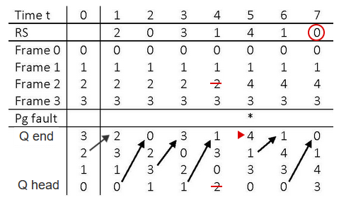

# Page Replacement Algorithms
March 5, 2022

Physical memory has a fixed capacity, and thus a fixed number of page frames. When a page fault occurs and no free frame is available, one approach is to choose a page at random and replace it. A **reference string** is the sequence of page numbers referenced by a program executing over an interval of time. They are used to compare page replacement algorithms, by counting the number of page faults.

The **optimal page replacement algorithm** will always choose to a page which will not be referenced for the longest time in the future. This is a lofty goal, since replacement depends on future references and is not known at runtime. This concept does, though, give an ability to define a lower bound for the number of page faults for use in comparing with other algorithms.

## FIFO Page Replacement
Just as with all other uses of the FIFO acronym, the algorithm selects the page which has been in RAM for the longest time. Whoever is the oldest, no matter how often it is referenced, is kicked out when a page fault occurs. A single pointer is updated to designate the oldest page in memory. Because execution of instructions is sequential by majority (branch instructions usually constitute a small part of a program), the likelihood of needing to reference an old page diminishes as time passes. 

## LRU Page Replacement
The **least-recently-used** algorithm selects the page which has not been referenced for the longest time. This requires a queue of length n, where n is the total number of memory frames. The queue contains the numbers of all resident pages. Whenever a page is referenced, it is moved to the back of the queue. Thus, the queue is always sorted from most recently used to least recently used. When a page fault occurs, a page replacement is perfomed on the page frame at the head of the queue. Thus, there is built-in overhead as the queue is updated each time interval.

## LRU Approximations
The overhead of an updated queue every time interval can be mitigated, using one or a combination of several algorithms.

The **aging page replacement** algorithm uses an **aging register** and **referenced bits (r-bits)** to track groups of recently used pages over a period of consecutive references. The register is shifted right periodically to discard the least-significant bit. For example, with the update period set to 50 consecutive references, a 4-bit aging register of 0100 indicates that the page associated with the register had been accessed during the previous period but not yet during the current period. A register value of 0000 indicates that the page has not been referenced in 200 reference intervals. The algorithm operates accordingly at the start of each period:
1. Shift all aging registers right
2. Copy r-bits for the last period into the most-significant bits of each register
3. Reset r-bits to 0

When a page fault occurs, the page with the smallest aging register value is chosen for replacement. If multiple pages have the same register value, one is chosen at random.

**Second-chance** and **third-chance** replacement algorithms refine the primitive aging page replacement algorithm <-- need to finish this section

## Variable Frame Capacity
When a program is executing, there is a number of frames which need to reside in memory to keep the program running smoothly. Otherwise, too many page faults occur and processes spend too much time moving pages around. The **optimal working set** is the minimum set of pages which will be referenced frequently or in the immediate future, and thus should remain in memory. When programs are written using long loops and static data structures, the set contains a small number of repeated page numbers. When branching is frequent or data structures are dynamic, there may be many page numbers in the set. <-- need to finish this section

## Virtual Memory Efficiency
need to finish this section