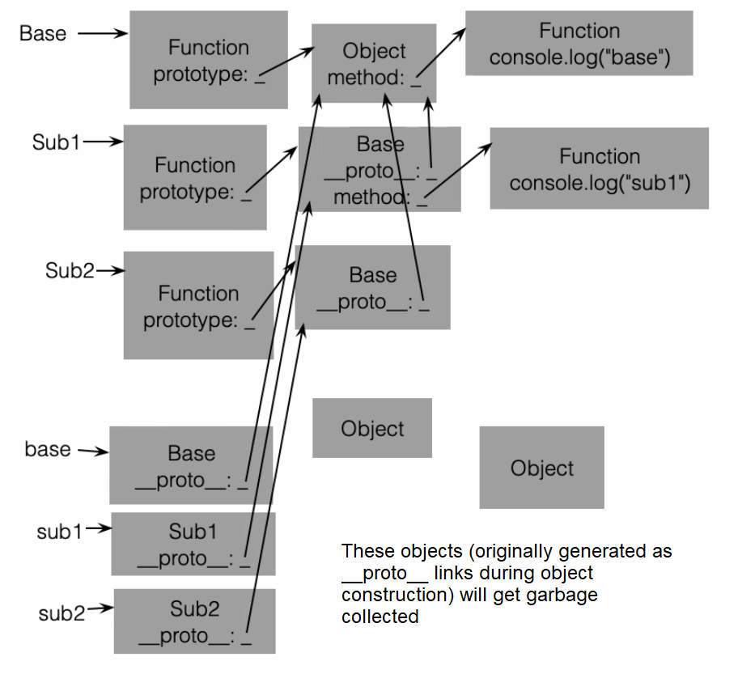

# Prototype-based Inheritance cont.
August 2, 2022

## JS Prototypes
Rather than explicitly defining a prototype that an object will inherit from, we can instead explicitly assign methods on the object prototype:

```javascript
function Rectangle(inputWidth, inputHeight) {
	this.width = inputWidth;
	this.height = inputHeight;
}

Rectangle.prototype.getArea = function() {
	return this.width * this.height;
}
```

The order of these expressions does not matter - the prototype can be assigned first if desired.

Behind the scenes, this creates an empty object and assigns a function to the `getArea` property. The `Rectangle` prototype field then points to this object.

## Exercises
1. Consider the JavaScript code below:
```javascript
function Base() {}  
function Sub1() {}  
function Sub2() {}  
// <<some additional code>>  
let base = new Base();  
let sub1 = new Sub1();  
let sub2 = new Sub2();  
base.method(); // prints "base"  
sub1.method(); // prints "sub1"  
sub2.method(); // prints "base"  
console.log(base instanceof Base); // prints "true"  
console.log(sub1 instanceof Base); // prints "true"  
console.log(sub2 instanceof Base); // prints "true"
```
Code is missing where ``<<some additional code>>`` is. Write what this missing code must be below:
```javascript
Base.prototype.method = function () {  
	console.log("base");  
}  
Sub1.prototype = new Base();  
Sub1.prototype.method = function () {  
	console.log("sub1");  
}  
Sub2.prototype = new Base();
```

