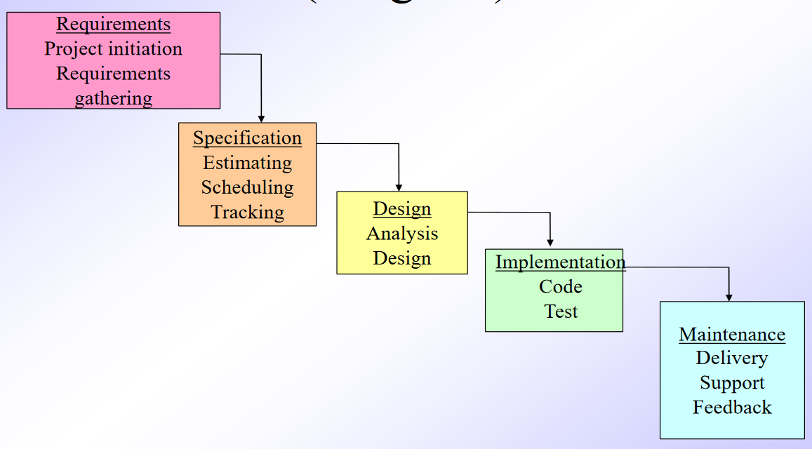
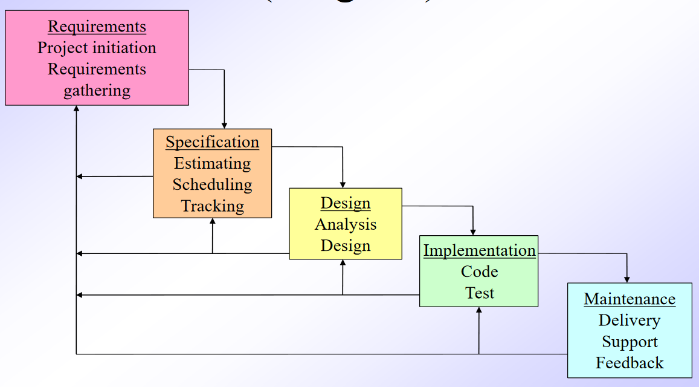
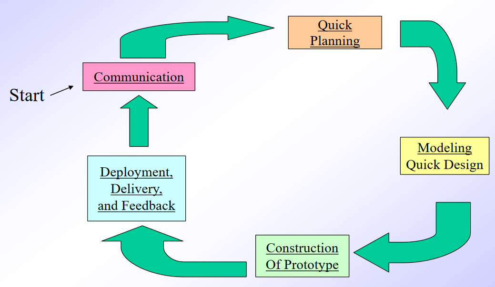
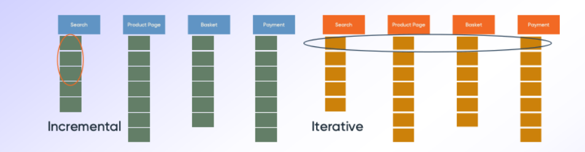
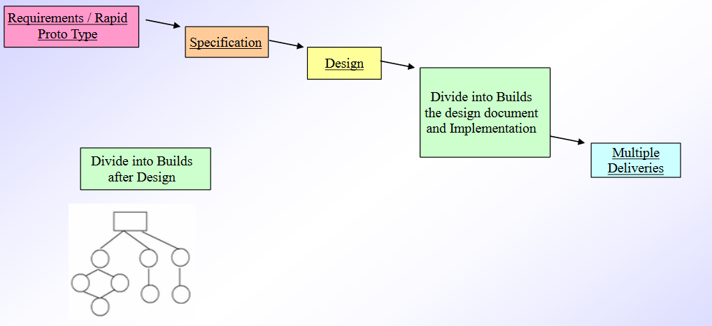
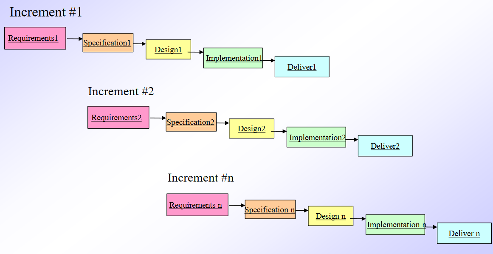
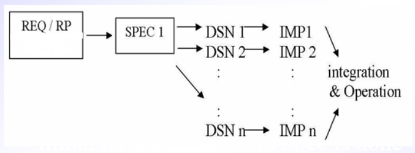
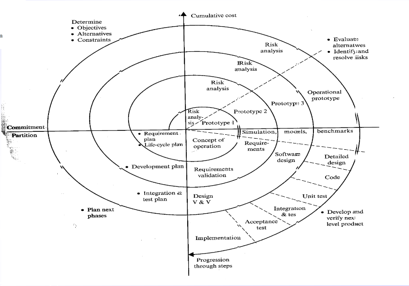
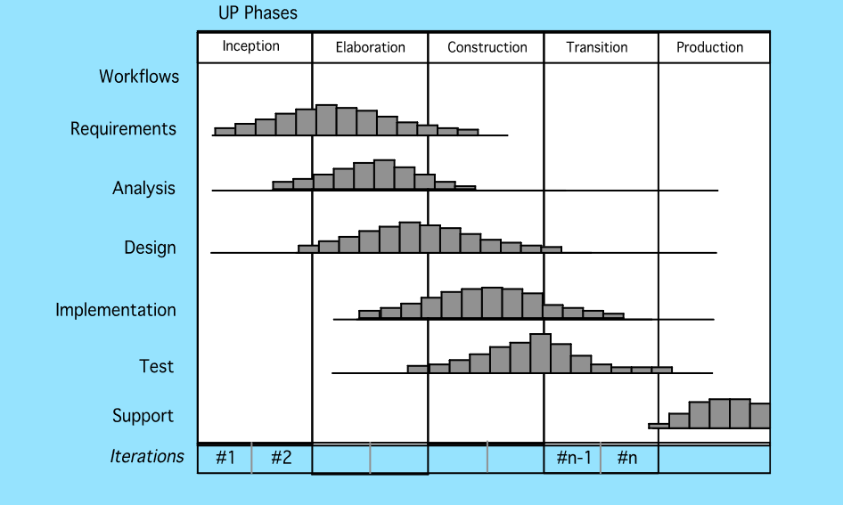
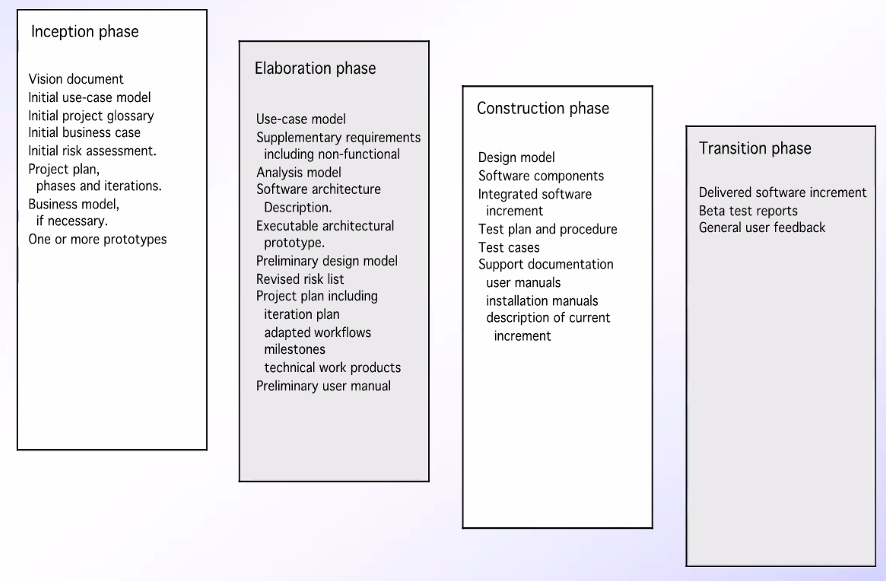

# Process Models
January 31, 2022

Process models are a methodology to completing a process flow. A balance must be sought between rigid order and structure, and flexibility and "creative chaos."

The following are widely used examples of process models:
- Waterfall
- Rapid Prototype
- Incremental
- Spiral
- Unified Process (Object-oriented)
- Agile

## Waterfall
The Waterfall model is a linear approach, and is the oldest lifecycle model, as well as the best understood by older upper management. It is most often used when requirements are well defined and understood, and risk factors are low. Each step produces a documentation, and each documentation is verified.

The Waterfall model doesn't support iteration, so changes can introduce confusion to the process. As well, it can be difficult for customers to fully state all requirements before work can begin. If changes are needed, or if a requirement has been left out by mistake, the introduction of feedback loops can help to catch these problems. A working version of the software is rarely ready for evaluation until the last phase of the model.

## Rapid Prototyping
When requirements are evolving, or not completely understood from the start, then feedback can be used to identify explicit requirements. This is known as rapid prototyping, where focus is on those aspects of the software that are visible to the customer/user, and details such as error handling, databases, etc. are not necessarily apparent.

Potential failures include the tendency of the client to take a prototype as a "working version" before the product is fully implemented. As well, developers will often make compromises in design decisions, such as language choice, algorithm usage, or frameworks, to get the prototype presented as soon as possible. In most circumstances, the model is used as a "proof of concept" and the production software uses little to no parts of the rapid prototype. Gordon and Bieman performed a study of 39 rapid prototype projects, with results of 33 successes, 3 failures, and 3 unknown results.

## Incremental
Incremental development divides the product, based on requirements, into fully working slices that are called increments. Each new increment builds on top of the existing released functionality. For example, an e-commerce website might be released featuring search, product info, a shopping basket, and a checkout process. The second incremental release may add a favorites feature. A third release might add customer reviews.

Iterative development is when teams gradually build up the features and functions, but don’t wait until each of these is complete before releasing. They release a basic version of each feature and the add to that feature in subsequent iterative releases, usually based on feedback from the basic version released.

There are a few different approaches to incremental models:
- Rapid Application Development, where the product is constructed in stages after design is analyzed
- Concurrent Development, where multiple incremental developments are happening in parallel and released separately
- Synchonize and Stabilize, where parallel development is synchonized at the end of the day

## Spiral
Invented by Dr. Barry Boehm in 1988, this model follows an evolutionary approach similar to the incremental approach. However, as the spiral moves out from the starting steps at the center, the approach becomes more linear. As a risk-driven model, a go/no-go decision occurs after each complete spiral in order to react to risk determinations. This requires considerable expertise in risk assessment, but serves as a realistic model for large-scale software development.

---

In general, evolutionary approaches suffer similar weaknesses across the board. Prototyping creates a problem in planning stages because the iterations required to reach the desired product are unknown. If evolutionary speed is not well-defined in the model, the project can quickly fall apart, or fall behind schedule. As a rule, evolutionary processes focus more on flexibility and moudularity, and less on pristine quality.

## Unified Process
UP is driven by "use cases," in which scenarios are developed by how the product will be used in the real world. It is closely aligned with the object-oriented programming paradigm and often uses Unified Modeling Language (UML) to describe the design of the system. It was first seen during the late 1980's and early 1990s when object-oriented languages were gaining wide-spread use. Early authors of the process include Grady Booch, Ivar Jacobson, and James Rumbaugh, including the development of UML, which became an industry standard in 1997. UP consists of five phases: inception, elaboration, construction, transition, and production.

### Inception
Encompasses both customer communication and planning activities of the generic sofware process, when business requirements for the software are identified. A rough architecture for the system is proposed and a plan may be created for an incremental, iterative development. Fundamental business requirements are described through preliminary use cases.

### Elaboration
Overlapping with the inception phase, use cases are refined and expanded. Modeling can begin by expanding the architectural details of the project:
- Use-case models
- Analysis models
- Design models
- Implementation models
- Deployment models

This often results in a "baseline" executable system, which demonstrates viability but still lacks fully-fledged fucntionality.

### Construction
Use cases are used to develop acceptance tests, which are used to drive development and implementation. Components can be written or acquired in order to meet use case requirements. Analysis and design models from the elaboration phase are completed to reflect the
final version of the increment.

### Transition
Covering the last part of the construction phase, as well as the first part of the production phase, software is given to end users for beta testing and user feedback reports on defects and necessary changes. Documentation is created, such as installation procedures and user manuals. After this step, the software should be ready for production.

### Production
The software is evaluated in real-world use. Support for the operating infrastructure is developed, and defects are identified. As well, feedback in analyzed and evaluated for future development possibilities.

