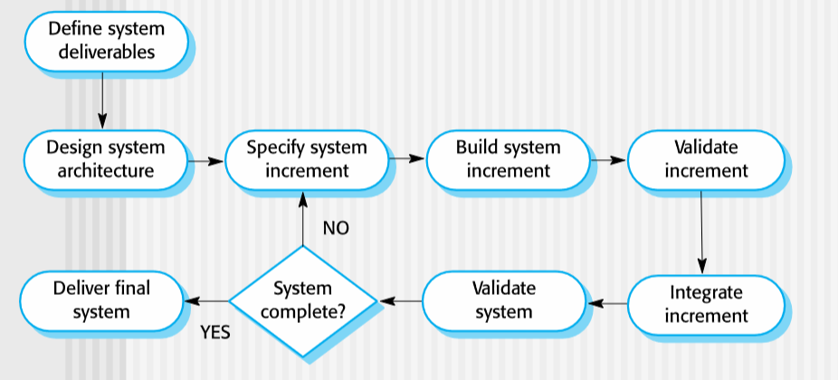

# RAD and Agile Methods
February 2, 2022

## The need for RAD
Successful product developmetn often depends on getting to market as quickly as possible. Sacrifices to a rigid process model must be made to increase agility.

Rapid Application Development was an early buzzword which entailed defining requirements, designs, and implementation concurrently, and the overall system is developed as a series of increments, ideally with end users providing feedback along the way. User interfaces may be built using an automated IDE tool.

Advantages include accleration of the delivery of essential functionality, as well as user engagement with the process. Problems include management issues (judging progress, documentation, business contracts) as well as validation and maintenance issues. An alternative augmented incremental approach involves prototyping, which is development of a rudimentary system in order to develop overall system requirements.

## Agile
Agile arose as a methodology out of early RAD methods, as well as out of the overheads involved with Waterfall. It is based on an iterative approach, focusing on code implementation over design and documentation. It is meant to deliver a working piece of software quickly, and to evolve quickly to meet changing requirements. Communication remains, as with many RAD-based processes, a hurdle to consider as developers may be stepping on each others toes. The **Agile Manifesto** was written in 2001, when 17 software developers met to discuss methodologies:

> “We are uncovering better ways of developing software by doing it and helping others do it. Through this work we have come to value:
>- Individuals and interactions over processes and tools
>- Working software over comprehensive documentation
>- Customer collaboration over contract negotiation
>- Responding to change over following a plan
>
>That is, while there is value in the items on the right, we value the items on the left more.”
&mdash; <cite>Kent Beck et al</cite>

Agility can be defined as efficiency, but also involves organization and communication. That is, development must not only respond and adapt to changes quickly, but also draw the client into the development process, communicating effectively with their needs and keeping the team in control of the work performed. Thus, an Agile process:
- Is driven by customer descriptions of requirements (scenarios)
- Recognizes that plans are short-lived
- Develops software iteratively with a heavy emphasis on construction activities
- Delivers multiple ‘software increments’
- Adapts as changes occur

Problems possible with Agile development include customer involvement (or rather, lack of - the client must be willing to participate), figuring out how to prioritize changes among multiple stakeholders, personality contracts, and contractual issues (the lack of a specific set of requirements can prove tricky if disputes occur, particularly legally).

### Agility Principles
1. The highest priority is to satisfy the customer through early and continuous delivery of valuable software.
2. Welcome changing requirements, even late in development. Agile processes harness change for the customer's competitive advantage. 
3. Deliver working software frequently, from a couple of weeks to a couple of months, with a preference to the shorter timescale. 
4. Business people and developers must work together daily throughout the project.  
5. Build projects around motivated individuals. Give them the environment and support they need, and trust them to get the job done. 
6. The most efficient and effective method of conveying information to and within a development team is face–to–face conversation.
7. Working software is the primary measure of progress. 
8. Agile processes promote sustainable development. The sponsors, developers, and users should be able to maintain a constant pace indefinitely.  
9. Continuous attention to technical excellence and good design enhances agility.  
10. Simplicity – the art of maximizing the amount of work not done – is essential.  
11. The best architectures, requirements, and designs emerge from self–organizing teams. 
12. At regular intervals, the team reflects on how to become more effective, then tunes and adjusts its behavior accordingly.

In summary, Agile is well-suited for small/medium systems and software, but large-scale or "mission-critical" software often requires the rigidity provided by linear models. Indeed, the rise in popularity of Agile coincided with the development of the mobile app environment, and proved to be effective in delivering new apps quickly.