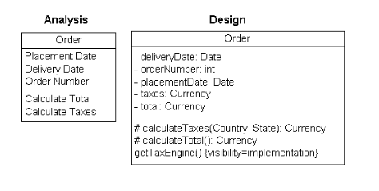

# UML Diagrams
February 21, 2022

Unified Modeling Language is a general-purpose tool used in software engineering, developed in 1989 by the Object Modeling Group (11 companies, including HP, IBM, Sun Microsystems, Apple, etc).

## Diagram Types
UML consists of structure diagrams and behavior diagrams (as well as interaction diagrams, a subset of behavior). The class diagram is the de facto standard for object-oriented structure diagramming. Other structure diagrams include packages, objects, components, profiles, deployments, and composites. 

Classes describe the types of objects in the system as well as the relationships between them. Each class encapsulates fields, attributes, and operations.  A class in a UML diagram in a rectangle divided into 3 sections: a name in bold, optional attributes, and optional operations. The simplest classes only have a name. Operations can specify return and parameters types.

### Details
UML diagrams can show a wide variety of details, which can be iterated upon and refined. For instance, an analysis stage UML diagram will be initialized but not necessarily refined. Attributes and methods are formalized during the design stage, in order to be a reference during the implementation stage.

