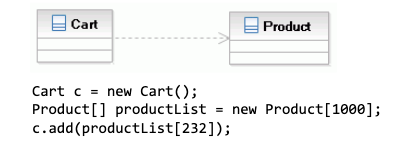
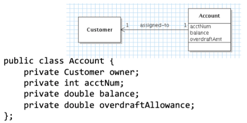

# Object Relations
February 23, 2022

## Relationships
Objects must be able to communicate in order to accomplish tasks. Different types of relationships include (in order of weakest to strongest):

- works-with / depends-on
- has-a
- implements-a
- is-a

The cardinality (one-to-one, one-to-many, etc) is depicted through special labels on the ends of the relationship connectors connecting classes together.

### Dependencies
When one object *might* relies on another to accomplish its assigned task, this creates a dependency. Implementation of a dependency occurs when a class attribute or method is a parameter or local variable of another class. For instance, in an e-commerce application, a Cart object might depend on a Product class when an add(Product item) method is called. It is important to distinguish between an attribute of a class (the Cart's capacity or "fullness") and dependencies (Products "fill" the Cart but are not an attribute of the Cart itself).

Dependencies are depicted in a diagram using a dotted line.

### Association
Stronger than a dependency relationship, an association occurs when an object *will* contain references to another object or its properties. For example, a LinkedList object will be built using Node objects. Note that this does not imply that construction of an associated object is controlled by the user object.

Associations are depicted using a solid line, with an optional label, as well as directional arrows showing navigability of the relation. Most often, this is a bidirectional relationship, and the arrows can be dropped. Multiplicity is also displayed using either characters or special line endings.

In the above example, the customer-account relationship is unidirectional. Thus, the customer doesn't "know" about the account and the customer can only have one account at a time.

### Aggregation and Composition
