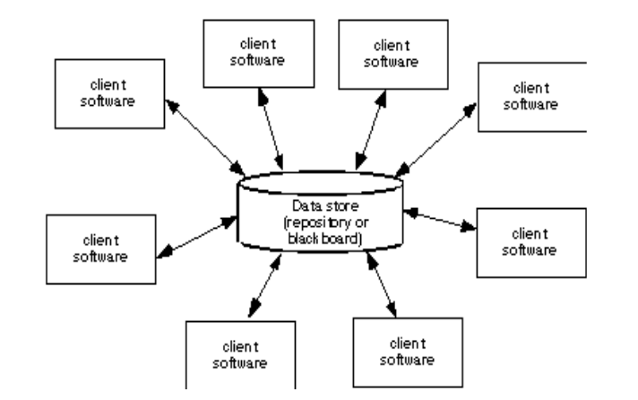
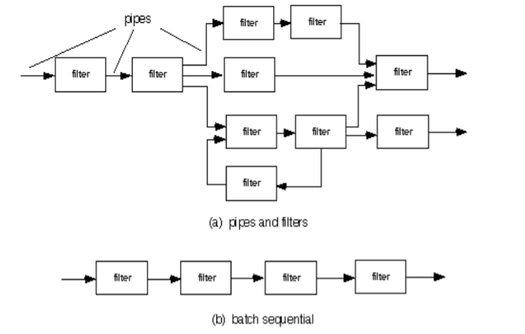
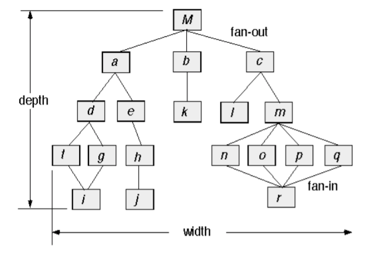
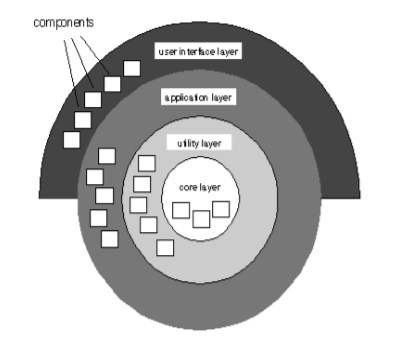

# Design Modeling
February 28, 2022

## Architectural Design
Architectural design looks at the project from a wide perspective. Architecture depends on what kind of application domain the software resides in. This representation of the project allows an engineer to analyze the effectiveness of the design in meeting requirements, reduce risks with constructing the software, and offers an early opportunity to reconfigure the software to another architectural choice if needed. The architecture choice highlights early design decisions and provides an easily understood picture of the structure of the system and its components.

### Genres and Styles
A **genre** is a specific category in the scope of the domain at-large. There can be sub-categories in each category separating genres into smaller blocks called **styles.** Every architectural style describes a category which encompasses components, connectors, constraints, and semantic models.

#### Data-Centered Architecture
This style relies on a central database or repository to provide data, which is passed to the client to be used or processed.

#### Data Flow Architecture
Data travelling between the client and the server undergoes some sort of filtering in its "flow" from place to place. Examples include image editors, encryption, and e-commerce departments.

#### Call-and-return Architecture
A single module will "fan-out" and call to other modules in order to perform a task. This structure is similar to a tree, except that a given layer may share children between its nodes.

#### Layered Architecture
Just as it sounds, this architecture layers aspects of the software like an onion, encapsulating lower-level tasks like disk access or printing farther away from the client-facing UI.

#### Cloud Architecture
A very up-and-coming paradigm, this allows for layers of the system to reside in the same context, more or less. The majority of the system is hosted on someone else's computer, which works better and faster than yours. The client-facing UI layer can therefore be very lightweight, taking computing requirements farther away from the end-user.

### Choosing an Architecture
Typically, a master of software architecture will 

## Cohesion and Coupling
The level of functional independence of individual modules of the system are measured by the cohesiveness of the module's stated purpose or goal, as well as its interaction with other modules. The goal of functional independence is to see high cohesion with low coupling. 

Examples of cohesive structures include:
- Coincidental: a module performs many completely unrealated actions, such as a utility library
-  Logical: the module performs an action in many different ways, in that the result is logically the same but the performance and implementation of each part is different. For example, input/output libraries fall into logical structures.
- Temporal: module acts based on the occurance of an event, or time passed. Examples include exception handlers, which would throw an error, close open files, and write to a log.
- Procedural: A module which performs the same series of tasks everytime it is called to act. For instance, a file system module would read file permissions, then open the file accordingly.
- Communicational/Informational: a series of actions, each with its own entry point, are performed on a single piece of data. An example would be updating a database record.
- Sequential: Output from one part of the module is then processed as input by another part, like an assembly line.
- Functional: Parts of the module are grouped in such a way as to perform a single well-defined task.

---

Coupled components have some measure of interdependence between each other. Overuse of coupling results in less reusable code and increased relaince on side effects, rather than functional returns.

Examples of coupling include:
- Call coupling: an operation invokes another operation
- Type-use coupling: A component uses a data type which is defined in a different component
- Data coupling: arguments to the module as parameters are homogenous data items (like passing a string to a print function)
- Stamp coupling: this occurs when an entire structure is passed to a component, but the component is only manipulating a small part of the structure.
- Control coupling: The control flow of a component is dependent on the logic of another component, such as a boolean function acting as a flag controlling the flow of another function
- Common coupling: Two components access and manipulate the same global resource, such as multiple components writing to a database.
- Content coupling: Code in a component directly references parts of another component (such as a goto instruction)