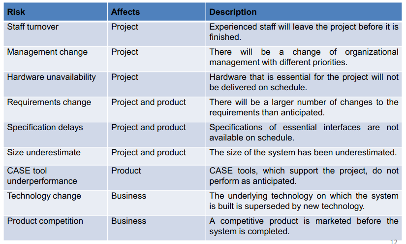
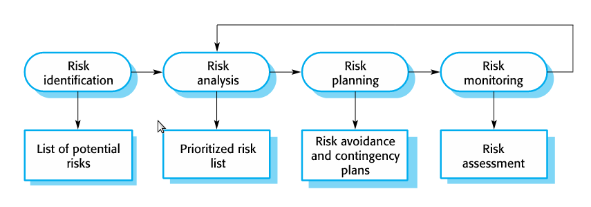
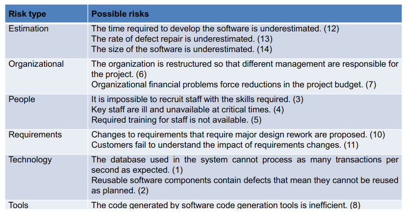
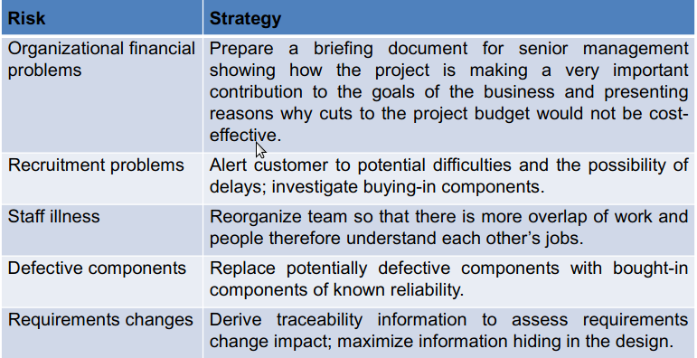

# Project Management
March 16, 2022

Project management in the software context is concerned with making sure that delivery is on-time and in accordance with requirements. Development is always subject to budget and schedule constraints, and it is important that these are acknowledged and adhered to.

Factors which may influence project management decisions include:
- Company size
- Software customers
- Software size and type (application, utility, OS)
- Organizational culture
- Software development process

Project managers perform common tasks to all management postions such as project planning, risk management, and people management.

### Software Management Distinctions
A software product is intangible, and progress cannot be judged by simply looking at the product under construction. New products are usually quite different from old projects, and problems may arise which require new solutions. Software processes are variable and specific to organizational contexts, and there is no "one-size-fits-all" solution.

## Risk Management
Managers must be able to identify potential for risk, and make plans to avoid or minimise their effect on a project. Uncertainties are the main source of risk and can come from evolving or changing stakeholder requirements. Other sources include unavailabilities of resources, and differences in individual skills among the team.

There are normally two dimensions of risk classification: the type, and the scope (area of effect on the project). **Project risks** affect scheduling or resources. **Product risks** affect the quality or performance of the software. **Business risks** affect the organizational entities or stucture.

The risk management process can follow a simple outline:
- Risk identification
- Risk analysis (likelihood and consequences of risks)
- Risk planning (plans to mitigate risk)
- Risk monitoring

### Risk Identification
Risks may be identified by either expertise, or by team-based brainstorming activities. Common risks include:
- technology
- organizations
- people
- requirements
- estimation

### Risk Analysis
The probability and seriousness of each risk must be considered, and prioritized accordingly. Probability may be classified on a frequency spectrum from low to high. Consequences may be categorized as catestrophic, serious, tolerable, or insignificant.

### Risk Planning
After analysis, each risk can be assigned a plan for reducing or eliminating its influence on the product. Strategies include:
- Avoidance, reducing the probability that the risk will occur
- Minimization, reducing the impact of the risk
- Contingency, providing a process to use for if/when the risk occurs

### Risk Monitoring
