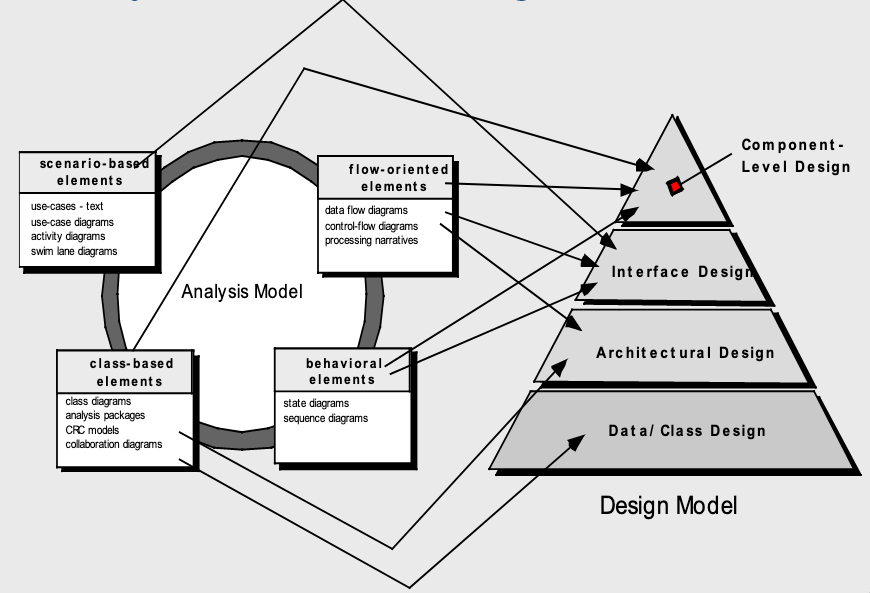
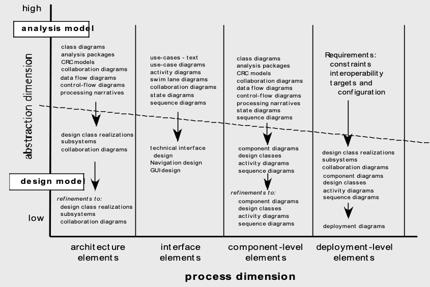

# Design Concepts
March 3, 2022

The design step of software engineering involves a variety of different contexts, some of which have previously been covered:
- Data/Class design, transforming analysis classes into data structures and implementable classes
- Architectural design, which defines relationships between major software elements of the system and its structure
- Interface design, defining how software and hardware communicates with the end-user, and vice-versa
- Component-level design, which focuses on translating structural elements into code

For the class project, class-based elements like CRC models and class diagrams should be sufficient.

## Fundamental Concepts
**Abstracting** the data, procedures, and control structures of the software into reusable code is one of the most important steps to creating a maintainable software product. **Design patterns** can provide proven solutions to design concerns. The separation of concerns between components can also keep the tendency for complexity at bay. As well, the **architectural design** structure of the software must allow for future updates, and in most cases, scalability as the software becomes more and more popular. **Modularity** of the software can break the software into smaller, more maintainable pieces, as well as introducing the possibility for expansion of functionality. More granular modularity can also provide control through **invisibility of data**, encapsulating an attribute into a privately accessible structure and reducing the likelihood of side effects or namespace pollution through global variables. **Functional independence** between modules reduces coupling and lessens the risk of updates to a function affecting another part of the system. Maintenance involves not only additional features, but also **refinement** and **refactoring** of existing components; all of the above concepts will improve ability for the project to evolve as needed.

## Design Model Elements