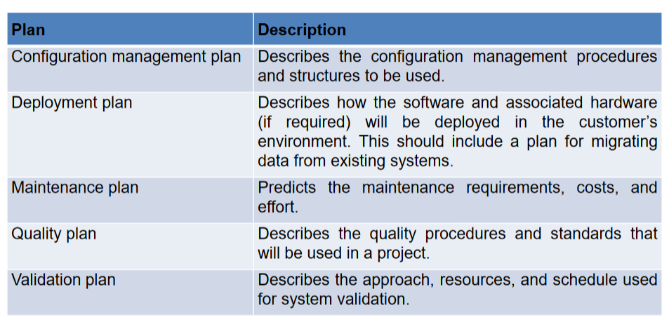
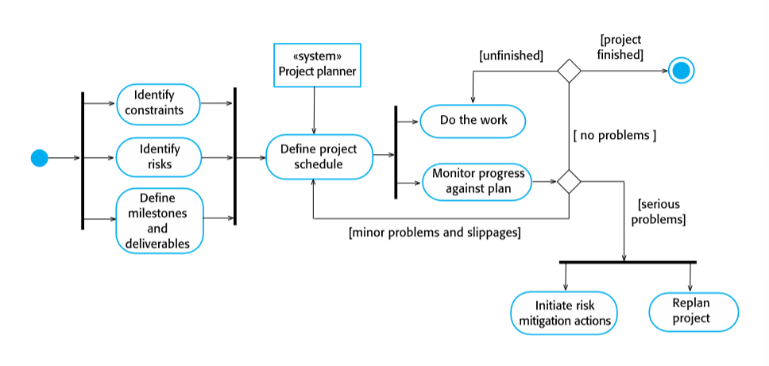
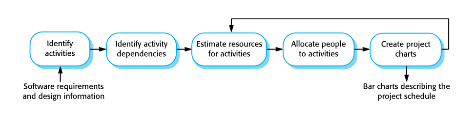
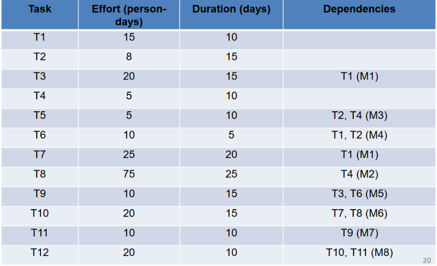
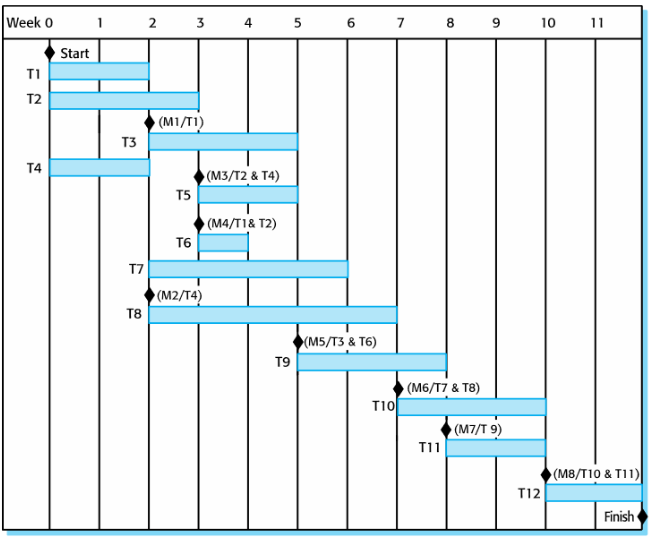
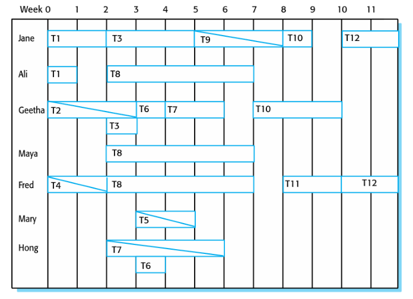

# Project Planning
March 28, 2022

## Plan-driven development
Plan-driven or plan-based development is a traditional method behind managing large-scale projects. It is based on engineering project management techniques. A plan is created that records wrok to be done, who will do it, the schedule, and the work products. Managers are in charge of making decisions and measuring progress, based on adherance to the plan.

Early planning allows organizational risks and issues to be evaluated and dependencies are discovered before the project starts. On the other hand, natural changes to the development environment will require a revision of the plan.

A project plan should list the resources available, the breakdown of work required, and a schedule for the work. Sections may include:
- Introduction
- Project organization
- Risk analysis
- Hardware/software resources and requirements
- Work breakdown
- Project schedule
- Monitoring/reporting methodology

Supplements and/or components of a project plan

Planning is an iterative process, and changes are inevitable. As more information becomes available the plan should be updated to reflect new requirements or business goals. Assumptions regarding the plan should be realistic, rather than optimistic, as problems will always arise which lead to delays. Initial assumptions and scheduling should therefore account for tolerances due to unexpected events, as well as contingency plans. Risk mitigation may include re-planning or re-negotiating project constraints, which could lead to re-scheduling.

## Scheduling
The project should be organized in such a way that work is separated into separate tasks, and assigned a schedule and method for when and how it is executed. Tasks are assigned a calendar time duration, effort level, and a team of workers. Resources are also allocated , such as disk space on a server or specialized hardware like a simulator.

Activities include:
- Splitting project into tasks
- Estimating time and resources for each task
- Organizing tasks concurrently to use resources efficiently
- Minimizing dependencies to avoid delays
- Using intuition and experience to accomplish above tasks

Estimating the difficulty of tasks can difficult in itself. Productivity is not always proportional to the number of people working on a task, and the population of a project team may change over time. Contingency is vital in scheduling effectively.

A schedule should be presented to a project team using easy to understand graphical methods and calendar-based scales. Bar charts and activity netowrks are most often used. Each task activity has:
- a calendar duration
- an effort estimate, measured in person-days or months
- a deadline
- completion requirements

**Milestones** are points in the schedule at which progress may be measured, such as the handover of a system for testing. **Deliverables** are work products which are delivered to the customer, such as a requirements document.

## Agile Planning
Unlike plan-driven development, increments in an agile methodology is not typically planned in advance, but rather decided during development. The priorities and requirements of the customer and project itself will change, so a plan must be flexible and evolutionary.

**Release planning** looks ahead for several months to decide on features that should be included as a deliverable. **Iteration planning** is shorter in scope and focuses on 2-4 weeks of work to plan a single increment.