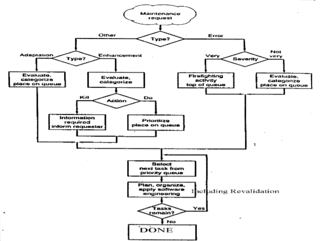

# Performing Maintenance
May 2, 2022

## Revalidation
Revalidation involves examining the software to make sure it meets business requirements and specifications. As well, functionality and bugs are identified for patching or improvement.

Typically, a revalidation will start with either human review or regression testing. From a human review, either a formal or informal technical review will be performed. A formal review will consist of an inspection as well as a walkthrough of the code; on the other hand, an informal review may consist simply of manually reading through the source code.

### Inspection
Inspection focuses on 3 main questions:
- Does a proposed change do what it is supposed to do?
- Does a proposed change work without side-effects?
- Does a proposed change follow standards?

At least 3, but ideally 5, people participate in an inspection. The following roles are required:
- Moderator (lead)
- Author (creator of change)
- Scribe (recorder)
- Reviewer (Inspector)
- Reader

### Regression Testing
## SCM and RE

