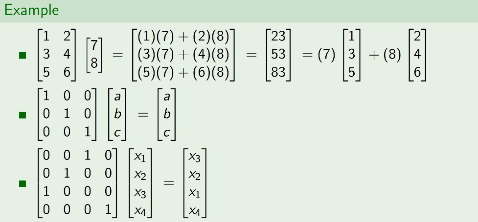

# Solutions of Linear Systems
September 15, 2021

## Dot product of two vectors
In two vectors $\vec{v}$ and $\vec{w}$, with entries (components) $v_1, v_2,\ldots, v_n$ and $w_1, w_2,\ldots, w_n$, the dot product is a scalar value given by

$$\vec{v}\cdot\vec{w} = v_1w_1 + v_2w_2 + \ldots + v_nw_n$$

## Applications of Dot Products

Two important concepts which come out of the dot product are the norm, and angle between vectors:

#### Norm:  
$$\Vert\vec{v}\Vert = \sqrt{\vec{v}\cdot\vec{v}} = \sqrt{v_1^2 + v_2^2+\ldots+ v_n^2}$$

#### Angle:  
$$\theta (\vec{v}, \vec{w}) = \arccos\frac{\vec{v}\cdot\vec{w}}{\Vert v\Vert \Vert w\Vert}$$

#### Variance and correlation
In statistics, data is often stored in a single-dimension vector (like an array or a list).

For a vector $\vec{x}$ of $n$ values, with dimension $\Reals^n$, the **mean-centered** vector $\vec{x}_c$ consists of elements $x_i - \overline{x}$ where $\overline{x} = \frac{x_1 + \dots + x_n}{n} = mean(\vec{x})$. 

**Variance**, or the quantified amount of varying values amongst the data, can be calculated as follows:

$$var(\vec{x}) = \frac{\Vert\vec{x}_c\Vert^2}{n} = \frac{\vec{x}_c\cdot\vec{x}_c}{n}$$

Standard deviation can then be calculated by taking the square root of the variance:
$$ std(\vec{x}) = \sqrt{var(\vec{x}})$$

For multiple vectors of data, say for multiple individuals answering a multiple choice survey, vectors of responses can be compared by correlation:
$$corr(\vec{x}, \vec{y}) = \frac{\vec{x}_c\cdot\vec{y}_c}{\Vert\vec{x}_c\Vert\Vert\vec{y}_c\Vert}$$

## Multiplying a vector by a matrix
In this operation, we can see how a matrix can be interpreted as a collection of vectors, through linear combinations:

More examples:

The last example shows how the "swap" elementary row operation can be implemented: this is known as a permutation matrix, as it simply re-arranges the vector values in the original vector without scaling or changing their magnitudes.

## Linear combinations
A vector $\vec{u}$ is considered a linear combination of a series of vectors $\vec{v_1}, \vec{v_2}, \ldots , \vec{v_n}$ if there are existing scalar values $x_1, x_2, \ldots, x_n$ in which:
$$\vec{u} = x_1\vec{v_1}, x_2\vec{v_2}, \ldots , x_n\vec{v_n}$$

How can we determine if a vector is a linear combination of two other vectors? We can treat this as a linear system and solve. For instance, determine if the vector $\begin{bmatrix}7 \\ 8 \\ 9\end{bmatrix}$ is a linear combination of $\begin{bmatrix}1 \\ 2 \\ 3\end{bmatrix}$ and $\begin{bmatrix}4 \\ 5 \\ 6\end{bmatrix}$:

$$
\begin{bmatrix}7 \\ 8 \\ 9\end{bmatrix} = x\begin{bmatrix}1 \\ 2 \\ 3\end{bmatrix} + y\begin{bmatrix}4 \\ 5 \\ 6\end{bmatrix} \rightarrow\\
\space \\
x + 4y = 7 \\
2x + 5y = 8 \\
3x + 6y = 9
$$

This system can be expressed by its augmented matrix:

$$
M = \begin{bmatrix}\begin{array}{cc:c}
1 & 4 & 7 \\
2 & 5 & 8 \\
3 & 6 & 9
\end{array}\end{bmatrix} \\
rref(M) = \begin{bmatrix}\begin{array}{cc:c}
1 & 0 & -1 \\
0 & 1 & 2 \\
0 & 0 & 0
\end{array}\end{bmatrix}
$$  

Solving this system, we find: $(x, y)= (-1, 2)$