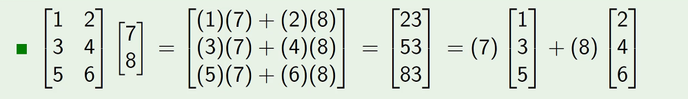

# Solutions of Linear Systems
September 15, 2021

## Dot product of two vectors
In two vectors $\vec{v}$ and $\vec{w}$, with entries (components) $v_1, v_2,\ldots, v_n$ and $w_1, w_2,\ldots, w_n$, the dot product is a scalar value given by

$$\vec{v}\cdot\vec{w} = v_1w_1 + v_2w_2 + \ldots+ v_nw_n$$

Two important concepts which come out of the dot product are the norm, and angle between vectors:

Norm:  
$$\Vert\vec{v}\Vert = \sqrt{\vec{v}\cdot\vec{v}} = \sqrt{v_1^2 + v_2^2+\ldots+ v_n^2}$$

Angle:  
$$\theta (\vec{v}, \vec{w}) = \arccos\frac{\vec{v}\cdot\vec{w}}{\Vert v\Vert \Vert w\Vert}$$

## Multiplying a vector by a matrix
In this operation, we can see how a matrix can be interpreted as a collection of vectors, through linear combinations:

## Linear combinations
A vector $\vec{u}$ is considered a linear combination of a series of vectors $\vec{v_1}, \vec{v_2}, \ldots , \vec{v_n}$ if there are existing scalar values $x_1, x_2, \ldots, x_n$ in which:
$$\vec{u} = x_1\vec{v_1}, x_2\vec{v_2}, \ldots , x_n\vec{v_n}$$

