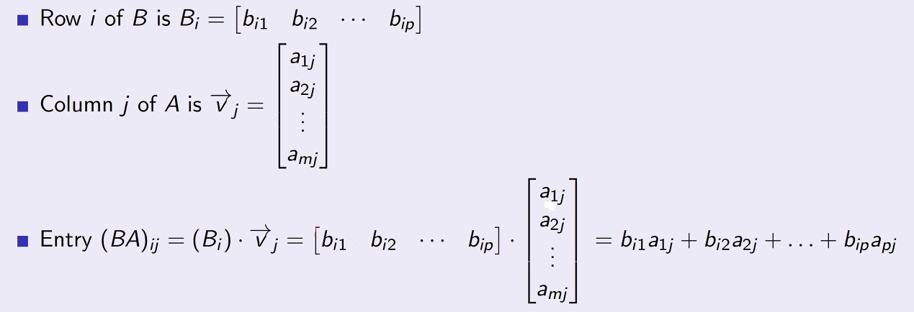
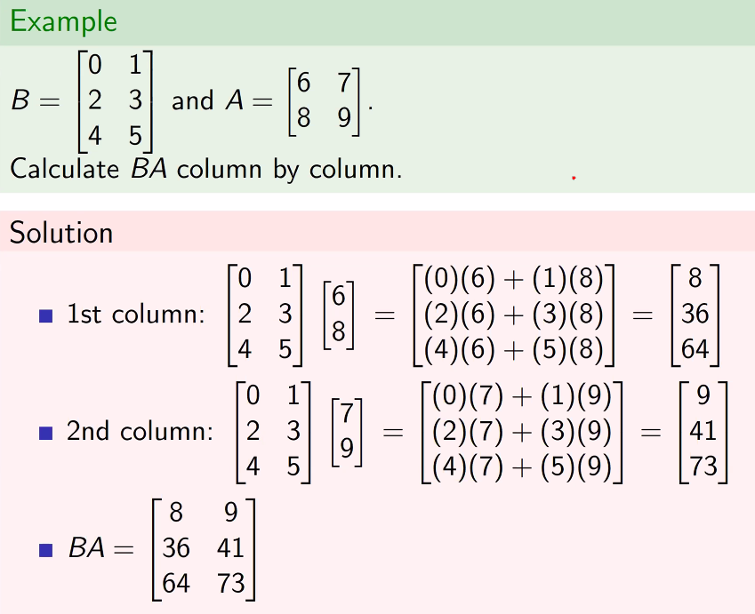
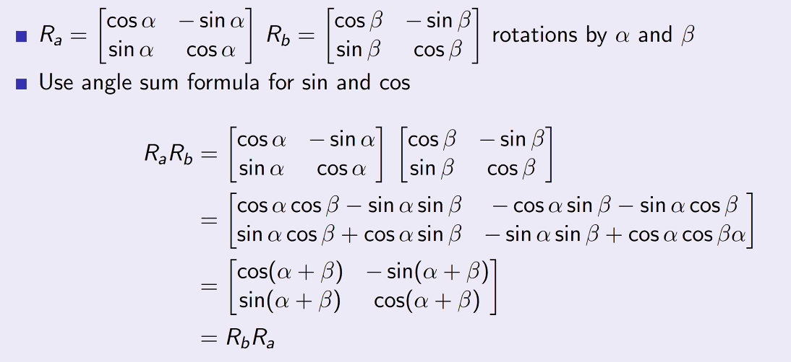
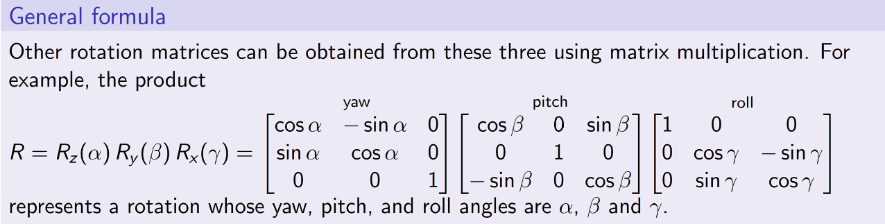

# Matrix Algebra
September 27, 2021

## Matrix products
A linear transformation is a formula that expresses a set of dependent variables as sums of the scalar multiples of another set of variables. For instance:

y1 = x1 - 2x2

where the value of y1 is dependent on the values of x1 and x2.

Often, we will be the dependent variables of one set of equations are also the independent variables of another set of equations! We can imagine this scenario as a *product* of two matrices:

$$\vec{y} = Y(\vec{x}) = A\vec{x} = \begin{bmatrix}
1 & -2 \\
3 & -4 \\
5 & -6 \\
\end{bmatrix} \\
\space \\
\vec{z} = Z(\vec{y}) = \begin{bmatrix}
1 & -3 & 5 \\
-2 & -4 & -6 \\
\end{bmatrix}\vec{y} \\
\vec{z} = Z(Y(\vec{x})) = \begin{bmatrix}
1 & -3 & 5 \\
-2 & -4 & -6 \\
\end{bmatrix}
\begin{bmatrix}
1 & -2 \\
3 & -4 \\
5 & -6 \\
\end{bmatrix}\ = 
\begin{bmatrix}
17 & -20 \\
20 & 24 \\
\end{bmatrix}\$$

### Matrices as derivatives
A derivative of a composite function is found by using the chain rule. This can be imagined in describing derivatives as matrices.

### Formula
Let A be a p x m matrix and let B be an n x q matrix.
- The product BA is defined when (and only when) p = q
- In that case, BA is an n x m matrix

$$ \Reals^m\rightarrow^A\Reals^{p = q}\rightarrow^B\Reals^n$$

The entry $BA_{ij}$ is the dot product of row $i$ of $B$ and column $j$ of $A$:

We can also calculate products using a column-by-column approach:

## Rotations in 2-D
Any two rotations in two dimensions are commutable:

## Rotations in 3-D
Rotations in three dimensions are only commutable if:
- They have the same axis
- They are 180 degree rotations about perpendicular axes
