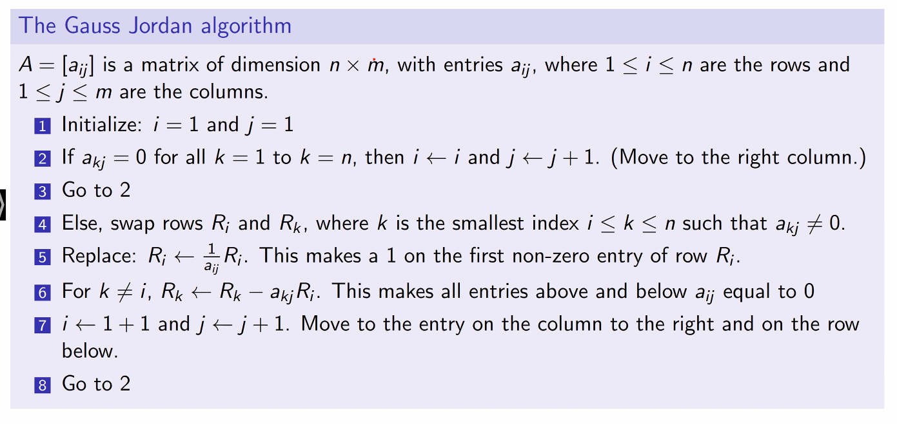

# Matrices and Gauss Jordan Elimination
September 8, 2021

When working with a system of linear equations, the variables are not very useful for calculations. We can instead present them as a matrix, either a *coefficient* matrix using only the coefficient values of the variables, or an *augmented matrix* which includes the full equation values.

Matrices can be manipulated using the following methods:
- Multiply a row R by a non zero number a (R <- aR>)
- Add a row R' to another row R (R <- R + R')
- Exchange two rows, R and R' (R <-> R')

If leading variables in a system are already reduced to a coefficient of 1, and the variables are not used in any other row, then additional variables which are not leading are considered "free" variables and can contain an arbitrary value.

## The Gauss Jordan algorithm
