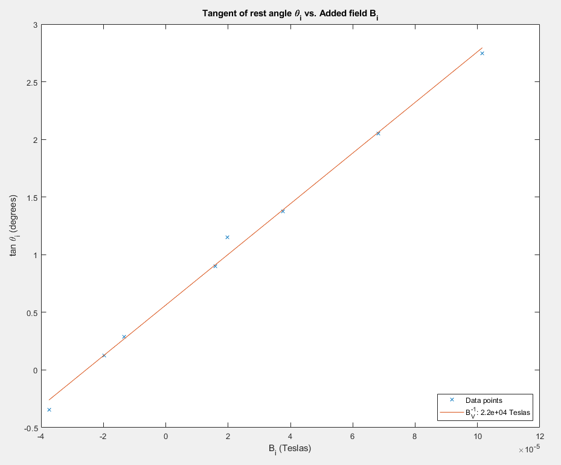
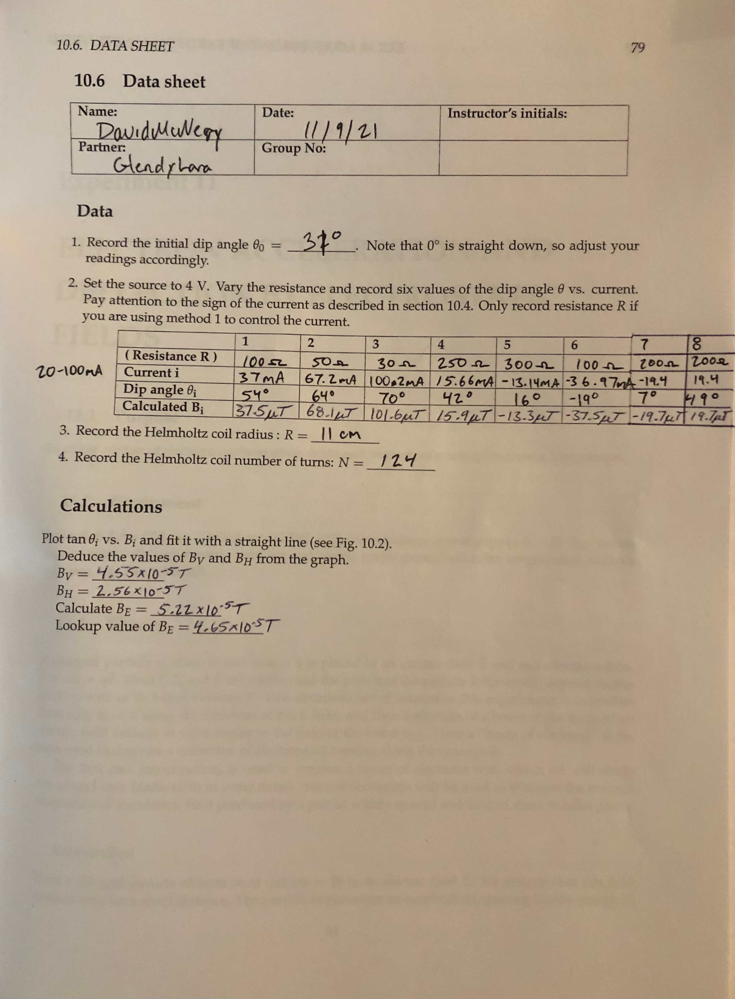

### Lab Experiment #10:
# Measurement of Earth's Magnetic Field
David McNeary 
Partner: Glendy Lara
PHYS 220BL 
11/15/2021

---

## Data
Initial dip angle: $\theta_0 = 31\degree$
Helmholtz coil radius: $R = 11\text{ cm}$
Helmholtz coil wrap quantity: $N = 124\text{ turns}$

### Dip angle vs current
| Iteration | 1 | 2 | 3 | 4 | 5 | 6 |
| --- | --- | --- | --- | --- | --- | --- |
| **Resistance** | $100\Omega$ | $50\Omega$ | $30\Omega$ | $250\Omega$ | $300\Omega$ | $100\Omega$ |
| **Current** $i$| $37\text{mA}$ | $67.2\text{mA}$ | $100.2\text{mA}$ | $15.66\text{mA}$ | $-13.14\text{mA}$ | $-36.97\text{mA}$ |
| **Dip angle** $\theta_i$ | $54\degree$ | $64\degree$ | $70\degree$ | $42\degree$ | $16\degree$ | $-19\degree$ |
| **Calculated** $B_i$ | $37.5\mu T$ | $68.1\mu T$ | $101.6\mu T$ | $15.9\mu T$ | $-13.3\mu T$ | $-37.5\mu T$ |

| 7 | 8 |
| --- | --- |
| $200\Omega$ | $200\Omega$ |
| $-19.4\text{mA}$ | $19.4\text{mA}$ |
| $7\degree$ | $49\degree$ |
| $-19.7\mu T$ | $19.7\mu T$ |

---

## Calculations and plots

### Calculated values

$B_V = 4.55\times10^{-5}\text{ T}$
$B_H = 2.56\times10^{-5}\text{ T}$
$B_E = \sqrt{B_V^2 + B_H^2} = 5.22\times10^{-5}\text{ T}$

### Reference value
$B_E = 4.65\times10^{-5}\text{ T}$
Measured at: CSUN Library
Latitude: 34° 14' 21" N
Longitude: 118° 31' 40" W 
Model used: WMM-2020
Referenced from: https://www.ngdc.noaa.gov/geomag/calculators/magcalc.shtml

Percent difference: $11.6\%$

---

## Data sheet + Quiz

(Quiz was a physical exercise)

