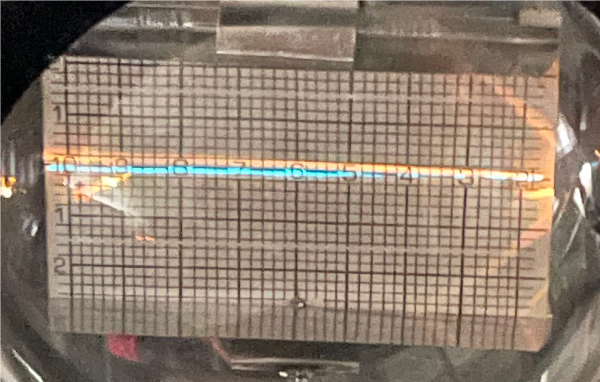
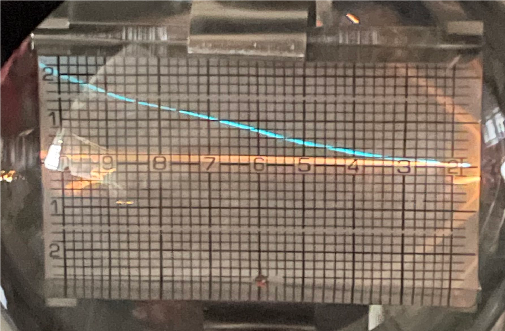
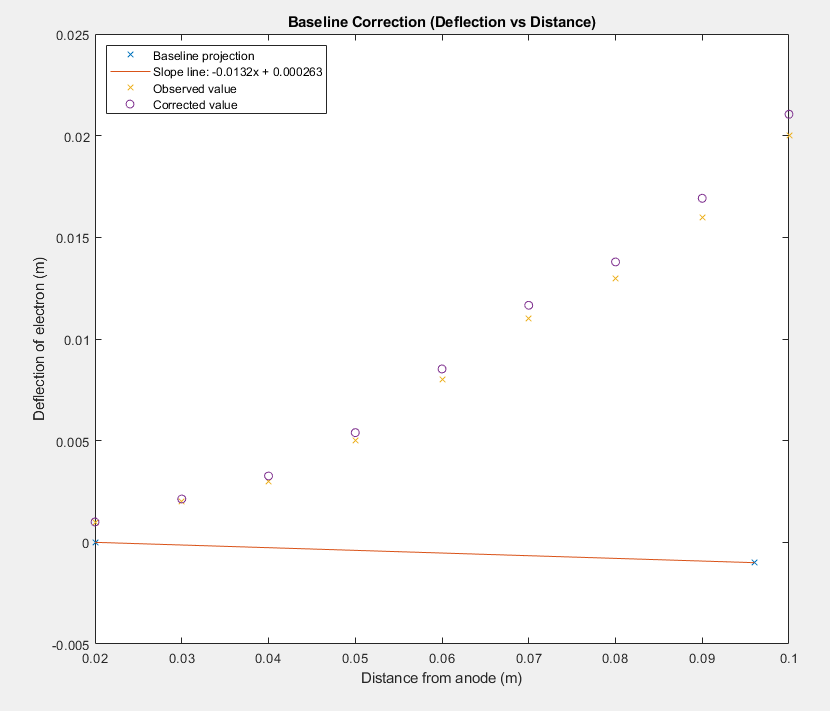
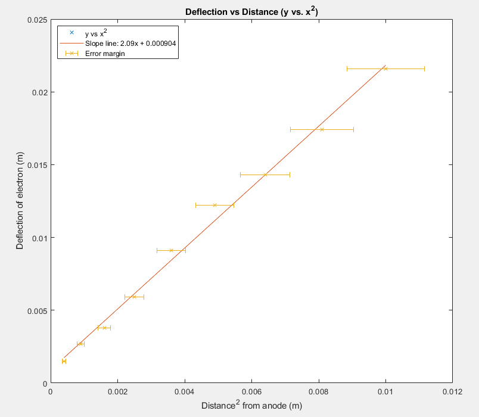

### Lab Experiment #11:
# Electron Acceleration and Deflection by Electrostatic Fields
David McNeary 
Partner: Glendy Lara
PHYS 220BL 
11/29/2021

---

## Data

### Baseline measurement

| Point near anode | Point near 10cm | Fit to $y = mx + b$ |
| --- | --- | --- |
| $x_1 = 0.02\text{ m}$ | $x_2 = 0.096\text{ m}$ | $a = -1.32 \times 10^{-2}$ |
| $y_1 = 0\text{ m}$ | $y_2 = -0.001\text{ m}$ | $b = 2.63 \times 10^{-4}$ |

### Electron deflection

| $x_{\text{obs}}$ | $y_{\text{obs}}$ | $y_{\text{baseline}}$ | $ y = y_{\text{obs}} - y_{\text{baseline}}$ |
| --- | --- | --- | --- |
| $0.02\text{ m}$ | $0.001\text{ m}$ | $-5.26 \times 10^{-4} \text{ m}$ | $1.53 \times 10^{-3} \text{ m}$ |
| $0.03\text{ m}$ | $0.002\text{ m}$ | $-6.58 \times 10^{-4} \text{ m}$ | $2.67 \times 10^{-3} \text{ m}$ |
| $0.04\text{ m}$ | $0.003\text{ m}$ | $-7.89 \times 10^{-4} \text{ m}$ | $3.79 \times 10^{-3} \text{ m}$ |
| $0.05\text{ m}$ | $0.005\text{ m}$ | $-9.21 \times 10^{-4} \text{ m}$ | $5.92 \times 10^{-3} \text{ m}$ |
| $0.06\text{ m}$ | $0.008\text{ m}$ | $-1.05 \times 10^{-3} \text{ m}$ | $9.05 \times 10^{-3} \text{ m}$ |
| $0.07\text{ m}$ | $0.011\text{ m}$ | $-1.18 \times 10^{-3} \text{ m}$ | $1.22 \times 10^{-2} \text{ m}$ |
| $0.08\text{ m}$ | $0.013\text{ m}$ | $-1.31 \times 10^{-3} \text{ m}$ | $1.43 \times 10^{-2} \text{ m}$ |
| $0.09\text{ m}$ | $0.016\text{ m}$ | $-1.45 \times 10^{-3} \text{ m}$ | $1.75 \times 10^{-2} \text{ m}$ |
| $0.10\text{ m}$ | $0.020\text{ m}$ | $-1.58 \times 10^{-3} \text{ m}$ | $2.16 \times 10^{-2} \text{ m}$ |

Distance between conducting plates: $s = 5.5\text{ cm} = 0.055\text{ m}$
Slope of $y$ vs. $x^2$ : $m = 2.10$
Correction factor: $F_D = ms = 0.46m$

### Thompson's experiment
| $V_{PS} \text{ (kV)}$ | $2.00$ | $2.50$ | $3.00$ | $3.50$ |
| --- | --- | --- | --- | --- |
| **$I\text{ (A)}$** | $0.26\text{ A}$ | $0.29\text{ A}$ | $0.31\text{ A}$ | $0.33\text{ A}$ |
| **$B\text{ (T)}$** | $1.1\times 10^{-3}\text{ T}$ | $1.2\times 10^{-3}\text{ T}$ | $1.3\times 10^{-3}\text{ T}$ | $1.4\times 10^{-3}\text{ T}$ |
| **$\frac{e}{m} (\frac{\text{C}}{\text{kg}})$** | $8.71\times 10^{10}\frac{\text{C}}{\text{kg}}$ | $8.75\times 10^{10}\frac{\text{C}}{\text{kg}}$ | $9.19\times 10^{10}\frac{\text{C}}{\text{kg}}$ | $8.91\times 10^{10}\frac{\text{C}}{\text{kg}}$ |

Average value of charge/mass ratio: $\frac{e}{m} = 8.89\times 10^{10}$
Standard deviation: $2.18\times 10^9$

---

## Calculations and plots

## Questions

1. $v_{V_{max}} = \sqrt{\frac{2eV_{max}}{m}} = \sqrt{2V_{max}\frac{e}{m}} = \sqrt{2(3500\text{ V})(8.91\times 10^{10}\frac{\text{C}}{\text{kg}})} \\ = 2.50\times 10^7 \frac{\text{m}}{\text{s}}$
2. $2.50 \times 10^7 / 3.0 \times 10^8 = 0.083$
3. $m_0 = 9.10938356 \times 10^{-31}\text{ kg} \rightarrow \\ m = \frac{m_o}{\sqrt{1-\frac{v^2}{c^2}}} = \frac{9.10938356 \times 10^{-31}}{\sqrt{1-\frac{(2.50 \times 10^7)^2}{(3.0 \times 10^8)^2}}} = 9.14\times 10^{-31}\text{ kg} \rightarrow \\
\frac{9.14\times 10^{-31}}{9.11\times 10^{-31}} = 1.003 \rightarrow \\$
The mass of the electrons in this experiment appear to be 1.003 times greater than their initial at-rest mass.
4. The known $\frac{e}{m}$ ratio value of $1.76 \times 10^{11} \frac{\text{C}}{\text{kg}}$ contrasts quite a bit from the average and individual measured ratios found in this experiment. The average found value of the charge-to-mass ratio is at least 1.9 times smaller than the known value. Given the relatively coarse resolution of the graticule scales in the Teltron deflection tube, as well as the estimation required in measuring these scale values, it is still fairly remarkable that an "eyeball" measurement can offer a result within any small magnitude of the vicinity of a correct property for a particle as small as an electron.

---

## Data sheet + Quiz

