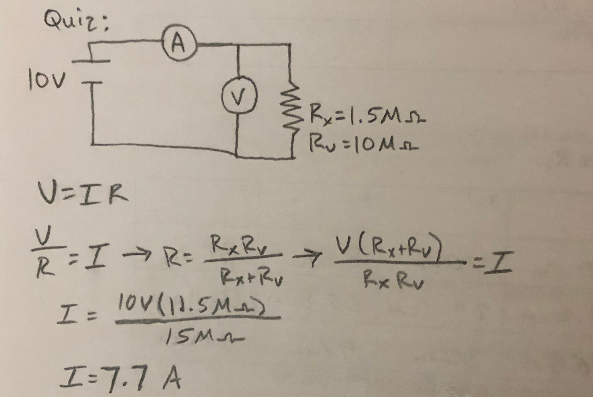
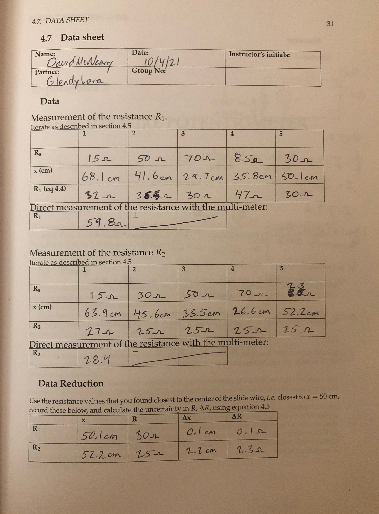

### Lab Experiment #4:
# Wheatstone Bridge
David McNeary 
Partner: Glendy Lara
PHYS 200BL 
10/4/2021

---

## Data

#### Measurement of $R_1$

|  | Iteration 1 | Iteration 2 | Iteration 3 | Iteration 4 | Iteration 5 |
| --- | --- | --- | --- | --- | --- | 
| $R_s$ | $15\Omega$ | $50\Omega$ | $70\Omega$ | $85\Omega$ | $30\Omega$ |
| $x\text{ (cm)}$ | $68.1\text{ cm}$ | $41.6\text{ cm}$ | $29.7\text{ cm}$ | $35.8\text{ cm}$ | $50.1\text{ cm}$ | 
| $R_1$ | $32\Omega$ | $36\Omega$ | $30\Omega$ | $47\Omega$ | $30\Omega$ |

**Direct multimeter measurement:** $59.8\Omega$

#### Measurement of $R_2$

|  | Iteration 1 | Iteration 2 | Iteration 3 | Iteration 4 | Iteration 5 |
| --- | --- | --- | --- | --- | --- | 
| $R_s$ | $15\Omega$ | $30\Omega$ | $50\Omega$ | $70\Omega$ | $23\Omega$ |
| $x\text{( cm)}$ | $63.9\text{ cm}$ | $45.6\text{ cm}$ | $33.5\text{ cm}$ | $26.6\text{ cm}$ | $52.2\text{ cm}$ | 
| $R_2$ | $27\Omega$ | $25\Omega$ | $25\Omega$ | $25\Omega$ | $25\Omega$ |

**Direct multimeter measurement:** $28.4\Omega$

---

## Data Reduction

|  | $x$ | $R$ | $\Delta x$ | $\Delta R$ |
| --- | --- | --- | --- | --- |
| $R_1$ | $50.1\text{ cm}$ | $30\Omega$ | $0.1\text{ cm}$ | $0.1\Omega$ |
| $R_2$ | $52.2\text{ cm}$ | $25\Omega$ | $2.2\text{ cm}$ | $2.3\Omega$ |

--- 

## Lab Questions
1. Using formula 4.5 and "percent difference" formula to calculate percent uncertainty:
a. $x = 10 \pm 0.1\text{ cm}$:  
$$100\Bigg[\frac{\vert40.1\frac{100}{(100-9.9)^2} - 39.9\frac{100}{(100-10.1)^2}\vert}{\frac{40.1\frac{100}{(100-9.9)^2} + 39.9\frac{100}{(100-10.1)^2}}{2}}\Bigg] = 0.56\%$$
b. $x = 50 \pm 0.1\text{ cm}$
$$100\Bigg[\frac{\vert0.1\frac{100}{(100-49.9)^2} - 0.1\frac{100}{(100-50.1)^2}\vert}{\frac{0.1\frac{100}{(100-49.9)^2} + 0.1\frac{100}{(100-50.1)^2}}{2}}\Bigg] = 0.80\%$$
c. $x = 95 \pm 0.1\text{ cm}$
$$100\Bigg[\frac{\vert45.1\frac{100}{(100-94.9)^2} - 44.9\frac{100}{(100-95.1)^2}\vert}{\frac{45.1\frac{100}{(100-94.9)^2} + 44.9\frac{100}{(100-95.1)^2}}{2}}\Bigg] = 7.55\%$$

2. If the 2 volts from the power supply were to be increased to 6 volts, I would expect the galvanometer to be much more sensitive to minute movements in the position of the "split" of the wire of the potentiometer ($x$ vs $100-x$), since given the same amount of resistance from the components of the circuit, there would be more current flowing (following from Ohm's Law). Since the galvanometer reads in &micro;A, we would need to be careful in using the "K-key" to increase the accuracy of the reading. to avoid overloading the galvanometer. I might also expect the wire of the potentiometer to get quite hot.

3. Depressing the K-key of the galvanometer greatly increased the precision of the reading once we were in the "ballpark" of a good $x-$value for an accurate reading. However, this increased sensitivity provided some concern when the distance to a proper $x$ was increased, as the instrument is apparently quite vulnerable to current in an "unbalanced" circuit.

4. Fluctuations in the voltage provided by the power supply will result in a fluctuating current reading from the galvanometer, and will make it harder to pinpoint a "balance" point for the $x-$position of the right and left sides of the split potentiometer resistance.

5. The contact point should be moved towards the right, decreasing the $x$ distance.

6. The measured and observed values for $R_2$ are quite close, and the percent difference is quite small:
$$ 100\Bigg[\frac{\vert25\Omega - 28.4\Omega\vert}{\frac{25\Omega + 28.4\Omega}{2}}\Bigg] = 8.7\%$$ 
However, the results from observed vs. direct measurements of $R_1$ are inconclusive, given the large percent of error:
$$ 100\Bigg[\frac{\vert30\Omega - 59.8\Omega\vert}{\frac{30\Omega + 59.8\Omega}{2}}\Bigg] = 66\%$$

--- 

## Data sheet + Quiz

