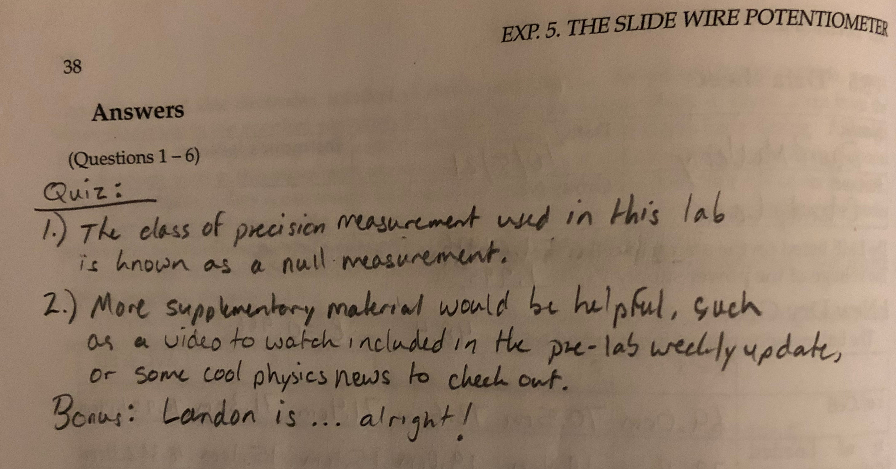
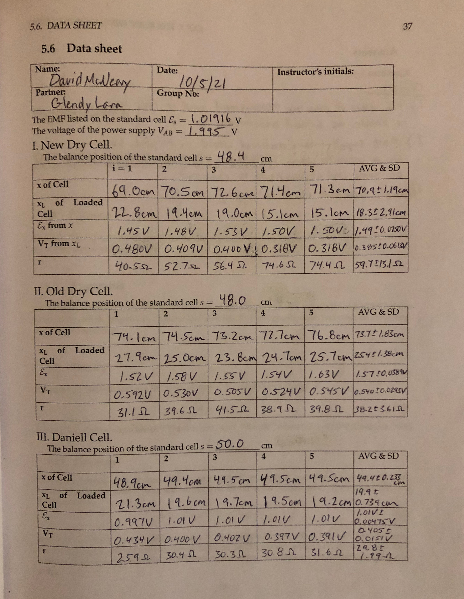

### Lab Experiment #5:
# The Slide Wire Potentiometer
David McNeary 
Partner: Glendy Lara
PHYS 200BL 
10/11/2021

---

## Data

The EMF listed on the standard cell $\epsilon_s = 1.01916 \text{ V}$
The voltage of the power supply $V_{AB} = 1.995 \text{ V}$

#### New Dry Cell

The balance position of the standard cell $s = 48.4 \text{ cm}$

|  | Iter 1 | Iter 2 | Iter 3 | Iter 4 | Iter 5 | Avg Value | Std Dev |
| --- | --- | --- | --- | --- | --- | --- | --- |
| $x$ of cell | $69.0\text{ cm}$ | $70.5\text{ cm}$ | $72.6\text{ cm}$ | $71.4\text{ cm}$ | $71.3\text{ cm}$ | $70.9\text{ cm}$ | $1.19\text{ cm}$ | 
| $x_L$ of loaded cell | $22.8\text{ cm}$ | $19.4\text{ cm}$ | $19.0\text{ cm}$ | $15.1\text{ cm}$ | $15.1\text{ cm}$ | $18.3\text{ cm}$ | $2.91\text{ cm}$ | 
| $\epsilon_x$ from $x$ | $1.45\text{ V}$ | $1.48\text{ V}$ | $1.53\text{ V}$ | $1.50\text{ V}$ | $1.50\text{ V}$ | $1.49\text{ V}$ | $0.0250\text{ V}$ | 
| $V_T$ from $x_L$ | $0.480\text{ V}$ | $0.409\text{ V}$ | $0.400\text{ V}$ | $0.318\text{ V}$ | $0.318\text{ V}$ | $0.385\text{ V}$ | $0.0613\text{ V}$ | 
| $r$ | $40.5\Omega$ | $52.7\Omega$ | $56.4\Omega$ | $74.6\Omega$ | $74.4\Omega$ | $59.7\Omega$ | $13.1\Omega$ | 

#### Old Dry Cell

The balance position of the standard cell $s = 48.0 \text{ cm}$

|  | Iter 1 | Iter 2 | Iter 3 | Iter 4 | Iter 5 | Avg Value | Std Dev |
| --- | --- | --- | --- | --- | --- | --- | --- |
| $x$ | $71.4\text{ cm}$ | $74.5\text{ cm}$ | $73.2\text{ cm}$ | $72.7\text{ cm}$ | $76.8\text{ cm}$ | $73.7\text{ cm}$ | $1.83\text{ cm}$ | 
| $x_L$ | $27.9\text{ cm}$ | $25.0\text{ cm}$ | $23.8\text{ cm}$ | $24.7\text{ cm}$ | $25.7\text{ cm}$ | $25.4\text{ cm}$ | $1.38\text{ cm}$ | 
| $\epsilon_x$ | $1.52\text{ V}$ | $1.58\text{ V}$ | $1.55\text{ V}$ | $1.54\text{ V}$ | $1.63\text{ V}$ | $1.57\text{ V}$ | $0.0389\text{ V}$ | 
| $V_T$ | $0.592\text{ V}$ | $0.530\text{ V}$ | $0.505\text{ V}$ | $0.524\text{ V}$ | $0.545\text{ V}$ | $0.540\text{ V}$ | $0.0293\text{ V}$ | 
| $r$ | $31.1\Omega$ | $39.6\Omega$ | $41.5\Omega$ | $38.9\Omega$ | $39.8\Omega$ | $38.2\Omega$ | $3.61\Omega$ |

#### Daniell Cell

The balance position of the standard cell $s = 50.0 \text{ cm}$

|  | Iter 1 | Iter 2 | Iter 3 | Iter 4 | Iter 5 | Avg Value | Std Dev |
| --- | --- | --- | --- | --- | --- | --- | --- |
| $x$ | $48.9\text{ cm}$ | $49.4\text{ cm}$ | $49.5\text{ cm}$ | $49.5\text{ cm}$ | $49.5\text{ cm}$ | $49.4\text{ cm}$ | $0.233\text{ cm}$ | 
| $x_L$ | $21.3\text{ cm}$ | $19.6\text{ cm}$ | $19.7\text{ cm}$ | $19.5\text{ cm}$ | $19.2\text{ cm}$ | $19.9\text{ cm}$ | $0.739\text{ cm}$ | 
| $\epsilon_x$ | $0.997\text{ V}$ | $1.01\text{ V}$ | $1.01\text{ V}$ | $1.01\text{ V}$ | $1.01\text{ V}$ | $1.01\text{ V}$ | $0.00475\text{ V}$ |
| $V_T$ | $0.434\text{ V}$ | $0.400\text{ V}$ | $0.402\text{ V}$ | $0.397\text{ V}$ | $0.391\text{ V}$ | $0.405\text{ V}$ | $0.0151\text{ V}$ |
| $r$ | $25.9\Omega$ | $30.4\Omega$ | $30.3\Omega$ | $30.8\Omega$ | $31.6\Omega$ | $29.8\Omega$ | $1.99\Omega$ |

--- 

## Lab Questions
1. Using a voltmeter would only measure the *terminal voltage,* and we would not be computationally aware of the internal resistance of the battery.
2. Yes - environmental and equipment conditions can and do change over time.
3. By reasoning of the answer to question #2, the balance position of the standard cell can and does change over time; even if the standard cell is reliable to deliver consistent EMF, variable conditions such as temperature fluctuations and charge state of the wires can introduce discalibration.
4. Yes - longer wires tend to "artificially" inflate measured resistance values.
5. For $V_{AB} = 1.995 \text{ V}$:

| New dry cell | Iter 1 | Iter 2 | Iter 3 | Iter 4 | Iter 5 |
| --- | --- | --- | --- | --- | --- |
| $x$ | $69.0\text{ cm}$ | $70.5\text{ cm}$ | $72.6\text{ cm}$ | $71.4\text{ cm}$ | $71.3\text{ cm}$ | 
| $\epsilon_x$ | $1.38\text{ V}$ | $1.41\text{ V}$ | $1.45\text{ V}$ | $1.42\text{ V}$ | $1.42\text{ V}$ |

| Old dry cell | Iter 1 | Iter 2 | Iter 3 | Iter 4 | Iter 5 |
| --- | --- | --- | --- | --- | --- |
| $x$ | $74.1\text{ cm}$ | $74.5\text{ cm}$ | $73.2\text{ cm}$ | $72.7\text{ cm}$ | $76.8\text{ cm}$ | 
| $\epsilon_x$ | $1.48\text{ V}$ | $1.49\text{ V}$ | $1.46\text{ V}$ | $1.45\text{ V}$ | $1.53\text{ V}$ |

| Daniell cell | Iter 1 | Iter 2 | Iter 3 | Iter 4 | Iter 5 |
| --- | --- | --- | --- | --- | --- |
| $x$ | $48.9\text{ cm}$ | $49.4\text{ cm}$ | $49.5\text{ cm}$ | $49.5\text{ cm}$ | $49.5\text{ cm}$ | 
| $\epsilon_x$ | $0.976\text{ V}$ | $0.986\text{ V}$ | $0.988\text{ V}$ | $0.988\text{ V}$ | $0.988\text{ V}$ |

These values are not the same as the values calculated using the experimental method. However, because the value of the EMF of the standard cell is known to be accurate, allegedly to 6 significant figures, this reduces the propagation of uncertainty and gives us a more accurate measurement than solely utilizing the meter stick.

6. For this lab, we were not using batteries which were clearly indicated as "old" or "new." Our data shows more variation in EMF and resistance for our "new" battery than for the "old" battery. Regardless of how worn they were assumed to be, as a battery is used, its ability to deliver a consistent voltage is decreased. This is due to a number of reasons, including repeated chemical reactions occuring internally (which may deplete reagents over multiple reactions), stresses (both from environmental sources as well as from within) on the materials used to construct the battery, corrosion of terminals over time, or how the storage environment of the battery changes over the course of its use.

--- 

## Data sheet + Quiz

