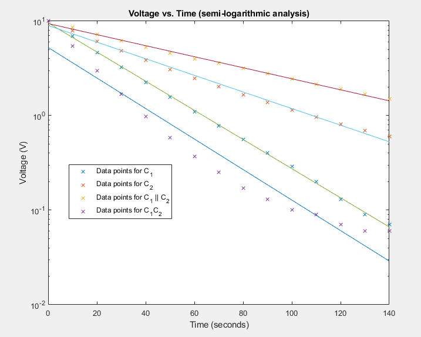
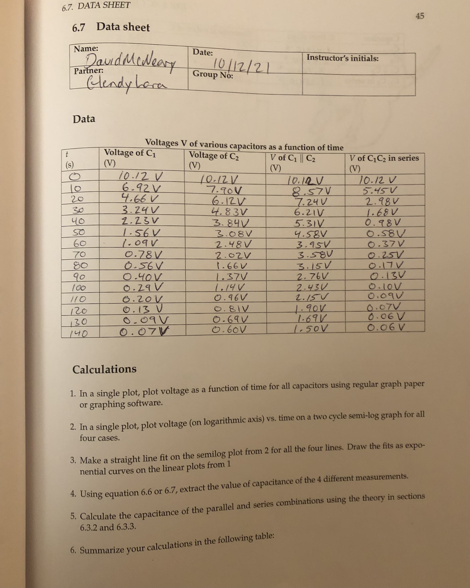
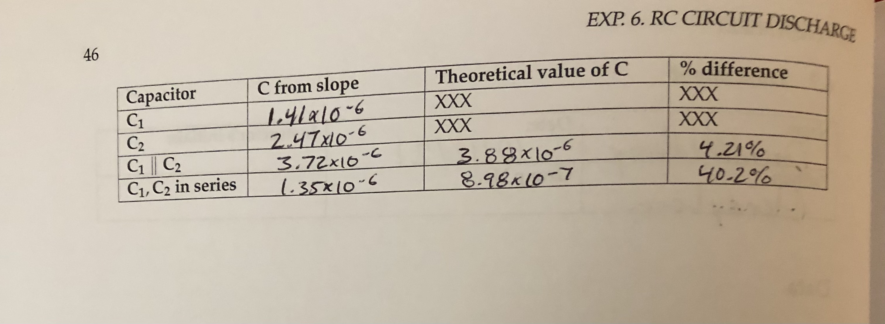
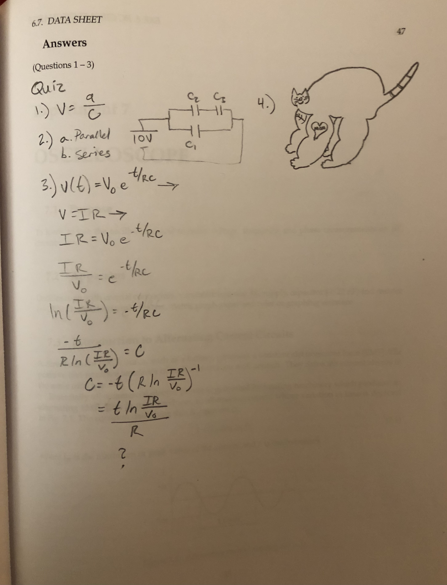

### Lab Experiment #6:
# RC Circuit Discharge
David McNeary 
Partner: Glendy Lara
PHYS 200BL 
10/18/2021

---

## Data

### Voltages $V$ of various capacitors as a function of time

| $t$ (seconds) | $V_{C_1}$ (Volts) | $V_{C_2}$ (Volts) | $V_{C_1\parallel C_2}$ (Volts) | $V_{C_1C_2}$ (Volts) |
| --- | --- | --- | --- | --- |
| $0\text{ s}$ | $10.12\text{ V}$ | $10.12\text{ V}$ | $10.12\text{ V}$ | $10.12\text{ V}$
| $10\text{ s}$ | $6.92\text{ V}$ | $7.90\text{ V}$ | $8.57\text{ V}$ | $5.45\text{ V}$ | 
| $20\text{ s}$ | $4.66\text{ V}$ | $6.12\text{ V}$ | $7.24\text{ V}$ | $2.98\text{ V}$ | 
| $30\text{ s}$ | $3.24\text{ V}$ | $4.83\text{ V}$ | $6.21\text{ V}$ | $1.68\text{ V}$ | 
| $40\text{ s}$ | $2.23\text{ V}$ | $3.84\text{ V}$ | $5.31\text{ V}$ | $0.98\text{ V}$ | 
| $50\text{ s}$ | $1.56\text{ V}$ | $3.08\text{ V}$ | $4.58\text{ V}$ | $0.58\text{ V}$ | 
| $60\text{ s}$ | $1.09\text{ V}$ | $2.48\text{ V}$ | $3.95\text{ V}$ | $0.37\text{ V}$ | 
| $70\text{ s}$ | $0.78\text{ V}$ | $2.02\text{ V}$ | $3.58\text{ V}$ | $0.25\text{ V}$ | 
| $80\text{ s}$ | $0.56\text{ V}$ | $1.66\text{ V}$ | $3.15\text{ V}$ | $0.17\text{ V}$ | 
| $90\text{ s}$ | $0.40\text{ V}$ | $1.37\text{ V}$ | $2.76\text{ V}$ | $0.13\text{ V}$ | 
| $100\text{ s}$ | $0.29\text{ V}$ | $1.14\text{ V}$ | $2.43\text{ V}$ | $0.10\text{ V}$ | 
| $110\text{ s}$ | $0.20\text{ V}$ | $0.96\text{ V}$ | $2.15\text{ V}$ | $0.09\text{ V}$ | 
| $120\text{ s}$ | $0.13\text{ V}$ | $0.81\text{ V}$ | $1.90\text{ V}$ | $0.07\text{ V}$ | 
| $130\text{ s}$ | $0.09\text{ V}$ | $0.69\text{ V}$ | $1.69\text{ V}$ | $0.06\text{ V}$ | 
| $140\text{ s}$ | $0.07\text{ V}$ | $0.60\text{ V}$ | $1.50\text{ V}$ | $0.06\text{ V}$ | 

Extracted values for time constant $\tau$:
- $C_1: 28.2$ seconds
- $C_2: 49.4$ seconds
- $C_1 \parallel C_2: 74.4$ seconds
- $C_1C_2: 26.9$ seconds

| Capacitor | C from slope | Theoretical value of C | % difference |
| --- | --- | --- | --- |
|$C_1$ | $1.41 \times 10^{-6}$ | XXX | XXX |
|$C_2$ | $2.47 \times 10^{-6}$ | XXX | XXX |
|$C_1\parallel C_2$ | $3.72 \times 10^{-6}$ | $3.88 \times 10^{-6}$ | $4.21\%$
|$C_1C_2$ | $1.35 \times 10^{-6}$ | $8.98\times 10^{-7}$ | $40.2\%$

--- 

## Lab Questions
1. The voltage drop across the capacitor in the "power source/capacitor" Kirschoff loop must be 20 Volts, as the total provided by the power source is also 20 volts. Thus, the voltage drop over the resitors in series in the "capacitor/resistor" loop must also equal 20 volts. The total resistance of the resistors in series is the product of the resistance of the multimeter and the resistor, so it stands to reason that the resistor would provide half of the resistance; the multimeter, then, is measuring the voltage from the resistor to the negative terminal, which is 1/2 * 20 volts = 10 volts.

2. Because the ratio of capacitance $C = \frac{Q}{V}$ doesn't change, and the resistors are both of equal magnitude, we again only need to know one value of R to determine the total voltage at any point RC.

3. a. The total resistance would be inverted, for an approximate value of $5 \times 10^{-8}$.
b. The experiment would take many orders of magnitude more time to complete, with the given voltage. This would not be practical when Landon has to study for an exam after class.

--- 

## Data sheet + Quiz

