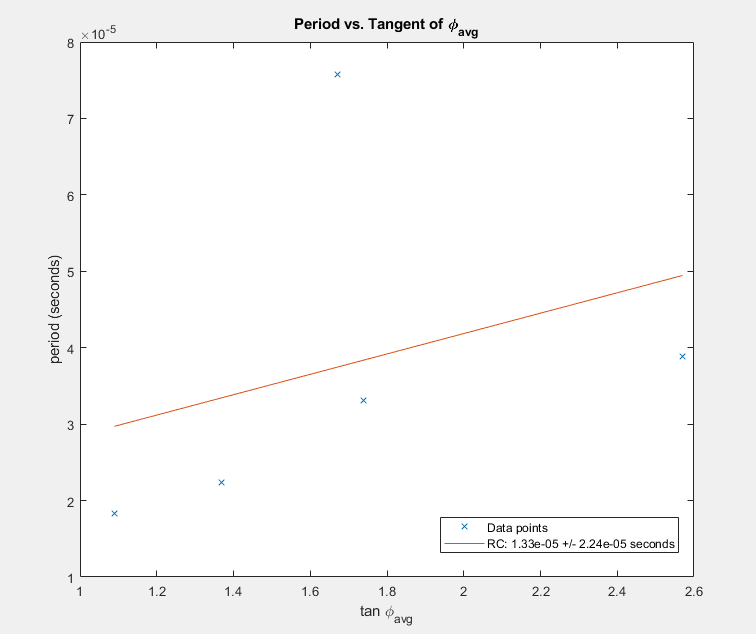
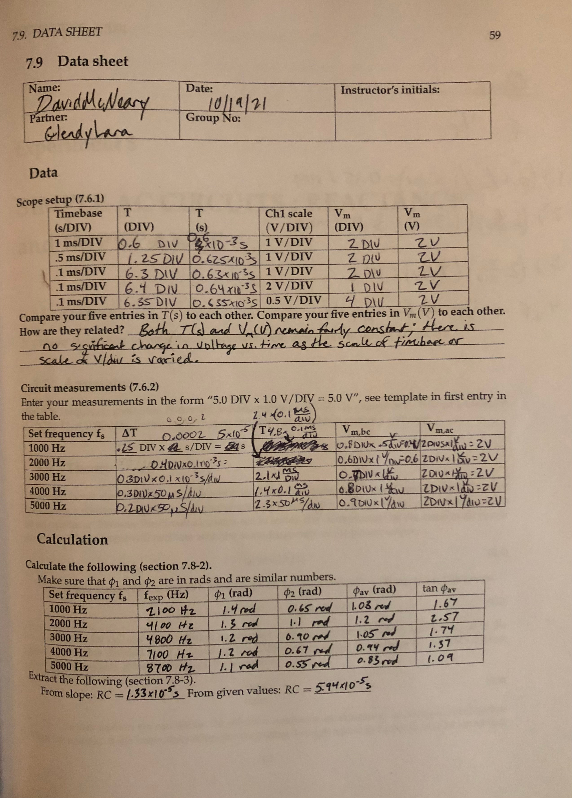
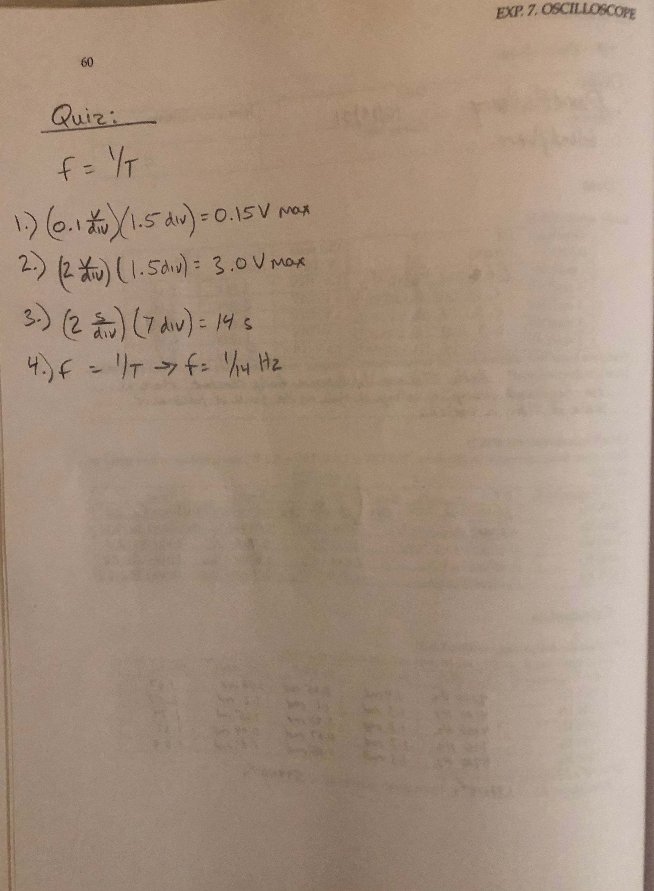

### Lab Experiment #7:
# Oscilloscope
David McNeary 
Partner: Glendy Lara
PHYS 200BL 
10/25/2021

---

## Data
### Scope setup
| Timebase (s/div) | T (div) | T (s) | Chan. 1 scale (V\div) | Vm (div) | Vm (V) |
| --- | --- | --- | --- | --- | --- |
| $1 \frac{\text{ms}}{\text{div}}$ | $0.6\text{ div}$ | $0.6 \times 10^-3\text{ s}$ | $1 \frac{\text{V}}{\text{div}}$ | $2\text{ div}$ | $2\text{ V}$ |
| $0.5 \frac{\text{ms}}{\text{div}}$| $1.25\text{ div}$ | $0.625 \times 10^-3\text{ s}$ | $1 \frac{\text{V}}{\text{div}}$ | $2\text{ div}$ | $2\text{ V}$ |
| $0.1 \frac{\text{ms}}{\text{div}}$ | $6.3\text{ div}$ | $0.63 \times 10^-3\text{ s}$ | $1 \frac{\text{V}}{\text{div}}$ | $2\text{ div}$ | $2\text{ V}$ |
| $0.1 \frac{\text{ms}}{\text{div}}$ | $6.4\text{ div}$ | $0.64 \times 10^-3\text{ s}$ | $2 \frac{\text{V}}{\text{div}}$ | $1\text{ div}$ | $2\text{ V}$ |
| $0.1 \frac{\text{ms}}{\text{div}}$ | $6.35\text{ div}$ | $0.635 \times 10^-3\text{ s}$ | $0.5 \frac{\text{V}}{\text{div}}$ | $4\text{ div}$ | $2\text{ V}$ |
The values of the period T compared to the voltage V remain fairly constant: there is no significant quantitative change in voltage vs. time as the scale definitions are changed.
### Circuit measurements
| Set frequency fs | &Delta;T | T | Vm, bc (div) | Vm, ac (V) |
| --- | --- | --- | --- | --- |
| $1000 \text{ Hz}$ | $0.25 \text{ div} \times 0.0002\frac{\text{s}}{\text{div}} = 5\times10^{-5}\text{ s}$ | $4.8 \text{ div} \times 0.1\frac{\text{ms}}{\text{div}} = 4.8\times10^{-4}\text{ s}$ | $0.8 \text{ div} \times 0.5\frac{\text{V}}{\text{div}} = 0.4\text{ V}$ | $2 \text{ div} \times 1\frac{\text{V}}{\text{div}} = 2\text{ V}$ |
| $2000 \text{ Hz}$ | $0.4 \text{ div} \times 0.1\frac{\text{ms}}{\text{div}} = 4\times10^{-5}\text{ s}$ | $2.4 \text{ div} \times 0.1\frac{\text{ms}}{\text{div}} = 2.4\times10^{-4}\text{ s}$ | $0.6 \text{ div} \times 1\frac{\text{V}}{\text{div}} = 0.6\text{ V}$ | $2 \text{ div} \times 1\frac{\text{V}}{\text{div}} = 2\text{ V}$ |
| $3000 \text{ Hz}$ | $0.3 \text{ div} \times 0.1\frac{\text{ms}}{\text{div}} = 3\times10^{-5}\text{ s}$ | $2.1 \text{ div} \times 0.1\frac{\text{ms}}{\text{div}} = 2.1\times10^{-4}\text{ s}$ | $0.7 \text{ div} \times 1\frac{\text{V}}{\text{div}} = 0.7\text{ V}$ | $2 \text{ div} \times 1\frac{\text{V}}{\text{div}} = 2\text{ V}$ |
| $4000 \text{ Hz}$ | $0.3 \text{ div} \times 50\frac{\mu\text{s}}{\text{div}} = 1.5\times10^{-5}\text{ s}$ | $1.4 \text{ div} \times 0.1\frac{\text{ms}}{\text{div}} = 1.4\times10^{-4}\text{ s}$ | $0.8 \text{ div} \times 1\frac{\text{V}}{\text{div}} = 0.8\text{ V}$ | $2 \text{ div} \times 1\frac{\text{V}}{\text{div}} = 2\text{ V}$ |
| $5000 \text{ Hz}$ | $0.2 \text{ div} \times 50\frac{\mu\text{s}}{\text{div}} = 1\times10^{-5}\text{ s}$ | $2.3 \text{ div} \times 0.1\frac{\mu\text{s}}{\text{div}} = 1.15\times10^{-4}\text{ s}$ | $0.9 \text{ div} \times 1\frac{\text{V}}{\text{div}} = 0.9\text{ V}$ | $2 \text{ div} \times 1\frac{\text{V}}{\text{div}} = 2\text{ V}$ |
## Calculations
| Set frequency fs | fexp (Hz) | $\phi$1 (rad) | $\phi$2 (rad) | $\phi$avg (rad) | tan $\phi$avg |
| --- | --- | --- | --- | --- | --- |
| $1000 \text{ Hz}$ | $2100 \text{Hz}$ | $1.4\text{ rad}$ | $0.65\text{ rad}$ | $1.03\text{ rad}$ | $1.67$ |
| $2000 \text{ Hz}$ | $4100 \text{Hz}$ | $1.3\text{ rad}$ | $1.1\text{ rad}$ | $1.2\text{ rad}$ | $2.57$ |
| $3000 \text{ Hz}$ | $4800 \text{Hz}$ | $1.2\text{ rad}$ | $0.90\text{ rad}$ | $1.05\text{ rad}$ | $1.74$ |
| $4000 \text{ Hz}$ | $7100 \text{Hz}$ | $1.2\text{ rad}$ | $0.67\text{ rad}$ | $0.94\text{ rad}$ | $1.37$ |
| $5000 \text{ Hz}$ | $8700 \text{Hz}$ | $1.1\text{ rad}$ | $0.55\text{ rad}$ | $0.83\text{ rad}$ | $1.09$ |

From slope: $RC = 1.33\times 10^{-5} \text{ seconds}$
From given values: $RC = 5.94\times 10^{-5} \text{ seconds}$
## Data sheet + Quiz

