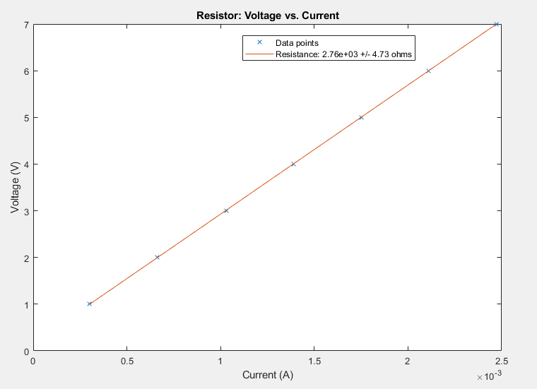
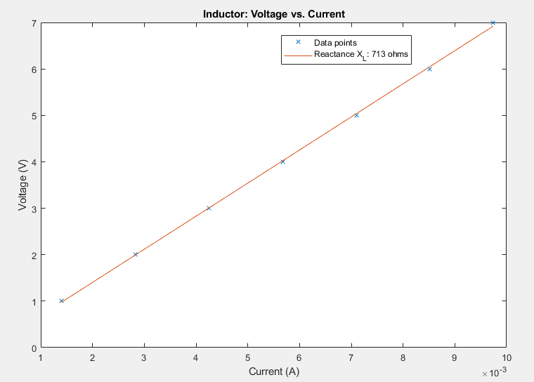
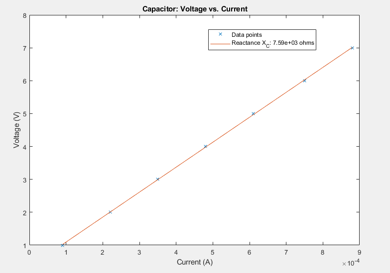
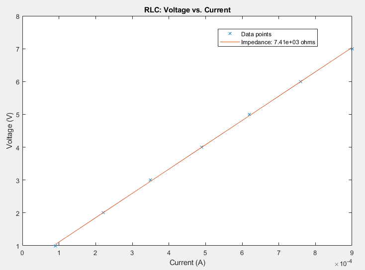
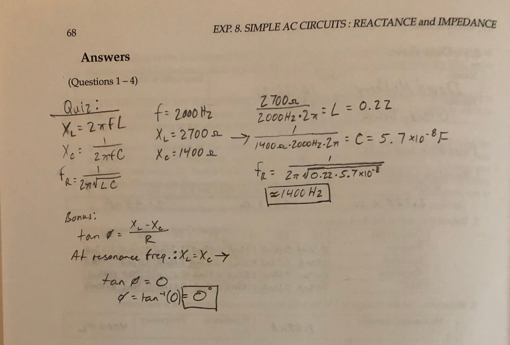
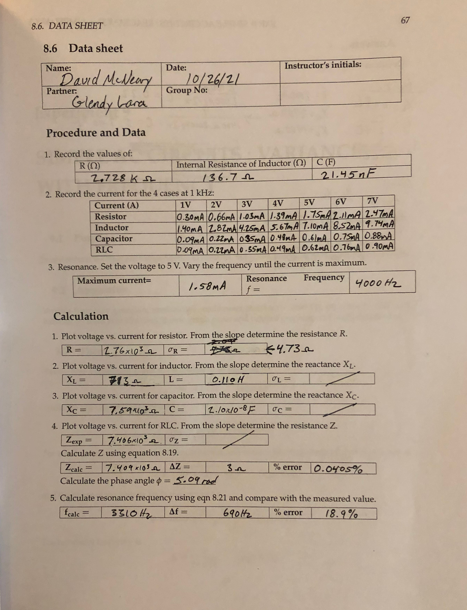

### Lab Experiment #8:
# Simple AC Circuits: Reactance and impedance
David McNeary 
Partner: Glendy Lara
PHYS 220BL 
11/1/2021

---

## Data
### Inherent values of elements
| R (&Omega;) | Internal R of inductor (&Omega;) | C (F) |
| --- | --- | --- |
| $2.728 \times 10^3 \Omega$ | $136.7 \Omega$ | $21.45 \text{nF}$ |
### Current for 4 circuit configurations:
| Current (A) | 1V | 2V | 3V | 4V | 5V | 6V | 7V |
| --- | --- | --- | --- | --- | --- | --- | --- |
| **Resistor** | $0.30\times10^{-3}\text{A}$ | $0.66\times10^{-3}\text{A}$ | $1.03\times10^{-3}\text{A}$ | $1.39\times10^{-3}\text{A}$ | $1.75\times10^{-3}\text{A}$ | $2.11\times10^{-3}\text{A}$ | $2.47\times10^{-3}\text{A}$ |
| **Inductor** | $1.40\times10^{-3}\text{A}$ | $2.82\times10^{-3}\text{A}$ | $4.25\times10^{-3}\text{A}$ | $5.67\times10^{-3}\text{A}$ | $7.10\times10^{-3}\text{A}$ | $8.52\times10^{-3}\text{A}$ | $9.74\times10^{-3}\text{A}$ |
| **Capacitor** | $0.09\times10^{-3}\text{A}$ | $0.22\times10^{-3}\text{A}$ | $0.35\times10^{-3}\text{A}$ | $0.48\times10^{-3}\text{A}$ | $0.61\times10^{-3}\text{A}$ | $0.75\times10^{-3}\text{A}$ | $0.88\times10^{-3}\text{A}$ |
| **RLC** | $0.09\times10^{-3}\text{A}$ | $0.22\times10^{-3}\text{A}$ | $0.35\times10^{-3}\text{A}$ | $0.49\times10^{-3}\text{A}$ | $0.62\times10^{-3}\text{A}$ | $0.76\times 10^{-3}\text{A}$ | $0.90\times10^{-3}\text{A}$ |
### Resonance
**Maximum current:** $1.58\times10^{-3}\text{A}$  
**Resonance frequency** $f = 4000\text{Hz}$

---

## Calculations and plots
$R = 2.76 \times 10^3 \Omega, \sigma_R = 4.73\Omega$

$X_L = 713\Omega, L = 0.110\text{H}$

$X_C = 7.59\times10^3\Omega, C = 2.10\times10^{-8}F$

$Z_{exp} = 7.406\times10^3\Omega$

$Z_{calc} = 7.409\times10^3\Omega, \\
\Delta Z = 3\Omega, \\
\%\space\text{error}: 0.0405\%$

$f_{calc} = 3310\text{Hz}, \\
\Delta f = 690\text{Hz}, \\
\%\space\text{error}: 18.9\%$

---

## Questions
1. The given values $R = 2700\Omega$, $L \approx0.106 \text{ H at }1000\text{Hz}$, and $C \approx 0.02\mu F$ compare to the experimental values of $R = 2.76\times10^3\Omega$, $L = 0.110 \text{ H at }1000\text{Hz}$, and $C = 0.0210\mu F$. Therefore, the values do closely agree.

2. The calculated percent error using correct significant figures is zero; taking a leap and estimating beyond the accuracy of our calculations, the percent error using the next decimal place is still only 0.0405%. Therefore, the value Zexp of the total impedance of the experimental circuit agrees with the value Zcalc of the calculated impedance using individual values R, L, and C.

---

## Data sheet + Quiz

