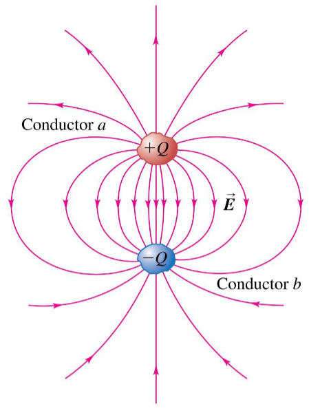
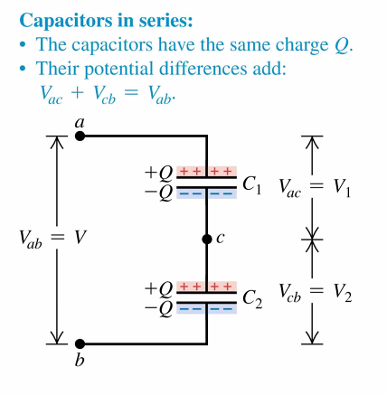

# Capacitors
October 18, 2021

## Basics

In flash photography, the energy used to make the flash is stored in a capacitor. 

The general structure of a capacitor is using two conductors, separated by an insulator (such as a vacuum). When the capacitor is charged, it means that the two conductors have an equal magnitude of opposite charge, meaning the system has a net charge of zero. The energy of a capacitor is actually stored in the electric field.

In order to charge the conductors, we much introduce a power source such as a battery or power supply. The power source will have a positive terminal and a negative terminal, with a specified voltage defined as the potential difference between the two terminals. For simplicity, we assign the negative terminal an arbitrary voltage of 0 and the positive terminal is the value of the total difference.

We can construct a circuit between these terminals with **ideal wires** whch will conduct charges from high voltage to low voltage.

Of course, there is also a potential difference between the conductors in a capacitor. When the capacitor conductors are uncharged, the electric field between the two is zero, and there is no potential difference. As soon as a power source is connected, an electric field is applied to the capacitor, and the "first" conductor thus applies an electric field which effects the other conductor, creating an increasing voltage difference inside the capacitor until the voltage between the two conductors matches the voltage of the power source.

To summarize:
- Capacitors are charges by applying a volatge, typically by a battery or other power source
- This gives a potential difference $V_{ab}$ between the conductors that is equal to the volatge of the battery
- The capacitance of a capacitor is given by the formula:
$$C = \frac{Q}{V_{ab}}$$

Though charge of the conductors, as well as the applied voltage, may change, this ratio of charge to voltage *does not change*. The unit of capacitance is charge over voltage, known as a **farad** after Michael Faraday. One farad is a very large capacitance; for instance, typical commerical photography capacitors are measured in microfarads.

## Geometry of Capacitors
A **parallel-plate** cap consists of two conductoing plates separated by a distance which is small compared to their geometric dimensions. With two plates with equal area, the electric field between the plates is essentially uniform, and the charges on the plates are approximately a uniform distribution over their surfaces. We can introduce another formula to deal with geometric information. Total capacitance is proportional to the area of the plates and inversely proportional to the distance between them:
$$C = \frac{\epsilon_0A}{d}$$

Thus, we can now find the magnitude of charge on each conductor of the capacitor as well as the potential difference between the plates:
$$\frac{Q}{V_{ab}} = \frac{\epsilon_0A}{d}$$

### Example
An isolated conducting sphere that has a 10.0 cm radius has an electric potential of 2.00 kV (the potential far from the sphere is zero). 
a. How much charge is on the sphere?
b. What is the self-capacitance of the sphere?
c. By how much does the self-capacitance change if the sphere’s electric potential is increased to 6.00 kV?

### Solution
a. 
$$
V = \frac{kQ}{R}\rightarrow Q = \frac{VR}{k}\rightarrow \\ \space \\
Q = \frac{(2000\text{V})(0.1\text{m})}{9 \times 10^9 \frac{\text{Nm}^2}{\text{C}^2}} \\ \space \\
= 22.3\text{nC}
$$
b. 
$$
C = \frac{Q}{V_c} = \frac{22.3 \times 10^{-9} \text{C}}{2000\text{V}} = 11.1 \times 10^{-12} \text{F} = 11.1 \text{pF}
$$
c. 
$$
C = \frac{Q}{V_c} = \frac{3Q}{3V_c} = \frac{Q}{V_c} = 11.1 \text{pF}
$$

### Application: Condensor microphones
Inside a condensor mic, there is a capacitor with a rigid plate and a flexible plate. Sound waves are converted to flowing charge by movement of the flexible capacitor, which varies the total capacitance by variation in distance. Thus, a sound wave is converted to an electric charge, which may be amplified and recorded digitally.

## Arrangements of capacitors
Capacitors are in series if they are connected one after the other in a circuit.

Capacitors in a series will results in a lower resulting capacitance than the sum of the values of the individual capacitors.