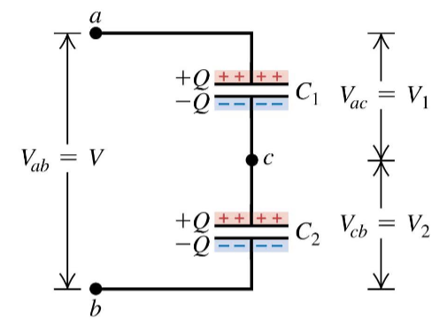
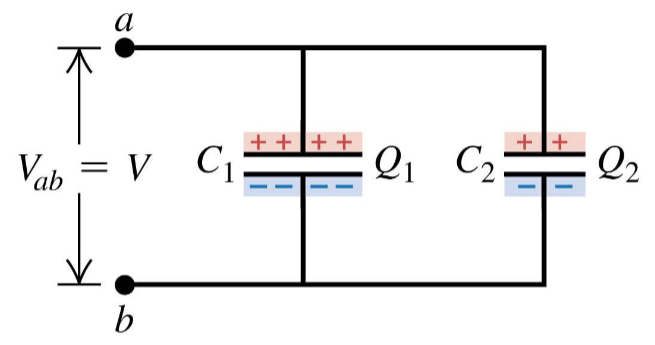

# Capacitors cont.
October 20, 2021

To review, capacitors are in series if they are connected one after the other:
- Capacitors in series have the same charge Q
- Their potential differences add: $V_{ac} + V_{cb} = V_{ab}$
- The equivalent capacitance in series is less than the individual capacitances

## Parallel capacitors
Capacitors are in parallel between two points if the potential difference is the same between points for each capacitor. The charge on a capacitor connected in parallel depends on its capacitance: $Q_n = C_nV$

Therefore, a capacitor with higher capacitance will hold a higher charge than one with less capacitance, connected in parallel.

An equivalent capacitor, or total capacitance in a circuit, will simply be the algebraic sum of the capacitances of each capacitor.

## Energy in a capacitor
The potential energy stored in a capacitor is:
$$
U = \frac{Q^2}{2C} = \frac{1}{2}CV^2 = \frac{1}{2}QV
$$

The capacitor energy is stored in the electric field between the conducting plates. The *density* of this energy is given by:
$$
u = \frac{1}{2}\epsilon_0E^2
$$

Note that $u$ above is the electric energy density in a vacuum, not the potential energy.