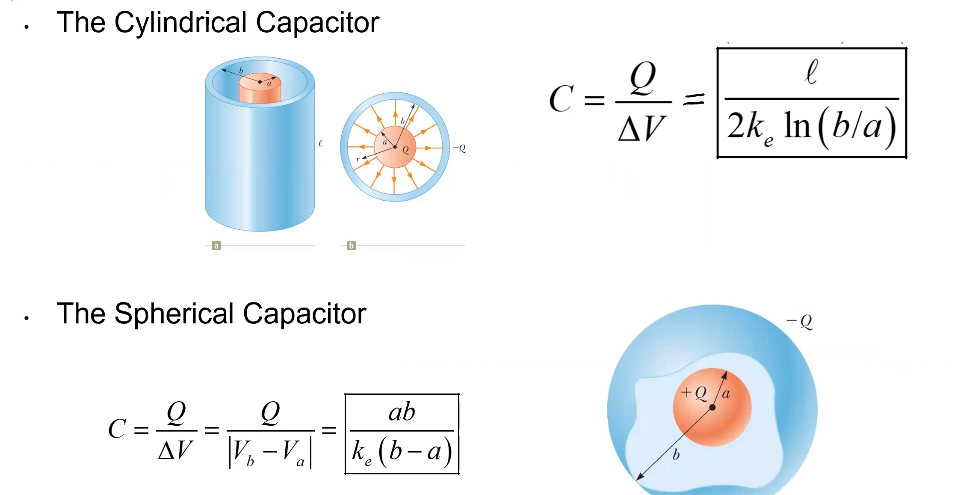

# Capacitance and Dielectrics
October 25, 2021

## Review

Capacitance is a quantity which measures the ability of an object to store charge. For instance, a camera has a flash device which can store a charge; when the flash is discharged, it must re-store the charge in order to use it again. The capacitor cannot generate energy or charge on its own, so usually this charge is restored using a battery.

The SI unit of capacitance is the farad (F):
$$
1 F = 1 \frac{C}{V} = 1 \frac{C^2}{N\cdot m} = 1 \frac{C^2}{J}
$$

The capacitance is defined by the ratio of the magnitude of charge on a conductor to the potential difference between the conductors:
$$
C = \frac{Q}{\Delta V}
$$

One farad is a **very** large amount of capacitance. Typical commercial capacitance is in the magnitude of picofarads to millifarads. Capacitance is always postive.

A capacitor consists of two conductors of any shape: each conductor, once charged, carries the same magnitude of charge with opposite polarities, separated by a distance and thus, a potential difference between them.

When a capacitor is connected to the terminals of a battery, charges move through the electric field generated by the battery, where electrons move from the conductor connected to the positive terminal, to the conductor connected to the negative terminal. This transfer process stops when the potential difference between the two conductors is equal to the voltage of the battery. The capacitor will maintain this stored charge even if the battery is disconnected.

The ratio of charge to voltage is constant; that is, the capacitance of an object is related entirely to its geometry (size of the conductors and the distance between them).

The capacitance of a sphere is particularly interesting. A sphereical conductor's capacitance is measured as so:
$$
C =  \frac{Q}{\Delta v} = \frac{Q}{k_eQ/R} = \frac{R}{k_e} = 4\pi \epsilon_0R
$$

The self-capacitance of a charged sphere is proportional to the sphere's radius and is independdent of both the charge and the potential difference; completely dependent on the object's geometry!

A parallel-plate capacitor is the most common configuration we will encounter. It consists on two plates of equal area separated by a distance. The magnitude of the charge per unit area on each plate is $\sigma = \frac{Q}{A}$.

If the plates are very close together, compared to their area, then a simple model can be adopted: the electric field will be uniform between the plates and zero elsewhere.
$$
E = \frac{\sigma}{\epsilon_0} = \frac{Q}{\epsilon_0A} \\
\Delta V = Ed = \frac{Qd}{\epsilon_0A} \\
C = \frac{\epsilon_0A}{d}
$$

Thus, the capacitance of a parallel-plate capacitor is proportional to the area of its plates and inversely proportional to the plate separation distaace.

The field can be considered as uniform in the "central region" of the plates, but is non-uniform at the edges of the plates (called an **edge effect**). As long as the distance between the plates is small, the edge effects can effectively be ignored.

