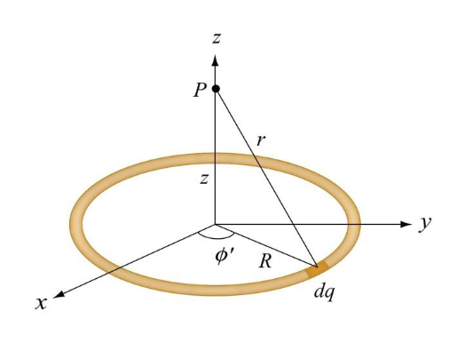

# Electric Potential vs Potential Energy cont.
October 6, 2021

Electric potential and potential energy are different, but related: they are both the result of the presence of a charge.

## Superposition
The electric potential of a point charge, as the result of many point charges, can be summed algebraicly. On the other hand, the calculation of electric potential as the result of a uniformly charged object takes a slightly different approach.

### Uniformly charged ring example
Consider a uniformly charged ring of radius R and charge density &lambda;. What is the electric potential at a distance z from the central axis?

$$dV = \frac{kdq}{r} = \frac{1}{4\pi\epsilon_0}\frac{dq}{r}$$

$dq$ can generally be replaced by some other relevant variable. Remember, $\frac{dq}{dl} = \lambda$ which is the charge density.

We can use the Pythagorean theorem to find the distance $r$ along the $z$-axis from the ring.

$$
r = \sqrt{R^2 + z^2}\rightarrow \\
dV = \frac{kdq}{r} = \frac{1}{4\pi\epsilon_0}\frac{dq}{\sqrt{R^2 + z^2}} \\
\space \\
= \int_0^l \frac{1}{4\pi\epsilon_0}\frac{dq}{\sqrt{R^2 + z^2}} \\
\space \\
= \frac{1}{4\pi\epsilon_0}\frac{1}{\sqrt{R^2 + z^2}}\int_0^l dq \\
\space \\
= \frac{kQ}{\sqrt{R^2 + z^2}}
$$

There are a number of ways to construct the integral: here, we chose to integrate over the change in charge $dq$ over the length of the ring $l$. We can also choose to integrate over the change of the angle of a portion of the ring, or the change in length of the ring.

### Another example
A uniformly charged, thin ring has a radius of 15.0 cm and a total charge +24.0 nC. An electon is placed on the ring's axis a distance of 30.0 cm from the center of the ring and is constrained to stay on the axis of the ring. The electron is then released from rest. (a) Describe the subsequent motion of the electron. (b) Find the speed of the electron when it reaches the center of the ring.

We must first calculate the electric potential, and from there we can determine the potential energy of the particle using $U_e = qV$:
$$
K_1 + U_{e1} = K_2 + U_{e2} \\
0 + qV = K_2 + 0 \\
q\Delta V = \frac{1}{2}mv^2 \rightarrow \\
V(x) = \frac{1}{4\pi\epsilon_0}\frac{q}{r} = \frac{1}{4\pi\epsilon_0}\frac{q}{\sqrt{R^2 + x^2}}\rightarrow \\
V(0.3) = \frac{1}{4\pi\epsilon_0}\frac{q}{r} = \frac{1}{4\pi\epsilon_0}\frac{24\times 10^{-9}}{\sqrt{0.15^2 + 0.3^2}} = 643\text{ V} \\
V(0) = \frac{1}{4\pi\epsilon_0}\frac{q}{r} = \frac{1}{4\pi\epsilon_0}\frac{24\times 10^{-9}}{\sqrt{0.15^2}} = 1438\text{ V} \rightarrow \\
\frac{1}{2}mv^2 = (1.602 \times 10^{-19}\text{ C})1438\text{ V} - 643\text{ V} \\
v = \sqrt{\frac{2(1.602 \times 10^{-19})1438\text{ V} - 643\text{ V}}{9.109 \times 10^{-31}\text{ kg}}}
$$

## Equipotential surfaces
Consider a topographic map with controur lines which indicate elevation. Each line is an equipotential line indicating potential gravitational energy.

With electricity, quipotential surfaces are those on which the electric potential is the same at each point. Electric field lines and equipotential lines are always perpendicular.

## Potential gradient
The components of the electric field can be foound by taking partial derivatives of the electric potential. The electric field is the negative gradient of the potential.

$$
E_x = -\frac{\delta V}{\delta x} \space 
E_y = -\frac{\delta V}{\delta y} \space 
E_z = -\frac{\delta V}{\delta z} \rightarrow \\
\vec{E} = -\vec{\nabla} V = -(\frac{\delta V}{\delta x}\hat{i} + \frac{\delta V}{\delta y}\hat{j} + \frac{\delta V}{\delta z}\hat{k})V$$