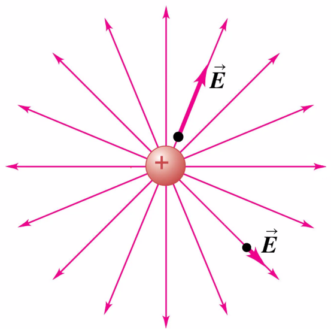
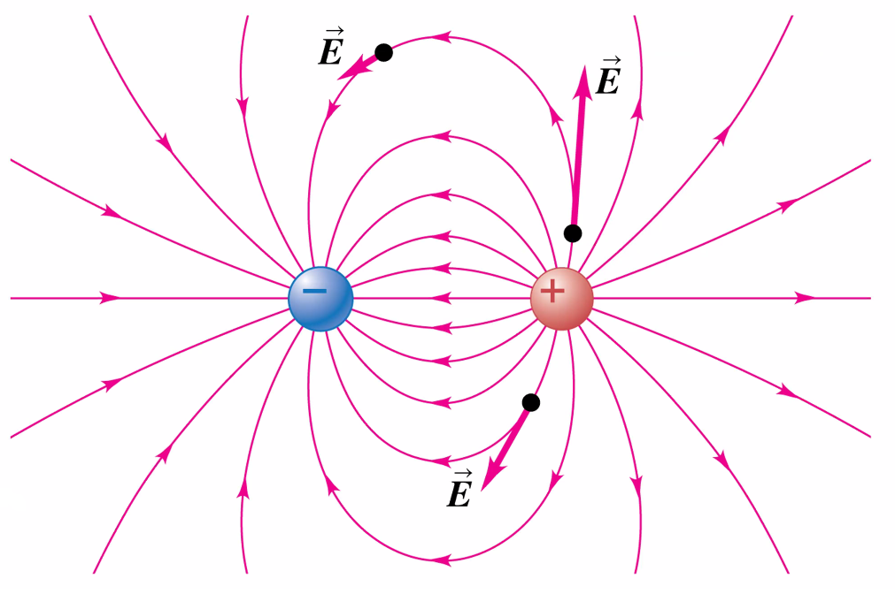

# Chapter 21: Electric Charge and Electric Field
September 13, 2021

## Review
Two charged bodies exert an electric force on each other, depending on their states of charge (opposite charges attract, similar charges repel), originating from the center of the body:

$$\vec{F_e} = k\frac{\vert q_1q_2 \vert}{r^2}\hat{r}$$

where $\hat{r}$ indicates a vector unit, representing a radial line between the bodies.

## Electric Field
Consider the mutual repulsion of two positively charged bodies A and B. Imagine that these bodies exist in a vacuum of space, where there are no other charged bodies to interact with.

The body A will generate an electric field throughout the *entire space*, which can be represented by a *vector field.*

By convention, the direction of the vectors in this field depend on the affect a charge will have on a **positive text charge.**

The vector quantity of the electric field generated by a charged body can be calculated using the formula:

$$\vec{E} = \frac{\vec{F}_0}{q_0}$$

where $q_0$ is the charge value of a test charge. This can then be simplified to:

$$\vec{E} = k\frac{\vert Q \vert}{r^2}\hat{r}\frac{ \text{N}}{\text{C}}$$

Thus, the calculation of an electric field has no dependence on the presence of a test charge. The body A is always affecting the space around it.

Notice the strength of the electric field, like the force between two point charges, also follows the inverse square law - the electric field decreases as the distance between the charge and the point of measurement increases.

Using this convention of direction for an electric field (acting on a positive test charge), we can then conclude that the force exerted on a test charge is pointed in the same direction as an electric field for a positive test charge, and in the opposite direction for a negative test charge.

In the above equations, we can instead use a different representation of the electric constant *k*:

$$k = \frac{1}{4\pi\epsilon_0}$$

...where $\epsilon_0 = 8.85 * 10^{-12} \frac{\text{ C}^2}{\text{ Nm}^2}$.

## Calculating Net Electric Force
When we are considering the effects of multiple electric fields at a point P, we must consider each electric force as a separate vector. The superposition of two or more electric fields can be calculated by finding the vector sum.

Steps:
 1. Break each vector into its components
 2. Sum the components of each component ($\sum{E_x}, \sum{E_y}$, etc.)
 3. Calculate the resultant using the root of the squares of the components.

## Electric field lines
We can imagine an array of **field lines** where the tangent at any point P in the field is the direction of the electric field. The spacing of the field lines in relation to each other gives us a general idea of the magnitude of the electric field at that point. At any point, the electric field has a unique direction, so the field lines *never intersect.*

An **electric dipole** is the presence of a complimentary pair of charges (i.e. one positive and one negative)

### Examples
1. Two point charges are separated by a distance of 10.0 cm. One has a charge of -25 &micro;C and the other +50 &micro;C.
a. Determine the direction and magnitude of the electric field at a point P between the two charges that is 2.0 cm from the negative charge.
b. If an electron (mass = $9.11 \times 10^{-31}$ kg) is placed at rest at P and released, what will be its initial acceleration (direction and magnitude)? Remember, $\vec{E} = \frac{\vec{F}}{q_0}$ and $\vec{F} = m\vec{a}$.

2. An electron is released from rest in a weak electric field $\vec{E} = -1.50 * 10^{-10}\frac{\text{N}}{\text{C}} \hat{j}$. After the electron has travelled a vertical distance of 1.0 micrometers, what is its speed? Do not neglect the gravitational force on the electron. 

### Solutions
1. 
a. 
$$\vec{E} = \sum{\vec{E}} = \vec{E_1} + \vec{E_2} \rightarrow \\
\space \\
\vec{E_1} = E_{1x} + E_{1y} \\
\vec{E_2} = E_{2x} + E_{2y} \rightarrow \\ 
\space \\
\vec{E_1} = E_{1x} + 0 
= k\frac{\vert -25 \times 10^{-6}\vert\text{ C}}{2.0 \times 10^{-2}\text{ m}^2} 
= 5.6 \times 10^8 \frac{\text{N}}{\text{C}}\rightarrow \\
\space \\
\vec{E_2} = E_{2x} + 0 
= k\frac{\vert 50 \times 10^{-6}\vert\text{ C}}{8.0 \times 10^{-2}\text{ m}^2}
=  7.0 \times 10^7 \frac{\text{N}}{\text{C}}\rightarrow \\
\space \\
-\vec{E_1} + \vec{E_2} = -4.9 \times 10^8 \frac{\text{N}}{\text{C}} \\
$$
So, the electric field points to the negative charge with an electric field of $4.9 \times 10^8 \frac{\text{N}}{\text{C}}$.

b. The electric field points to the positive charge here, because the test charge (the electron) is negative:
$$\vec{E} = \frac{\vec{F}}{q_0} \\
\vec{F} = m\vec{a} = q_0\vec{E} \\
\vec{a} = \frac{q_0\vec{E}}{m} 
= \frac{(-1.60\times 10^{-19}\text{ C})(-4.9 \times 10^8 \frac{\text{N}}{\text{C}})}{9.11\times 10^{-31}\text{kg}} \\
\vec{a} = 8.6 \times 10^{18} \frac{\text{m}}{\text{s}^2}$$

The electron has an initial acceleration of $8.6 \times 10^{18} \frac{\text{m}}{\text{s}^2}$ towards the positive charge.

2. $$\vec{E} = \frac{\vec{F_E}}{q_0} \\
\vec{F_E} = m\vec{a_E} = q_0\vec{E} \\
\vec{a_E} = \frac{q_0\vec{E}}{m} = \frac{(-1.60\times 10^{-19}\text{ C})(-1.50 \times 10^{-10} \frac{\text{N}}{\text{C}})}{9.11\times 10^{-31}\text{kg}}  = 26.3 \frac{\text{m}}{\text{s}^2} \rightarrow \\
\vec{a} = a_E + a_g = (26.3 - 9.8) \frac{\text{m}}{\text{s}^2} = 16.5 \frac{\text{m}}{\text{s}^2} \rightarrow \\
v^2 = v_0^2 + 2a\Delta y \\
v = \sqrt{0 + (16.5 \frac{\text{m}}{\text{s}^2})(1.0 \times 10^{-6}\text{m})} = 4.0 \times 10^{-3}\frac{\text{m}}{\text{s}}
$$

The electron is moving at 0.004 meters per second after travelling a vertical distance of 0.000001 meters.