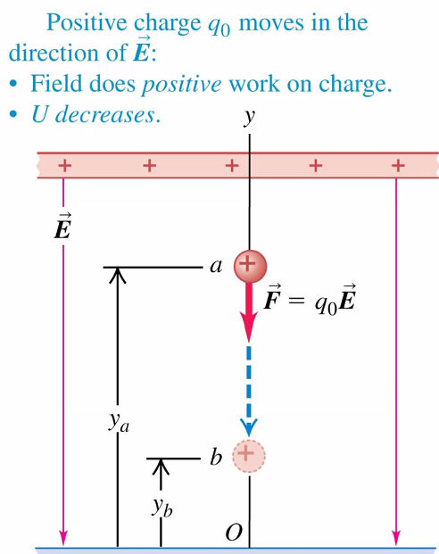

# Electric Potential
September 27, 2021

Similarly to Mechanics, we can approach problems in a variety of contexts. We will now explore solving electricity problems using an energy approach.

We will look at the meaning and significance of electric potential, and how to use it to calculate the electric field and electric force.

Energy is a scalar quantity, so it can be much more simple to work with compared to vector quantities.

## Work
To review, the dot product can be used to convert two vector quantities to a scalar:

$$\vec{A}\cdot\vec{B} = AB\cos\theta \\
W = \vec{F} \cdot\Delta\vec{s} = F\Delta s \cos \theta$$

When a force $\vec{F}$ acts on a particle that moves over a distance $s_i$ to $s_f$, energy is transferred into the particle system and the "work" done by the force is given by a line integral:

$$
W = \sum _j (F_s)_j \Delta s_j \rightarrow \int^{s_f}_{s_i} F_s ds = \int^f_i \vec{F} \cdot d\vec{s}
$$

The total energy in a system can be calculated by adding the kinetic energy, the gravitational potential energy, the elastic potential energy, and work done by other forces, like friction:

$$E = K + U_g + U_e + W_{other}$$

It's important to note that no work is done to a system if there is no change in position, even if there is an expenditure of energy!

## Potential energy
Every conservative force is associated with a potential energy. In the case of gravity, the work done can be calculated:

In general, when gravitational potential energy increases, the work done by the force of gravity to the system is negative; conversely, gravitational potential energy decreases as the force of gravity does work on the system to lower it to the ground:

$$W_{grav} = mgy_i - mgy_f \\
W_{grav} = U_i - U_f \\
W_{grav} = -\Delta U_{grav}$$

In a uniform electric field, such as that emitted by a pair of charged parallel metal plates, the field is directed downward and a positive test charge has a downward electric force exerted on it by the field. The work done by the electric force is the same for any path that the particle takes from start to finish:

$$W_{a\rightarrow b} = -\Delta U = q_0Ed$$

Electric force is a conservative force, and like gravitational force, is *independent* of the path taken by the particle in observation. If a positive charge moves in the same direction as the field, the field does *positive* work on the charge and the potential energy *decreases*.

